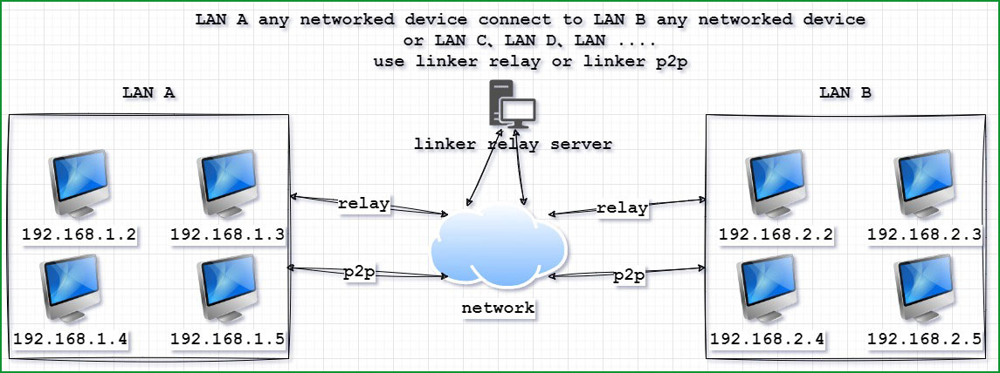
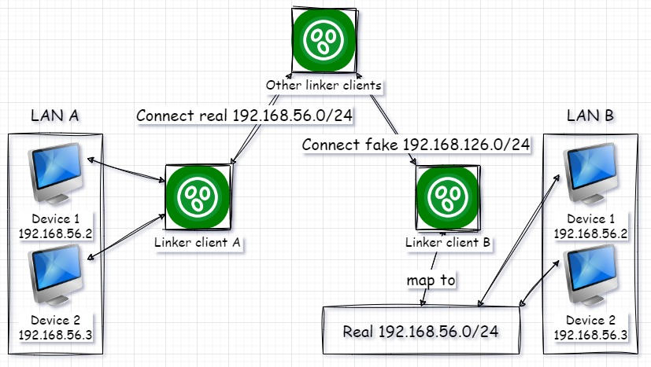

<!--
 * @Author: snltty
 * @Date: 2021-08-22 14:09:03
 * @LastEditors: snltty
 * @LastEditTime: 2022-11-21 16:36:26
 * @version: v1.0.0
 * @Descripttion: 功能说明
 * @FilePath: \client.service.ui.webd:\desktop\linker\README.md
-->
<div align="center">
<p></p> 

# .NET8.0、linker、link anywhere


[](https://gitee.com/snltty/linker/stargazers)
[](https://gitee.com/snltty/linker/members)

<a href="https://linker.snltty.com">Website</a>、<a href="https://linker-doc.snltty.com">Documentation</a>、<a href="https://jq.qq.com/?_wv=1027&k=ucoIVfz4" target="_blank">Join QQ Group</a>

[README](README.md) | [中文说明](README_zh.md)

</div>

## Platforms

|  | amd64 | x86 | arm64 | arm | 
|-------|-------|-------|-------|-------|
| Windows | ✔ | ✔ |✔ |✔ |
| Linux | ✔ |  |✔ |✔ |
| Linux Musl | ✔ |  |✔ |✔ |
| Openwrt | ✔ |  |✔ |✔ |
| Android(soon) | ✔ |  |  | |

## Overview

Using P2P or server relay, connect multiple LANs to enable communication between any networked devices across these LANs.

<div align="center">
<p></p> 
</div>

## Legal Compliance
The authors and contributors of this project are not liable for any direct, indirect, incidental, special, or consequential damages arising from the use, modification, copying, or distribution of this code. Under no circumstances shall the authors or contributors be held liable for any contractual, tort, or other legal responsibilities.

Users of this project are responsible for ensuring compliance with local laws and regulations. The authors and contributors assume no responsibility for any illegal activities or legal issues resulting from the use of this code. Users must ensure lawful usage within their jurisdiction.

This code is strictly intended for legal, ethical, and compliant purposes. The authors prohibit any use for illegal activities, attacks, abuse, or other malicious actions, including but not limited to unauthorized access, network attacks, etc.

For user convenience, this project provides **public messenger servers** and **public relay servers**. When using these services, users must comply with local laws and regulations. The authors, contributors, and server providers are not responsible for any illegal activities or legal issues arising from the use of these public servers.

## Features
- [x] Encrypted configuration files
- [x] Encrypted communication (SSL for all traffic)
- [x] Hole-punching support: TCP (including IPv6) and UDP
- [x] Hole-punching library: Use `linker.tunnel` in your projects
- [x] Relay connections with seamless switch to direct P2P once a hole is punched
- [x] Cross-LAN networking: Virtual NIC for building LANs between clients (P2P, point-to-network, network-to-network)
- [x] Virtual NIC library: Use `linker.tun` in your projects
- [x] Port forwarding: Forward local ports to remote client ports
- [x] Server penetration: Register ports/domains on a server to access internal services
- [x] Permission management: Master client controls permissions, exports/configures sub-client settings
- [x] Custom authentication: Validate connections via `HTTP POST` for beacon, relay, and penetration
- [x] Traffic statistics: Track beacon, relay, and penetration traffic on servers
- [x] Network configuration: Master client sets up networks, auto-assigns IPs to all clients
- [x] Distributed architecture: Multiple relay nodes for massive scalability
- [x] SOCKS5 proxy: Dynamic port forwarding without specifying ports
- [x] Easy integration: Use `linker.messenger.entry` to embed into your projects
- [x] CDKEY，It can temporarily lift certain restrictions

## Quick Integration
In a .NET 8+ project, install the NuGet package `linker.messenger.entry`
```
LinkerMessengerEntry.Initialize();
LinkerMessengerEntry.Build();
LinkerMessengerEntry.Setup(ExcludeModule.None);
```

## Network Mapping
Network mapping can help you resolve conflicts between multiple internal network.

<div align="center">
<p></p> 
</div>

## SNAT
Built-in SNAT enables you to use the point-to-site functionality even on Windows 7/8 and Windows Server 2008/2012 where NetNat is unavailable.

<div align="center">
<p></p> 
</div>

## Management Website

<div align="center">

<p></p> 
</div>

## Support the Author

<div align="center">
Buy the author a coffee to keep the project alive!
<p></p> 
</div>

## Special Thanks 

<div align="center">
<a href="https://mi-d.cn" target="_blank">
     米多贝克</a>
</div>