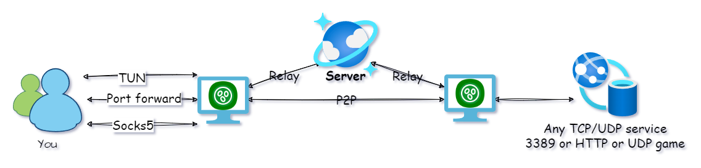
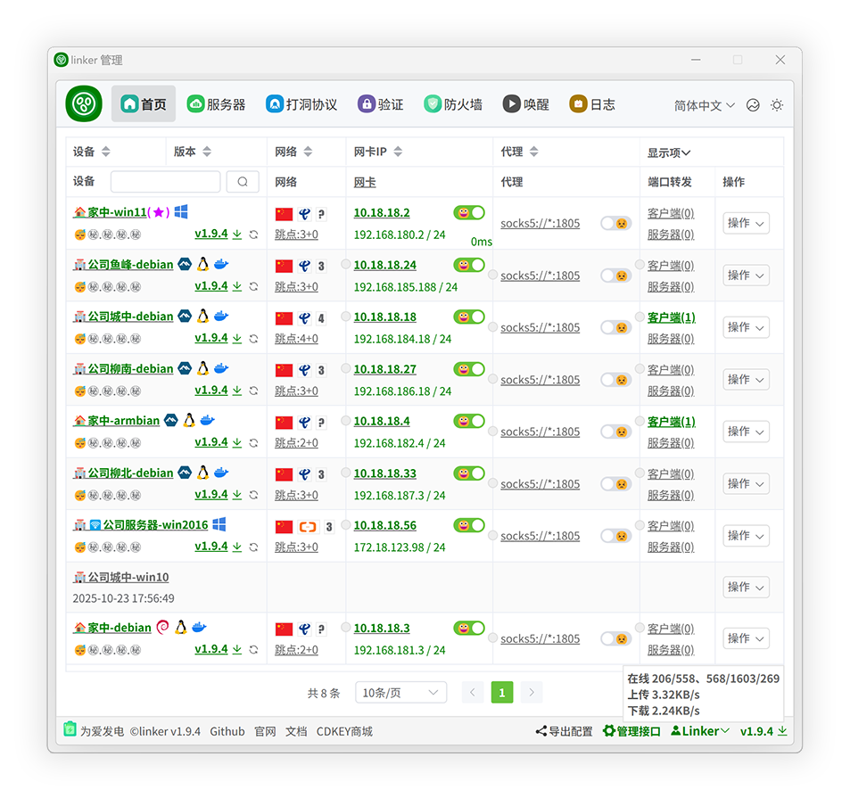

<!--
 * @Author: snltty
 * @Date: 2021-08-22 14:09:03
 * @LastEditors: snltty
 * @LastEditTime: 2022-11-21 16:36:26
 * @version: v1.0.0
 * @Descripttion: 功能说明
 * @FilePath: \client.service.ui.webd:\desktop\linker\README.md
-->

 

# Linker

让你那些散落在世界各地的联网设备就像在隔壁房间一样轻松访问。

<a href="https://linker.snltty.com">官方网站</a>、<a href="https://linker-doc.snltty.com">使用说明文档</a>、<a href="https://jq.qq.com/?_wv=1027&k=ucoIVfz4" target="_blank">加入组织：1121552990</a>

 

## [🎖️]主要功能

### 1、私有部署
- **私有部署:** 得益于各位老板的支持，官方提供了500Mbps+的公开服务器，还有一些免费中继节点，但会有所限制，建议私有部署属于你自己的服务器。
- **多平台支持：** 支持'Windows'、'Linux'、'Android'、'Docker'、'OpenWrt'、'NAS'、'PVE'、'LXC'、'macOS'，对于ios，我没有苹果手机，没有开发者账号，暂时不支持。

### 2、打洞中继

这些是隧道连接方式。

- **打洞连接:** 支持`TCP、UDP、IPV4、IPV6`，内含多种打洞方法，总有一个适合你。
- **中继连接:** 支持多中继节点，承载海量设备，在[官网](https://linker.snltty.com)展示了一些官方公开服务器的中继节点信息。

### 3、通信方式

这些是在隧道建立后，客户端之间访问实际业务的通信方式。

- **异地组网:** 使用虚拟网卡实现`点对点`、`点对网`、`网对网`，可`自动分配虚拟IP`。
- **端口转发:** 在无法使用虚拟网卡，或者不想使用虚拟网卡的时候，可以使用一对一端口转发实现相互访问，相关说明请查看[《关于单隧道实现多服务访问的端口转发状态管理的研究》](https://blog.snltty.com/2025/10/01/forward/)。
- **Socks5:** 区别于端口转发，端口转发两端一一对应，需要指定端口，而Socks5代理可以代理所有端口，实现类似于点对网的效果。

### 4、特色功能

一些别人可能没有的，比较特色的创新功能。

- **TCP over TCP:** 在tcp over tcp下，使用<a href="https://github.com/snltty/tun324">tun324</a>为通信提速，相关说明请查看[《关于TUN虚拟网卡内重定向实现TCP/IP三层转四层代理的技术原理研究》](https://blog.snltty.com/2025/09/27/tun2proxy/)。
- **网段映射:** 对于家庭网络，一般使用192.168.1.0/24这样的网段，这样多个设备之间难免冲突，网段映射可以很好的解决这个问题。
- **应用层NAT:** 默认使用`iptables`、`NetNat`建立NAT实现点/网点对网。在无法使用系统内置NAT的情况下，应用层NAT闪亮登场。
- **应用层防火墙:** 内置了防火墙功能，应用于虚拟网卡、端口转发、Socks5等通信功能，可以精细控制客户端的访问权限，例如只允许A访问B的3389，其它客户端无法访问。
- **远程唤醒:** 可以通过`WOL魔术包、USB COM继电器、USB HID继电器`远程唤醒局域网内的设备
- **内网穿透:** 类似于FRP，使用端口或域名通过服务器访问内网服务(支持`计划任务`，定时定长自动开启关闭，例如每天在上9点自动开启穿透，1小时后自动关闭穿透)。

## [🖼️]管理页面

客户端监听1804，HTTP+Websocket，对客户端进行日常管理。

 

## [🎁]为爱发电

若此项目对您有用，可以考虑对作者稍加支持，让作者更有动力，在项目上投入更多时间和精力

爱发电订单号可用于解锁官方服务器的中继带宽，善款将用于数字签名证书，望支持。

使用 **[🔋为爱发电](https://afdian.com/a/snltty)**、或

## [👏]特别说明

已加入[DotNetGuide](https://github.com/YSGStudyHards/DotNetGuide)列表、已加入[dotNET China](https://gitee.com/dotnetchina) 组织、

