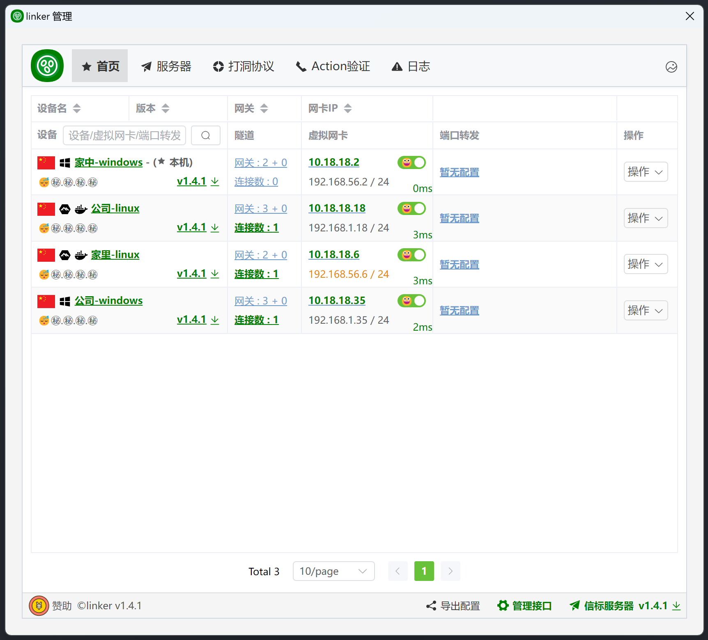

<!--
 * @Author: snltty
 * @Date: 2021-08-22 14:09:03
 * @LastEditors: snltty
 * @LastEditTime: 2022-11-21 16:36:26
 * @version: v1.0.0
 * @Descripttion: 功能说明
 * @FilePath: \client.service.ui.webd:\desktop\linker\README.md
-->

 

# .NET8.0、linker、link anywhere

<a href="https://linker.snltty.com">官方网站</a>、<a href="https://linker-doc.snltty.com">使用说明文档</a>

<a href="https://jq.qq.com/?_wv=1027&k=ucoIVfz4" target="_blank">加入组织：1121552990</a>

公共服务器，连通99.999%

## 超级叠甲

> 1. 本项目的作者和贡献者不对因使用、修改、复制或分发本代码而产生的任何形式的直接、间接、偶然、特殊或后果性损害负责。无论在何种情况下，无论是合同责任、侵权行为或其他任何法律责任，作者和贡献者均不承担任何责任。
> 2. 使用本项目代码的用户有责任确保其使用符合当地法律法规。作者和贡献者不对任何违法行为或因使用本代码而可能发生的法律问题负责。用户应确保在符合法律的范围内使用本项目。
> 3. 本项目的代码仅限用于合法、道德和合规的目的。作者严禁任何用户将其用于非法活动、攻击行为、滥用或其他不当用途，包括但不限于未经授权的访问、网络攻击等行为。
> 4. 为方便用户使用，本项目提供**公开信标服务器**、**公开中继服务器**，使用**公开信标服务器**、**公开中继服务器**时请遵守当地法律法规，作者和贡献者和服务器提供者不对任何违法行为或因使用**公开信标服务器**、**公开中继服务器**而可能发生的法律问题负责

## 主要功能
- [x] 配置加密，配置文件加密
- [x] 通信加密，所有通信均`ssl加密`
- [x] 打洞连接，TCP(支持IPV6)打洞、UDP打洞
- [x] 打洞类库，你可以使用`linker.tunnel`打洞库到你的项目中
- [x] 中继连接，先中继连接，然后偷偷打洞，打洞成功则无缝切换线路
- [x] 异地组网，使用虚拟网卡，将各个客户端组建为局域网络，`点对点`，`点对网`，`网对网`
- [x] 网卡类库，你可以使用`linker.tun` tun网卡库到你的项目中
- [x] 端口转发，将客户端的端口转发到其它客户端的端口
- [x] 服务器穿透，在服务器注册端口或域名，通过访问服务器端口或域名，访问内网服务 
- [x] 权限管理，主客户端拥有完全权限，可导出、配置子客户端配置，分配其管理权限
- [x] 自定义验证，通过`HTTP POST`让你可以自定义认证是否允许`连接信标`，`中继`，`内网穿透`
- [x] 流量统计，统计服务器`信标`、`中继`、`内网穿透` 的流量情况
- [x] 网络配置，主客户端设置网络，所有客户端自动分配IP
- [x] 分布式，多中继服务器节点，承载海量设备
- [x] socks5代理，端口转发需要指定端口，而socks5代理可以代理所有端口

## 界面预览

 

## 支持作者

请作者喝一杯咖啡，使其更有精力更新代码

 

## 感谢支持 

<a href="https://mi-d.cn" target="_blank">
 米多贝克</a>

