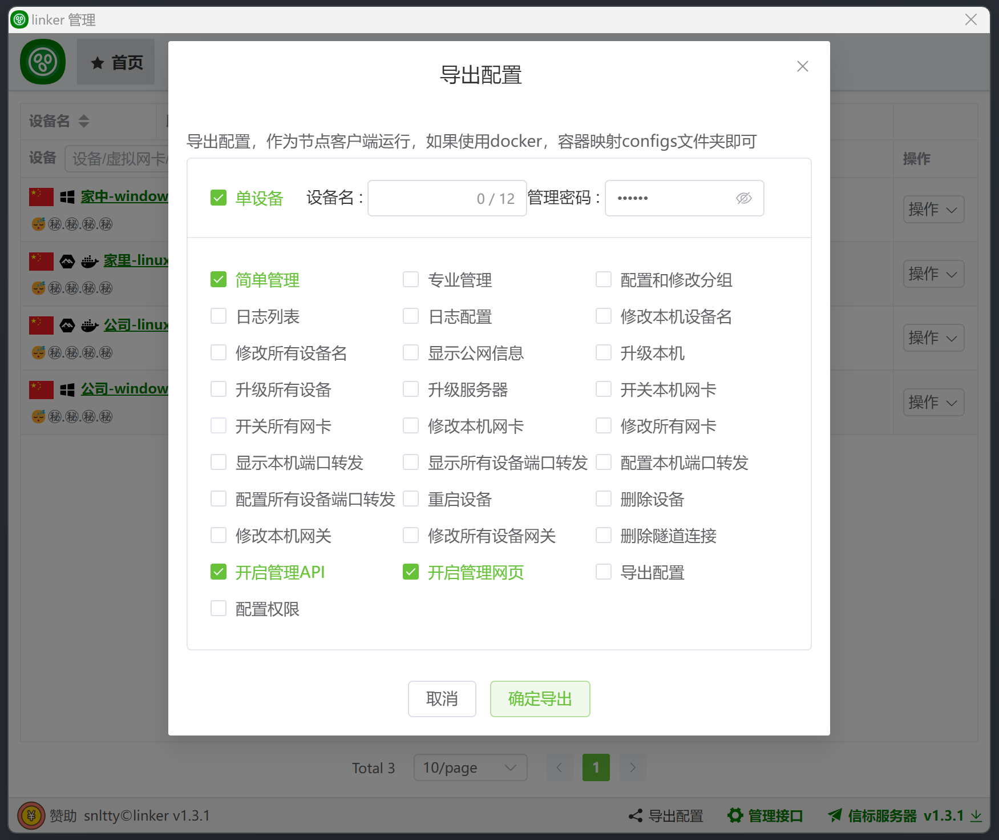
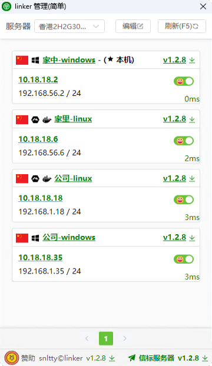

<!--
 * @Author: snltty
 * @Date: 2021-08-22 14:09:03
 * @LastEditors: snltty
 * @LastEditTime: 2022-11-21 16:36:26
 * @version: v1.0.0
 * @Descripttion: 功能说明
 * @FilePath: \client.service.ui.webd:\desktop\linker\README.md
-->

 

# .NET8.0、linker、link anywhere

<a href="https://linker.snltty.com">官方网站</a>、<a href="https://linker-doc.snltty.com">使用说明文档</a>

<a href="https://jq.qq.com/?_wv=1027&k=ucoIVfz4" target="_blank">加入 QQ 群：1121552990</a>

## 主要功能
- [x] 配置加密，配置文件加密
- [x] 通信加密，所有通信均`ssl加密`
- [x] 打洞连接，客户端之间打洞连接，TCP(支持IPV6)、UDP
- [x] 打洞类库，你可以使用`linker.tunnel`打洞库到你的项目中
- [x] 中继连接，打洞失败可无缝回退服务器转发连接
- [x] 异地组网，使用虚拟网卡，将各个客户端组建为局域网络，点对点，点对网，网对网
- [x] 网卡类库，你可以使用`linker.tun` tun网卡库到你的项目中
- [x] 端口转发，将客户端的端口转发到其它客户端的端口
- [x] 服务器穿透，在服务器注册端口或域名，通过访问服务器端口或域名，访问内网服务 
- [x] 权限管理，主客户端拥有完全权限，可导出、配置子客户端配置，分配其管理权限
- [x] 自定义验证，通过`HTTP POST`让你可以自定义认证是否允许`连接信标`，`中继`，`内网穿透`

## 打洞理论

除了`NAT4+NAT4`理论上都能通，但是也有例外，路由器可能有特殊限制，比如`SYN out, SYN in`和`ICMP Time Exceeded`
|     | NAT1 (Full Cone)  | NAT2 (Address-Restricted Cone)  | NAT3 (Port-Restricted Cone)  | NAT4 (Symmetric)  |
|  ----  | ----  | ----  | ----  | ----  |
| NAT1 (全锥型)  | √   | √  | √  | √ | 
| NAT2 (IP限制锥型) | √   | √  | √  | √ | 
| NAT3 (IP+端口限制锥型) | √   | √  | √  | √ | 
| NAT4 (对称型) | √   | √  | √  | × | 

## 界面预览

 

 

 

## 支持作者

请作者喝一杯咖啡，使其更有精力更新代码

 

## 感谢支持 

<a href="https://mi-d.cn" target="_blank">
 米多贝克</a>

