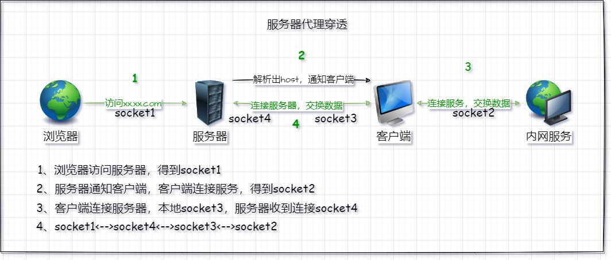

<!--
 * @Author: snltty
 * @Date: 2021-08-22 14:09:03
 * @LastEditors: snltty
 * @LastEditTime: 2022-11-21 16:36:26
 * @version: v1.0.0
 * @Descripttion: 功能说明
 * @FilePath: \client.service.ui.webd:\desktop\linker\README.md
-->
<div align="center">
<p></p> 

# linker、link anywhere


[](https://gitee.com/snltty/linker/stargazers)
[](https://gitee.com/snltty/linker/members)

<a href="./Linker.Tunnel/README.md">Linker.Tunnel 打洞库说明，在你的项目集成</a>

</div>

## 简单说明
1. 组件式
2. SSL加密
3. 使用了一些第三方库 **MemoryPack** 、**tun2socks** 、 **msquic**
4. 使用了winform、aardio 做窗体
5. <a href="https://jq.qq.com/?_wv=1027&k=ucoIVfz4" target="_blank">加入 QQ 群：1121552990</a>

## 主要功能

- [x] 打洞连接，客户端之间打洞连接，TCP打洞、MsQuic打洞 **tunnel**
    
    1. 默认msquic.dll win11+ <a target="_blank" href="https://github.com/dotnet/runtime/tree/main/src/libraries/System.Net.Quic">官方说明</a>，win10 请删除 msquic.dll，将 msquic-openssl.dll 更名为 msquic.dll
    2. linux 请按官方说明安装msquic

- [x] 中继连接，客户端之间通过服务器转发连接 **relay**

- [x] 虚拟组网，使用虚拟网卡，将各个客户端组建为局域网络 **tuntap**，使用 **tun2socks**
- [x] 端口转发，将客户端的端口转发到其它客户端的端口 **forward**
- [x] 服务器穿透，在服务器注册端口或域名，通过访问服务器端口或域名，访问内网服务 **sforward**



## 初始运行

##### 客户端
```
运行程序后，在浏览器打开 http://127.0.0.1:1804 进行初始化配置
```

##### 服务端

> 1. 修改common.json，Modes 只保留 server
> 2. 运行程序，在配置文件目录下会生成 server.json
> 3. 关闭程序，修改对应配置文件，再次运行程序

common.json
```
{
  //运行在哪个模式下，多个模式可同时存在
  "Modes": ["client","server"]
}
```
server.json
```
{
  //中继加密秘钥，当客户端与服务端秘钥不一致时，无法使用中继
  "Relay": {
    "SecretKey": ""
  },
  //监听端口
  "ServicePort": 1802,
  //服务器代理穿透配置
  "SForward": {
    //服务器代理秘钥
    "SecretKey": "",
    //网页端口，可以根据域名区分不同客户端
    "WebPort": 8088,
    //隧道端口范围，根据不同端口区分不同客户端
    "TunnelPortRange": [
      10000,
      60000
    ]
  },
}
```

## 安装示例

##### 1、windows
```
使用 linker.tray.win.exe
```

##### 2、linux  systemd
```
//1、下载linux版本程序，放到 /usr/local/linker 文件夹，并在文件夹下创建一个 log 目录

//2、 修改文件权限
chmod 0777 linker
chmoe 0777 plugins/tuntap/tun2socks

//3、写配置文件
vim /etc/systemd/system/linker.service

[Unit]
Description=linker

[Service]
WorkingDirectory=/usr/local/linker
ExecStart=/usr/local/linker/linker
ExecStop=/bin/kill $MAINPID
ExecReload=/bin/kill -HUP $MAINPID
Restart=always

[Install]
WantedBy=multi-user.target


//4、重新加载配置文件
systemctl daemon-reload

//5、启动，或者重新启动
systemctl start linker
systemctl restart linker

//6、设置为自启动
systemctl enable linker
```

##### linux docker
```
snltty/linker-alpine-x64
snltty/linker-alpine-arm64
```

## 发布项目

##### 2、发布脚本
```
publish.bat

public/publish 目录下查看已发布程序
```


## 支持作者

<div align="center">
请作者喝一杯咖啡，使其更有精力更新代码
<p></p> 
</div>
