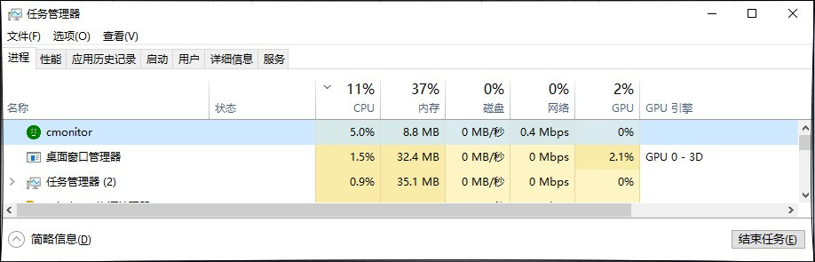
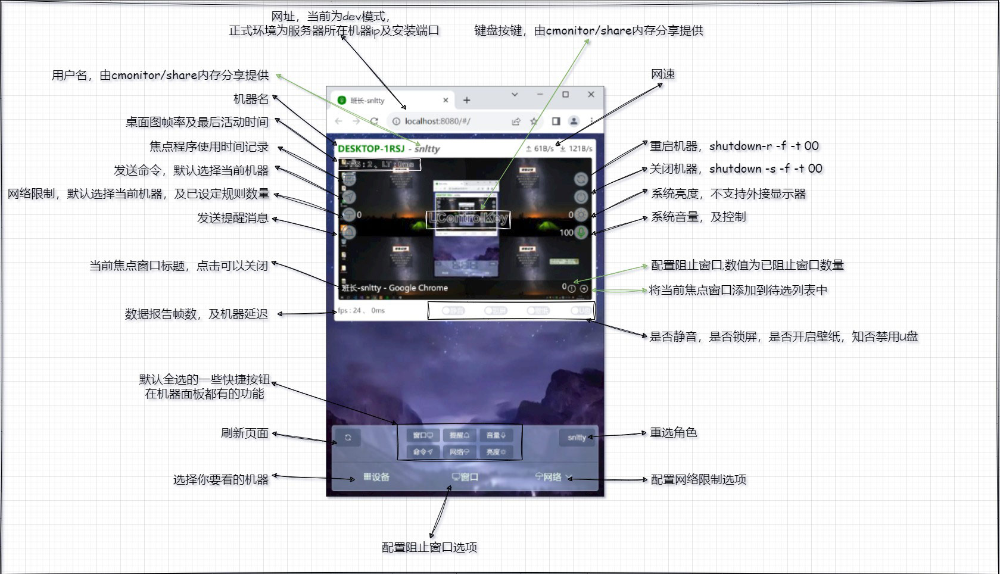

<!--
 * @Author: snltty
 * @Date: 2021-08-22 14:09:03
 * @LastEditors: snltty
 * @LastEditTime: 2022-11-21 16:36:26
 * @version: v1.0.0
 * @Descripttion: 功能说明
 * @FilePath: \client.service.ui.webd:\desktop\cmonitor\README.md
-->
<div align="center">
<p></p> 

# class monitor
#### Visual Studio 2022 LTSC 17.4.1
<a href="https://jq.qq.com/?_wv=1027&k=ucoIVfz4" target="_blank">QQ 群：1121552990</a>


[](https://gitee.com/snltty/cmonitor/stargazers)
[](https://gitee.com/snltty/cmonitor/members)

适合教培机构计算机教室监控

</div>

## 说明
1. 这是一个粗略的局域网监控程序（说是局域网，你放外网也不是不行）
2. 使用组件式，非常方便扩展，可由 **内存共享(MemoryMappedFiles)** 提供自己定义数据
3. 内存占用小，（非定时，自动GC），linux无解
4. 使用 **MemoryPack**、**SharpDX**、**NAudio**

<p></p> 

## 功能
###### 系统
- [x] 桌面捕获，捕获鼠标，**sharpDX**
    - [x] 登录界面捕获和登录页面键盘输入
    - [x] 双指画面缩放
    - [ ] 区域热更新
- [x] 功能禁用，禁用各种系统功能 **regedit**
    - 任务栏锁定，任务栏设置，任务栏菜单
    - 任务管理器
    - 注册表编辑，组策略编辑
    - 设置，保存设置
    - 修改主题，修改壁纸，颜色外观
    - 桌面图标
    - 屏幕保护，唤醒登录，关屏锁屏
    - 关机按钮，注销按钮，锁定按钮，修改密码，切换用户
    - 安全SAS
    - 禁用U盘
- [x] 系统信息，展示CPU，内存利用率，硬盘使用率，发呆时间 **win api**
- [x] 音量控制，音量和静音 **NAudio**
- [x] 音频峰值，展示音频峰值，是否在播放音视频，及激昂程度 **NAudio**
- [x] 系统亮度，暂不支持外界显示器 **WMI**
- [x] 模拟键盘，键盘操作，模拟ctrl+alt+delete，模拟win+l，等等 **win api**
- [ ] 模拟鼠标，鼠标操作 **win api**
###### 程序
- [x] 程序限制，分为禁止打开程序，和自定检测关闭程序 **regedit**
- [x] 前景窗口，当前焦点程序捕获，手动关闭之 **win api**
- [x] 时间统计，查看程序使用时间记录
###### 网络
- [x] 网络限制，程序，域名，IP 黑白名单
- [x] 网速显示，由网络限制组件提供
###### 消息
- [x] 消息提醒，向设备发送消息提醒 **winform**
- [x] 全局广播，向所有设备发送广播 **winform**
- [ ] 语音消息，向设备发送语音消息 **NAudio**
###### 命令
- [x] 发送命令，执行cmd命令，等等
###### 共享
- [ ] 屏幕共享，以某一设备为主机，向其它设备共享屏幕，用于演示 **sharpDX**
###### 壁纸
- [x] 壁纸程序，为所有设备设置统一壁纸，以程序的方式 **winform**
- [x] 键盘按键，显示键盘按键(当前键盘按键由壁纸程序提供) **win api**
###### 锁屏
- [x] 锁屏程序，打开锁屏程序，禁用键盘 **winform**
###### 其它
- [x] 设备用户，显示当前使用设备用户姓名 **MemoryMappedFiles**


## 面板
<p></p> 

## 运行参数

###### 公共的
1. **【--mode】** 运行模式 **client,server**
2. **【--report-delay】** 数据报告间隔ms **30**
3. **【--screen-delay】** 屏幕报告间隔ms **200**
4. **【--screen-scale】** 屏幕图片缩放比例 **0.2** 默认1/5

###### 客户端
1. **【--server】** 服务器ip  **192.168.1.18**
2. **【--service】** 服务端口 **1802**
3. **【--share-key】** 自定数据共享 **cmonitor/share**，每项数据长度255,klen+key+vlen+value
4. **【--share-len】** 数量 **10**，默认10项位置，0键盘、1壁纸、2锁屏，3 SendSAS，-1项保留自用不可动

###### 服务端
1. **【--web】** 管理UI端口 **1800**
2. **【--api】** 管理接口端口 **1801**
3. **【--service】** 服务端口 **1802**

## 安装示例
##### windows计划任务，客户端、服务端
也可以运行 comitor.install.win.exe 进行安装操作
```
params = " --report-delay 30 --screen-delay 200 --screen-scale 0.2";
//client
params += " --mode client --name cmonitor --server 192.168.1.18 --service 1802";
params += " --share-key cmonitor/share --share-len 2550";

//server
params = " --mode server --web 1800 --api 1801 --service 1802";

schtasks.exe /create /tn "cmonitor" /rl highest /sc ONLOGON /delay 0000:30 /tr "\"{exePath}\"{params}" /f
```
##### linux服务端 systemd
```
//1、下载linux版本程序，放到 /usr/local/cmonitor 文件夹，并在文件夹下创建一个 log 目录

//3、写配置文件
vim /etc/systemd/system/cmonitor.service

[Unit]
Description=cmonitor

[Service]
WorkingDirectory=/usr/local/cmonitor
ExecStart=/usr/local/cmonitor/cmonitor --mode server --web 1800 --api 1801 --service 1802
ExecStop=/bin/kill $MAINPID
ExecReload=/bin/kill -HUP $MAINPID
Restart=always

[Install]
WantedBy=multi-user.target


//4、重新加载配置文件
systemctl daemon-reload
//5、启动，或者重新启动
systemctl start cmonitor
systemctl restart cmonitor
```

##### linux服务端 docker
docker镜像 snltty/cmonitor-alpine-x64 or snltty/cmonitor-alpine-arm64
```
docker run -it -d --name="cmonitor" \ 
-p 1800:1800/tcp -p 1801:1801/tcp -p 1802:1802/tcp -p 1802:1802/udp \ 
snltty/cmonitor-alpine-x64 \
--entrypoint ./cmonitor.run  --mode server --web 1800 --api 1801 --service 1802
```

##### Ctrl+Alt+Delete 服务
由于使用**SendSAS**模拟**Ctrl+Alt+Delete**，需要以windows service方式运行，所以需要将 cmonitor.sas.service.exe 安装到服务中，可以使用 sc create创建服务，不需要此功能可以不安装
``` 
sc create "cmonitor.sas.service" 
binpath="xx\xx\cmonitor.sas.service.exe {--share-key} {--share-len} 3" 
start=AUTO 
```

## 发布项目
1. nodejs 16.17.0
2. netframework 4.5 加入环境变量，以能够使用msbuild，应该是 **C:\Windows\Microsoft.NET\Framework\v4.0.30319** 目录
3. NET7.0 SDK
4. 进入根目执行
```
./publish
```
5. 在 /public/publish 目录下查看已发布程序

## 支持作者

<div align="center">
请作者喝一杯咖啡，使其更有精力更新代码
<p></p> 
</div>
