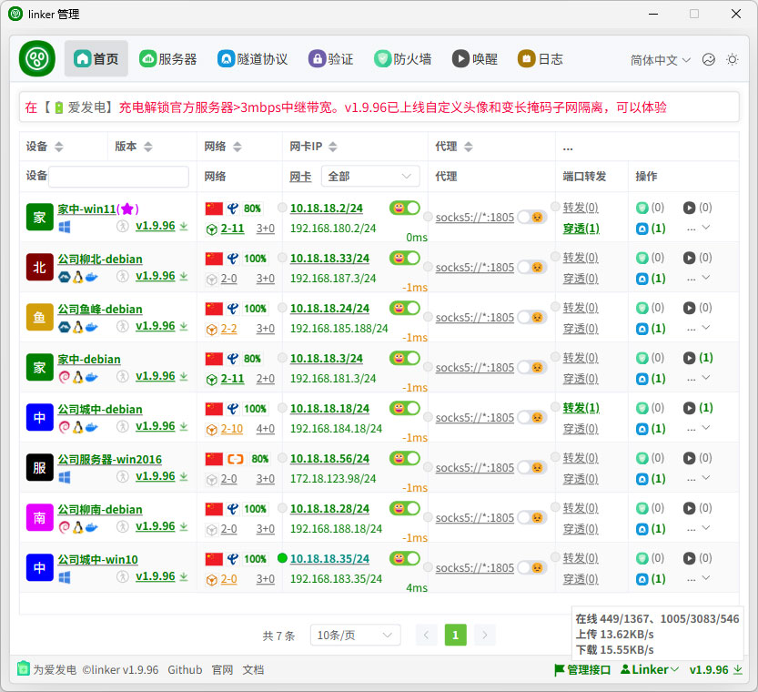

<!--
 * @Author: snltty
 * @Date: 2021-08-22 14:09:03
 * @LastEditors: snltty
 * @LastEditTime: 2022-11-21 16:36:26
 * @version: v1.0.0
 * @Descripttion: 功能说明
 * @FilePath: \client.service.ui.webd:\desktop\linker\README.md
-->

 

# linker

让你那些散落在世界各地的联网设备就像在隔壁房间一样轻松访问。

<a href="https://linker.snltty.com">官方网站</a>、<a href="https://linker-doc.snltty.com">使用说明文档</a>、<a href="https://jq.qq.com/?_wv=1027&k=ucoIVfz4" target="_blank">加入组织：1121552990</a>

## [🎖️]主要功能

### 1、私有部署
- **私有部署:** 私有部署服务端，信息更安全。
- **多平台支持:** 支持`windows、linux、android、docker、openwrt、各种NAS`。

### 2、打洞中继
- **打洞连接:** 支持`TCP、UDP、IPV4、IPV6`，内含多种打洞方法，总有一个适合你。
- **中继连接:** 自建中继节点，支持多中继节点，承载海量设备。

### 3、通信方式
- **异地组网:** 使用虚拟网卡，支持`点对点、点对网、网对网、自动分配虚拟IP`。
- **端口转发:** 如果你不喜欢使用虚拟网卡的话。
- **Socks5:** 区别于端口转发，端口转发两端一一对应，需要指定端口，而socks5代理可以代理所有端口，实现类似于点对网的效果。
- **服务器穿透:** 使用端口或域名访问内网服务(支持`计划任务`，定时定长自动开启关闭，例如每天在上9点自动开启穿透，1小时后自动关闭穿透)。

### 4、特色功能
- **TCP over TCP优化:** 不依赖第三方应用层协议栈，仅tun网卡内自转发实现转代理。
- **网段映射:** 当多个设备不同的局域网使用相同的内网网段（如`192.168.1.0/24`）存在冲突时，网段映射可以让你继续顺利的使用点对网和网对网，例如配置`192.168.188.0/24->192.168.1.0/24`，就可以使用`192.168.188.2`访问`192.168.1.2`。
- **应用层NAT:** 内置了使用应用层代理NAT，在无法使用系统NAT时也可以顺利使用点对网和网对网。
- **应用层防火墙:** 内置了防火墙功能，应用于虚拟网卡、端口转发、socks5，可以精细控制客户端的访问权限，例如只允许A访问B的3389，其它客户端无法访问
- **远程唤醒:** 可以通过`WOL魔术包、USB COM继电器、USB HID继电器`远程唤醒局域网内的设备

## [🖼️]管理页面

 

## [⭐]星星历史

## [🎁]为爱发电

若此项目对您有用，可以考虑对作者稍加支持，让作者更有动力，在项目上投入更多时间和精力

<strong>感谢名单</strong>

- 米多贝克&米多网络工程
- 旋律 * 3
- 阳阳
- 谢幕____(海那边的白月光)
- swayer.
- 浅浅
- 仰望 * 2
- 李氏の天下
- 小猪 * 2
- 菜菜(木子) * 3
- 杰米儿
- Oasis
- 坦然
- littleexe
- 黄品(Pim Hwang)
- GoodGoodStudy

**[🔋为爱发电](https://afdian.com/a/snltty)**、或

## [👏]特别说明

本项目已加入 [DotNetGuide](https://github.com/YSGStudyHards/DotNetGuide)  列表。 
本项目已加入 [dotNET China](https://gitee.com/dotnetchina)  组织。 

## [🚫]免责声明

本软件基于 [GPL-2.0 License](https://opensource.org/licenses/GPL-2.0) 发布，完全免费提供，旨在“按现状”供用户使用。作者及贡献者不对使用本软件所产生的任何直接或间接后果承担责任，包括但不限于性能下降、数据丢失、服务中断、或任何其他类型的损害。

**无任何保证**：本软件不提供任何明示或暗示的保证，包括但不限于对特定用途的适用性、无侵权性、商用性及可靠性的保证。

**用户责任**：使用本软件即表示您理解并同意承担由此产生的一切风险及责任，使用人员有责任和义务遵守当地法律条规，请勿用于违法犯罪。

