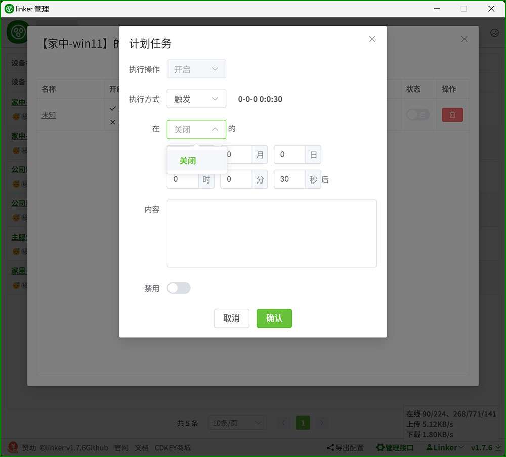
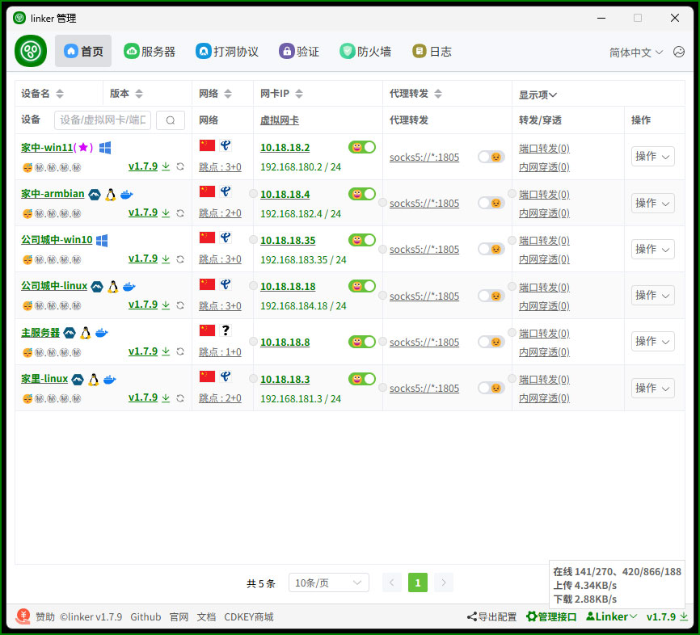

<!--
 * @Author: snltty
 * @Date: 2021-08-22 14:09:03
 * @LastEditors: snltty
 * @LastEditTime: 2022-11-21 16:36:26
 * @version: v1.0.0
 * @Descripttion: 功能说明
 * @FilePath: \client.service.ui.webd:\desktop\linker\README.md
-->

 

# .NET8.0、linker、link anywhere

<a href="https://linker.snltty.com">Website</a>、<a href="https://linker-doc.snltty.com">Documentation</a>、<a href="https://jq.qq.com/?_wv=1027&k=ucoIVfz4" target="_blank">Join QQ Group</a>

[README](README.md) | [中文说明](README_zh.md)

Users are responsible for complying with local laws and regulations. It must not be used for illegal or criminal purposes.

## Overview

Using P2P or server relay, connect multiple LANs to enable communication between any networked devices across these LANs.

 

## Platforms

|  | amd64 | x86 | arm64 | arm | 
|-------|-------|-------|-------|-------|
| Windows | ✔ | ✔ |✔ | |
| Linux | ✔ |  |✔ |✔ |
| Linux Musl | ✔ |  |✔ |✔ |
| Openwrt | ✔ |  |✔ |✔ |
| Android | ✔ |  |  | |

## Features

##### P2P & Relaying
- [x] Hole punching connections, supporting TCP, UDP, IPv4, and IPv6
- [x] Relay connections, with self-hosted relay nodes and support for multiple relay nodes

##### Communication
- [x] Cross-region networking: peer-to-peer, peer-to-network, network-to-network, automatic virtual IP allocation, subnet mapping (resolving multi-LAN subnet conflicts)
- [x] Port forwarding: forwards a client's port to another client's port
- [x] Server penetration: access internal network services via ports or domains (supports scheduled tasks for timed auto-enabling/disabling)
- [x] SOCKS5 proxy: while port forwarding requires specifying ports, the SOCKS5 proxy can handle all ports

##### Other
- [x] Encrypted configuration files
- [x] Permission management: the main client has full control, allowing the export and configuration of sub-client settings and delegated admin rights
- [x] Custom authentication: via HTTP POST, you can define verification rules for allowing connection beacons, relays, and intranet penetration
- [x] Traffic statistics: monitors traffic for beacons, relays, and intranet penetration on the server
- [x] CD-KEY: temporarily unlocks certain restrictions, such as relays and intranet penetration

## Development
- [x] Uses the linker.tunnel library for hole punching
- [x] Uses the linker.tun virtual NIC library, including Linux TUN and Windows Wintun adapters, NAT conversion, and subnet mapping
- [x] Uses the linker.snat library for NAT conversion
- [x] Uses linker.messenger.entry for full-feature integration

## Network Mapping
Network mapping can help you resolve conflicts between multiple internal network.

 

## Src NAT
Built-in SNAT enables you to use the point-to-site functionality even on Windows 7/8 and Windows Server 2008/2012 where NetNat is unavailable.

 

## Plan Task
Schedule tasks to control activation and deactivation timing.

 

## Management Website

 

## Support the Author

Buy the author a coffee to keep the project alive!

 

## Special Thanks 

<a href="https://mi-d.cn" target="_blank">
     米多贝克</a>

