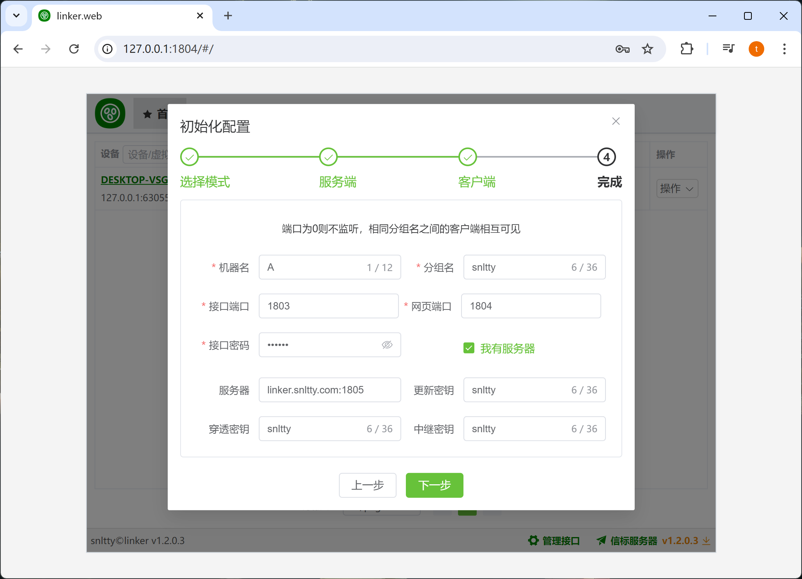
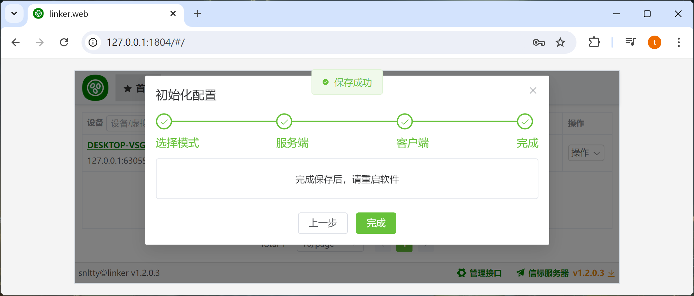

# 2.2、初始化配置

## 1、服务端手动修改配置文件

:::tip[服务端运行流程]
1. 运行程序，在configs目录下会生成 common.json server.json
2. 关闭程序
3. 修改common.json，Modes 只保留 server
4. 修改server.json
5. 再次运行程序


common.json
```
{
  //运行在哪个模式下，多个模式可同时存在
  "Modes": ["client","server"]
}
```
server.json
```
{
  //中继
  "Relay": {
    //中继密钥
    "SecretKey": "E779B46C-1373-4A1A-8E8D-76E47F783875",
    "BufferSize": 3
  },
  //服务端端口
  "ServicePort": 1802,
  //证书
  "Certificate": "./snltty.pfx",
  //证书密码
  "Password": "oeq9tw1o",
  //服务器穿透
  "SForward": {
    //穿透密钥
    "SecretKey": "E0CE0555-D31F-4C40-9861-FF892BAA0723",
    "BufferSize": 3,
    //HTTP端口
    "WebPort": 8080,
    //隧道端口范围
    "TunnelPortRange": [
      10000,
      60000
    ]
  },
  //信标密钥
  "SignIn": {
    "SecretKey": ""
  },
  //更新密钥
  "Updater": {
    "SecretKey": "6F45460C-CE40-4E20-867E-890BA39D9BB1"
  }
}
```
:::

## 2、客户端使用web初始化

:::tip[说明]
1. 运行程序后,浏览器打开<a href="http://127.0.0.1:1804" target="_blank">http://127.0.0.1:1804</a>
2. 如果你自己部署了服务端，你可以勾选**我有服务器**，填写你部署的服务端的各种信息




:::


