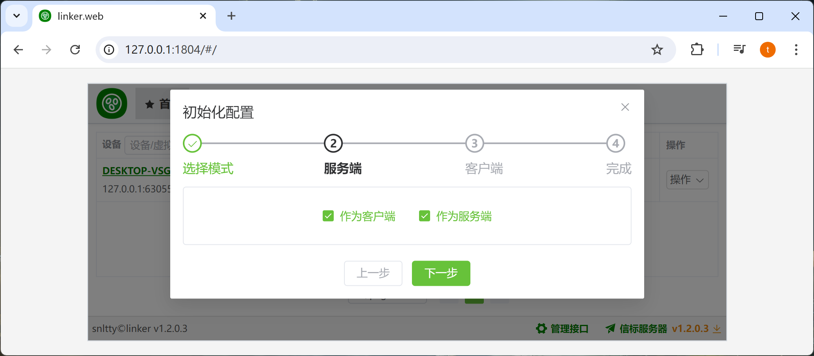

# 2.2、初始化配置

## 1、使用web初始化

运行程序后,浏览器打开<a href="http://127.0.0.1:1804" target="_blank">http://127.0.0.1:1804</a>




:::danger[重要说明]
如果你自己部署了服务端，你可以勾选**我有服务器**，填写你部署的服务端的各种信息
:::


## 2、手动修改配置文件

:::danger[重要说明]
1. 一般来说，仅作为服务端时，才选择这种方式，否则你应该使用web初始化
2. 服务端模式下，需要配置server.json，且服务端没有webui，也没有其它配置，只有server.json
:::

:::tip[服务端运行流程]
1. 运行程序，在configs目录下会生成 common.json server.json
2. 关闭程序
3. 修改common.json，Modes 只保留 server
4. 修改server.json
5. 再次运行程序
:::

common.json
```
{
  //运行在哪个模式下，多个模式可同时存在
  "Modes": ["client","server"]
}
```
server.json
```
{
  //中继加密秘钥，当客户端与服务端秘钥不一致时，无法使用中继
  "Relay": {
    "SecretKey": ""
  },
  //信标服务监听端口
  "ServicePort": 1802,
  //服务器代理穿透配置
  "SForward": {
    //服务器代理秘钥
    "SecretKey": "",
    //网页端口，可以根据域名区分不同客户端
    "WebPort": 8088,
    //隧道端口范围，根据不同端口区分不同客户端
    "TunnelPortRange": [
      10000,
      60000
    ]
  },
  //服务器更新密钥，客户端配置这个密钥，可以更新服务端
  "Updater": {
    "SecretKey": "46760C6B-5EA8-4FCB-B342-1D16A7CE9773"
  },
}
```