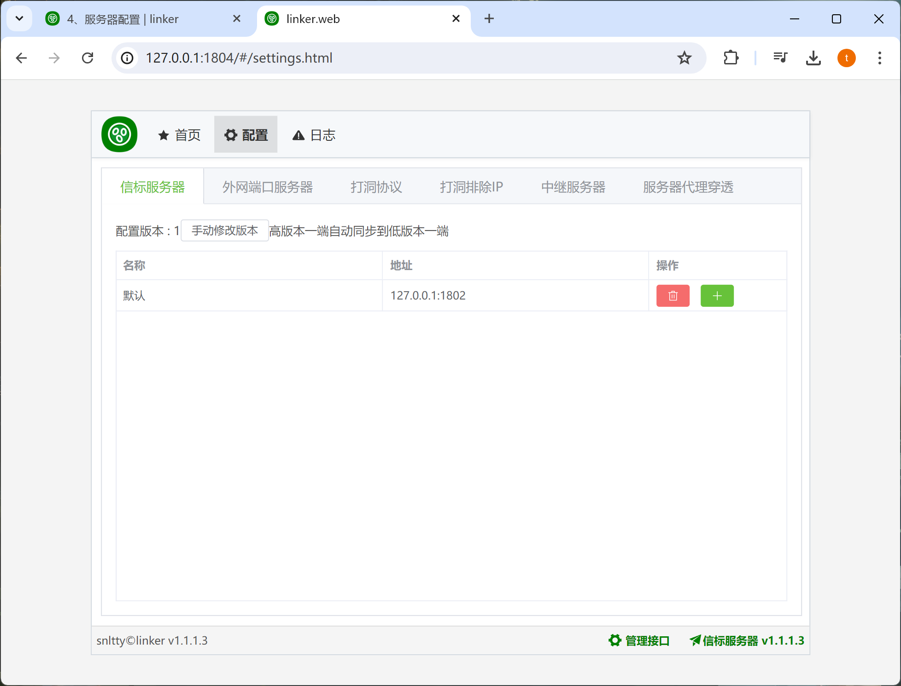

# 2.3、使用你自己的服务器

:::danger[说明]
下面这些配置，只有在你自己部署了服务端的时候才需要修改
:::

## 2、看图

:::tip[]
1. **信标服务器**，客户端之间交换信息，比如打洞，需要交换外网IP和外网端口
2. **端口服务器**，用于获取客户端外网IP和外网端口，协助打洞
3. **中继服务器**，用于在打洞失败后使用服务器中转进行通信，请填写你服务端的中继密钥
4. **服务器穿透**，就是内网穿透，你需要填写服务端的密钥
5. **服务器更新**，填写你服务器的更新密钥，让你的客户端有权自动更新服务器
:::

