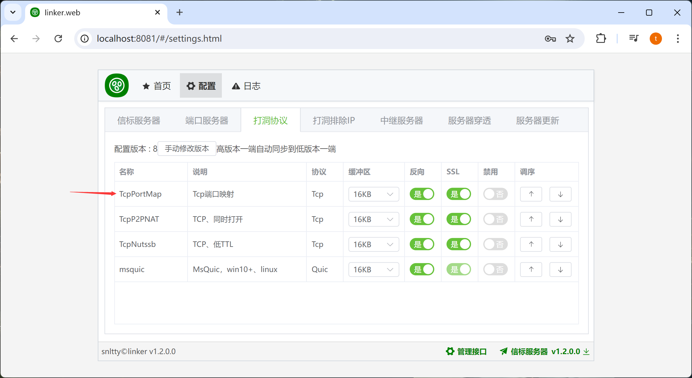

# 4.3、端口映射

:::tip[说明]

这适合什么场景呢
1. 你有公网IP，你可以在光猫或者路由器映射端口
2. 你希望只用一个端口，去访问多个服务
3. 你AB两端，只有A有公网IP，可以映射，你希望A可以通过这个映射端口去访问B的多个服务

:::

## 2、打洞协议调整

在光猫或路由器配置好端口映射后，填写你的映射端口，两台将要连接的设备之间，有一台做映射即可。

## 3、调整打洞协议的顺序

确保支持这种连接方式的打洞协议(**TcpPortMap**、**UdpPortMap**)排在前面，这样才会优先去连接你的映射端口

