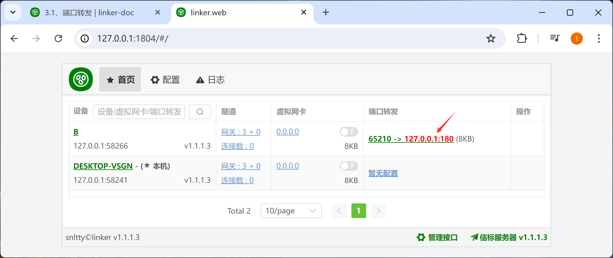

# 3.1、端口转发

## 1、配置端口转发

1. 在 **非本机** 设备上，端口转发一栏，表示要从本机指定端口转发数据到此目标设备的指定服务
2. 如果显示 **暂无配置**，表示未配置端口转发，可以点击，展开配置端口转发窗口。
3. 如果已经配置过端口转发，则显示端口转发列表

1. 点击**添加**按钮，添加一项转发
2. 可以自行选择 缓冲区大小，监听IP，可以双击 **名称**、**监听端口**、**目标服务**一栏进行修改
3. 当 **监听端口** 为 **0** 时，启动转发后，会随机配置端口
4. **目标服务**为目标设备上的服务，不是本机的服务
5. 配置完成后，在 **状态**一栏，选择开启或关闭转发

## 2、可能存在的问题

1. 当开启转发后，如果目标服务显示为红色，表示无法正常访问，一般是目标设备上不存在此服务
2. 如果是端口一栏为红色，表示监听失败，一般为端口已被其它程序占用
3. 此时，在配置转发面板，鼠标放上去，会看到一些基本的错误信息

## 3、如果没有问题

如果都是绿色的，那么久可以通过 **127.0.0.1:65210** 访问到目标设备的**127.0.0.1:180**服务