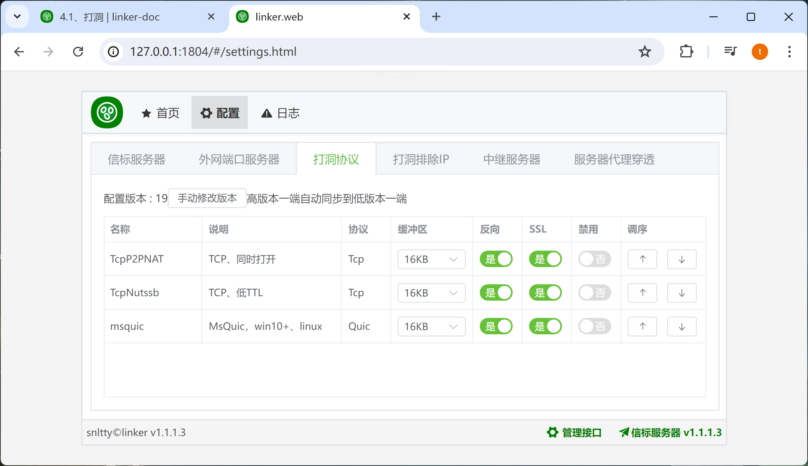
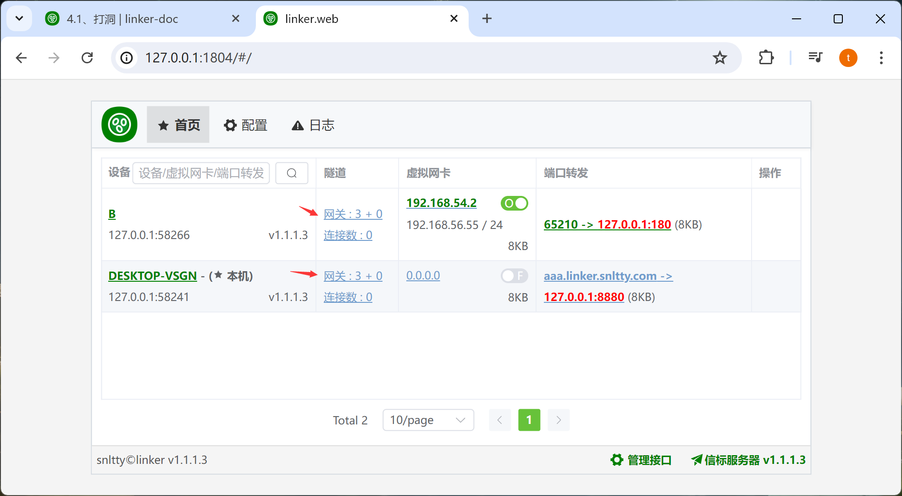

# 4.1、打洞

## 1、支持msquic

1. 在windows，如果提示不支持msquic，可以到 <a target="_blank" href="https://github.com/microsoft/msquic/releases/latest">msquic</a> 下载合适你系统的版本，覆盖根目录下的msquic.dll，一般来说，win10或以下版本，需要openssl版本的msquic
2. 再linux，请按<a target="_blank" href="https://github.com/dotnet/runtime/tree/main/src/libraries/System.Net.Quic">官方说明</a>安装msquic

## 2、打洞协议调整

在 配置、打洞协议、中，你可以做一些调整，调整协议使用顺序。或者是否禁用一些打洞协议

## 3、调整网关层级

TCP打洞，UDP打洞大都依赖于网关层级，默认网关层级是自动计算的，你也可以手动指定网关层级，这很有可能有助于打洞

