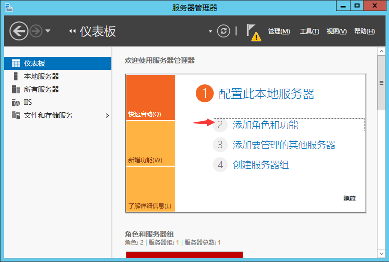
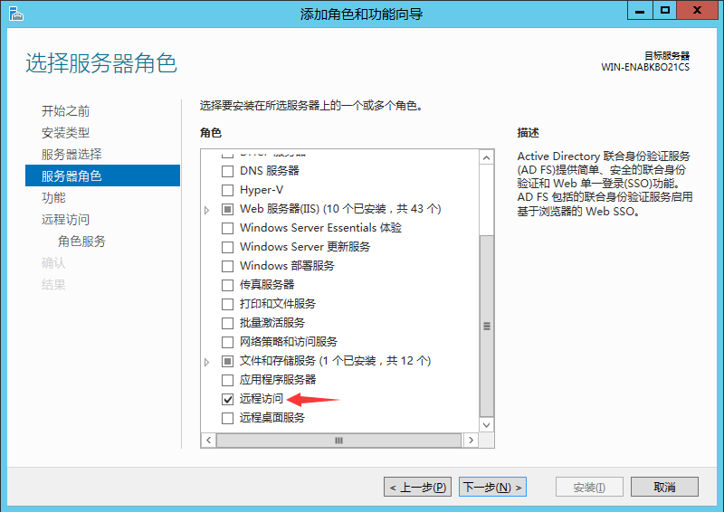
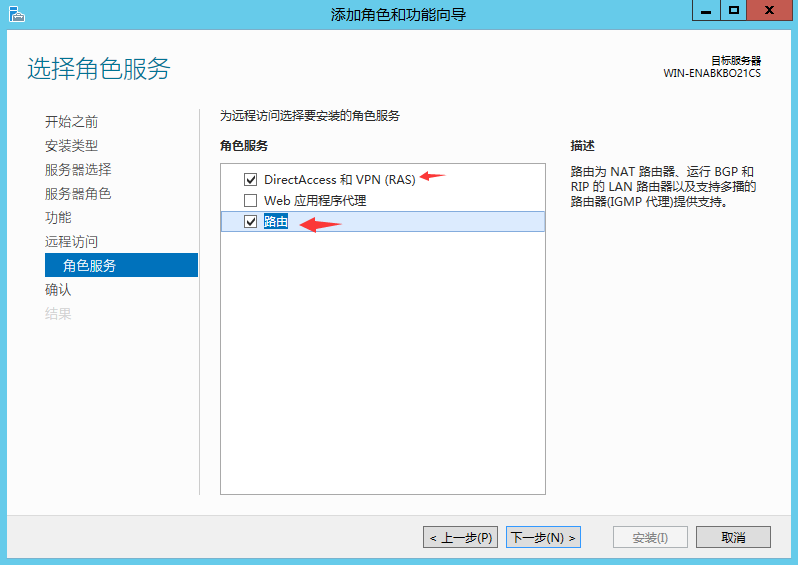
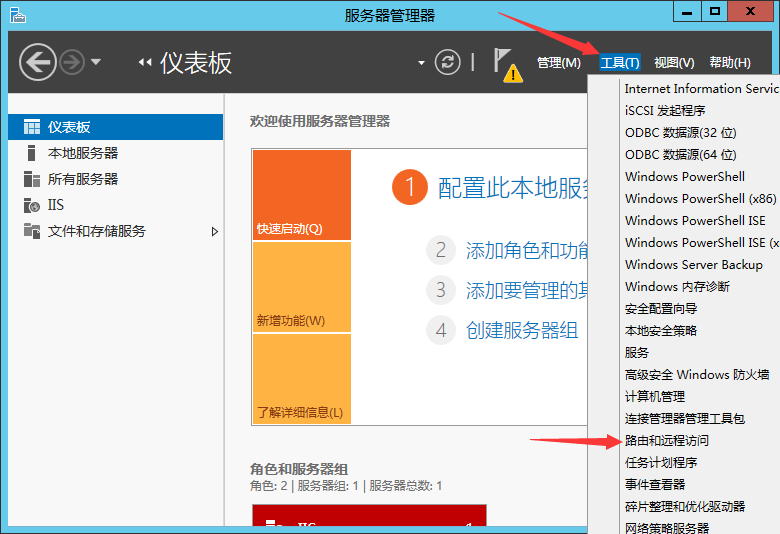
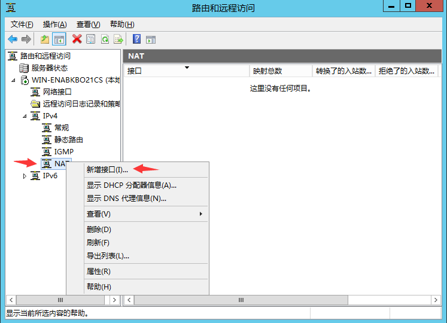
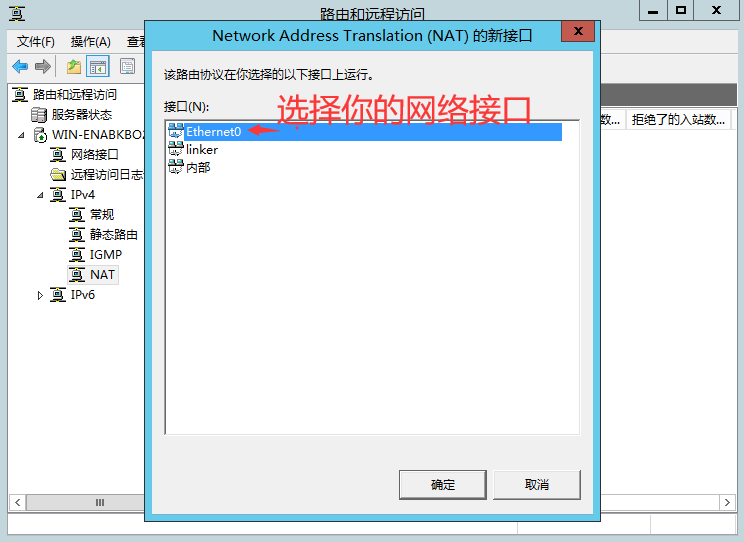
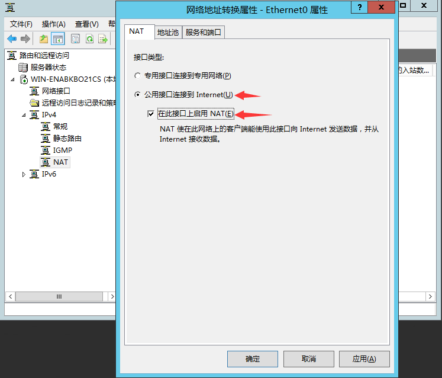

# 3.1.1.2、RRAS

:::danger[说明]
可能有问题，先不要用，先不要用，先不要用，先不要用，先不要用，先不要用，先不要用，先不要用，先不要用，先不要用，先不要用，
:::

:::tip[说明]

1. 在windows server中，你可以选择使用RRAS(Routing and Remote Access Service) 来启用NAT，从而实现点对网
:::

:::danger[说明]
所有步骤已经结束了，没有其它操作
:::