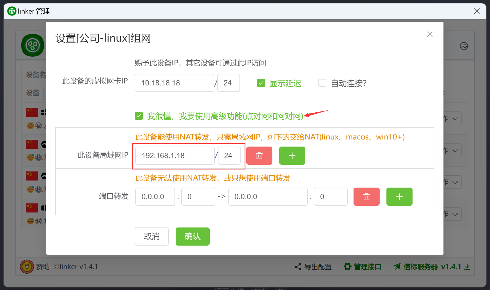
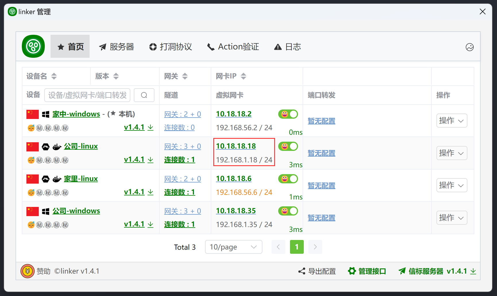
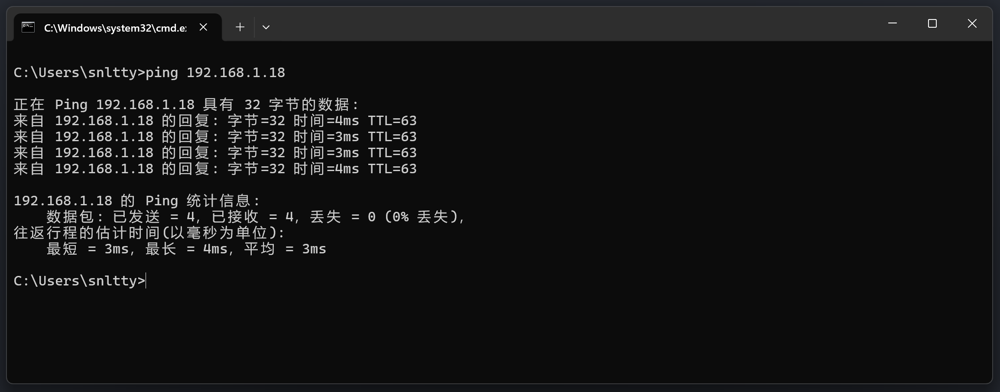

# 3.1.1、点对网

:::danger[重要]
你要确定你知道你在搞什么，如果只是简单的P2P通信，上面的内容已经够了，以下的东西不要看，不要看，不要看
:::

:::tip[1、情况1，你的设备支持NAT转发时]

1. linux，已经自动添加NAT转发
2. windows，暂时找到两种NAT方式
    1. NetNat，<a href="./3.1.1.1、NetNat">请参照 3.1.1.1、NetNat</a>
    2. RRAS，<a href="./3.1.1.2、RRAS">请参照3.1.1.2、RRAS(Routing and Remote Access Service)</a>
3. macos，需要你自己在**被访问端**添加NAT转发
```
# 开启ip转发
sudo sysctl -w net.ipv4.ip_forward=1
# 配置NAT转发规则
# 在/etc/pf.conf文件中添加以下规则,10.18.18.0/24是来源网段
nat on en0 from 10.18.18.0/24 to any -> (en0)
# 加载规则
sudo pfctl -f /etc/pf.conf -e
```

这里我`公司-linux`的局域网IP为`192.168.1.18`，配置完成后，即可访问其所在局域网`192.168.1.18/24`的所有设备




:::


:::tip[2、情况2，你的设备无法使用NAT转发时]

1. 你的设备无法使用NAT转发(一般出现在低版本windows下，win10以下)，那你只能使用端口转发功能来访问你当前设备局域网下的其它设备
2. 按如下配置。当其它设备通过`10.18.18.18:33890` 访问时，将访问到你的局域网的`192.168.1.35:3389`
3. macos下需要你自己在**被访问端**添加端口转发
```
//编辑 pf 配置文件
sudo nano /etc/pf.conf

//添加转发规则
rdr pass on en0 inet proto tcp from any to any port 33890 -> 192.168.1.35 port 3389
rdr pass on en0 inet proto udp from any to any port 33890 -> 192.168.1.35 port 3389

//启用并重新加载 pf
sudo pfctl -f /etc/pf.conf
sudo pfctl -e
```


:::

