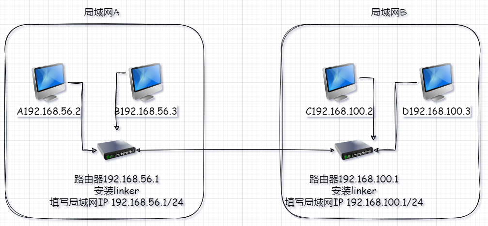
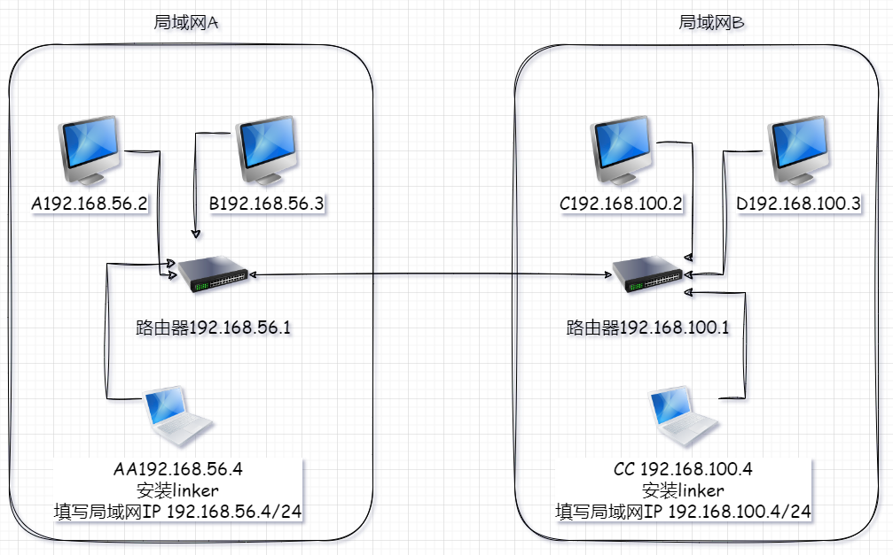

# 3.1.2、网对网

仅 linux 下，支持网对网（安装linker的设备，局域网内设备无限制），windows暂时未找到方法

:::tip[在网关]

1. 如果你把linker安装在路由器上，则已经支持网对网
2. A、B、C、D相互连通，因为默认已经有 `0.0.0.0` 路由到路由器

:::

:::danger[不在网关]

1. 如果你无法将linker安装在路由器上
2. 这时，你需要添加路由，将需要访问的IP，路由到安装linker的设备上，通过这个设备去访问对方的设备
3. A、B 添加路由，例如windows `route add 192.168.100.0 mask 255.255.255.0 192.168.56.4`
3. C、D 添加路由，例如windows `route add 192.168.56.0 mask 255.255.255.0 192.168.100.4`

:::
