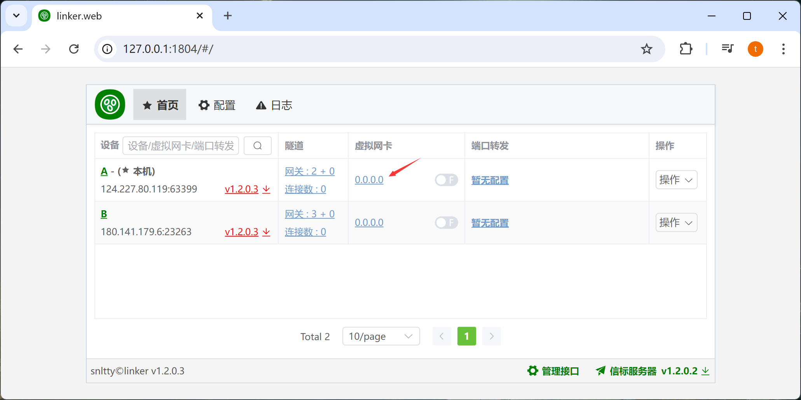
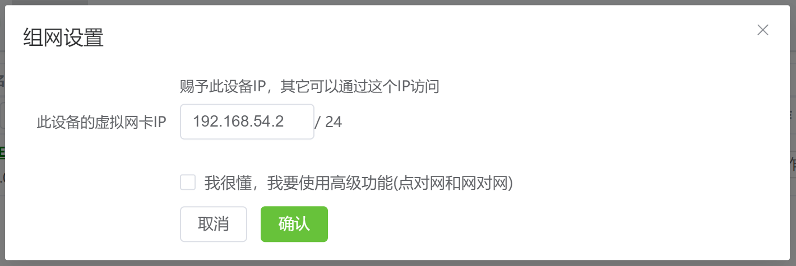
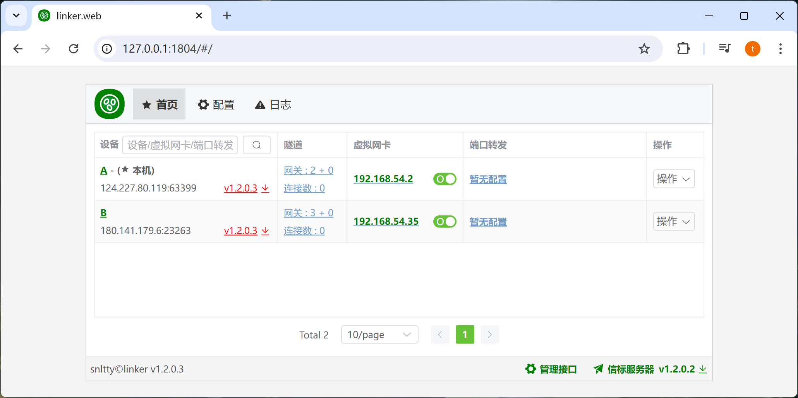

# 3.1、虚拟网卡

:::tip[说明]

1. 各个设备的`网卡IP`，不要一样，要同一网段，且不应该使用`1`、`255`
2. 请使用 `10.0.0.0 - 10.255.255.255`、`172.16.0.0 - 172.31.255.255`、`192.168.0.0 - 192.168.255.255` 范围内的IP 
3. 虽然支持UDP广播，但是UDP广播不会去主动连接所有设备，所以，你可以先 ping 以下对方，让两端相互连接
:::

## 1、配置虚拟网卡IP

在设备，虚拟网卡一栏，点击IP配置

开启网卡成功后，即可通过`虚拟IP`访问目标设备(当然，前提是能够打洞成功，或者中继成功)

试一下能不能连接，第一次连接时，会尝试去打洞或中继，时间可能会比较久，耐心等待

