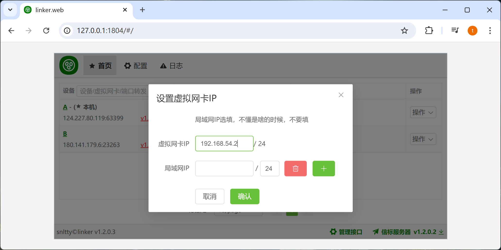
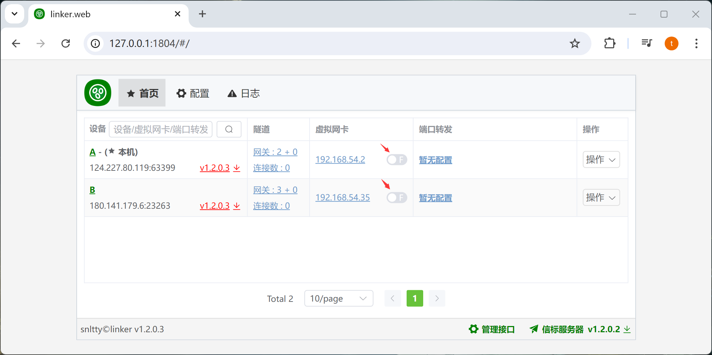
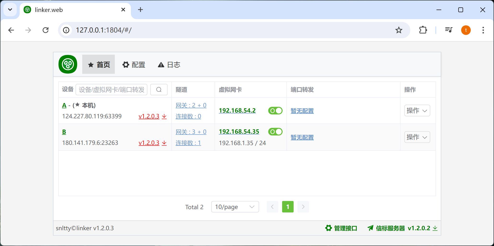
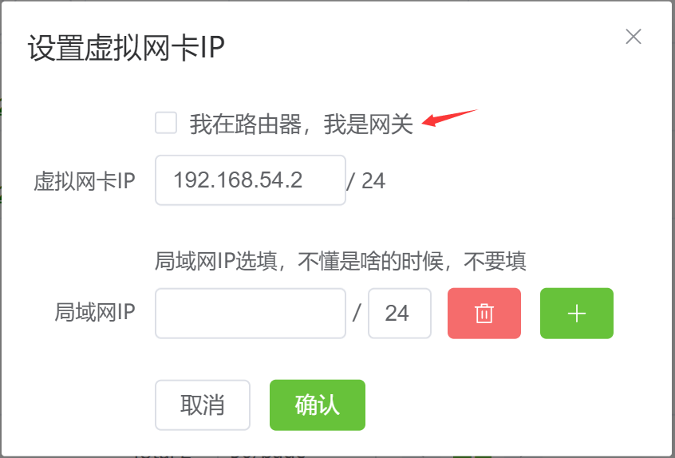

# 3.1、虚拟网卡

:::tip[说明]

1. 各个设备的`网卡IP`，不要一样，要同一网段，且不应该使用`1`、`255`
2. 请使用 `10.0.0.0 - 10.255.255.255`、`172.16.0.0 - 172.31.255.255`、`192.168.0.0 - 192.168.255.255` 范围内的IP 
3. `局域网IP`，是选填的，可以不填，不懂是啥时，不要填、不要填、不要填
4. 虽然支持UDP广播，但是UDP广播不会去主动连接所有设备，所以，你可以先 ping 以下对方，让两端相互连接
:::


## 1、配置虚拟网卡IP

在设备，虚拟网卡一栏，点击IP配置




开启网卡成功后，即可通过`虚拟IP`访问目标设备(当然，前提是能够打洞成功，或者中继成功)




试一下能不能连接，第一次连接时，会尝试去打洞或中继，时间可能会比较久，耐心等待


## 2、点对网（局域网IP）

:::tip[说明]

1. linux，已经自动添加NAT转发
2. windows，你可以尝试在`powershell`运行 `Get-NetNat` 如果没有报错则可以正常使用，如果报错，那你可能需要打开`Hyper-V`才能使用点对网功能， `控制面板\程序\启用或关闭 Windows 功能`
3. macos，需要你自己在**被访问端**添加NAT转发
```
# 开启ip转发
sudo sysctl -w net.ipv4.ip_forward=1
# 配置NAT转发规则
# 在/etc/pf.conf文件中添加以下规则,en0是出口网卡，192.168.54.0/24是来源网段
nat on en0 from 192.168.54.0/24 to any -> (en0)
# 加载规则
sudo pfctl -f /etc/pf.conf -e
```
3. 局域网IP，是你设备所在局域网的IP，不是虚拟网卡IP、不是虚拟网卡IP、不是虚拟网卡IP

:::

我这里，B端的局域网IP是 `192.168.1.35`



尝试连接 对方的局域网IP，或者局域网内其它设备(记得关闭防火墙，或者防火墙添加一条规则，允许ICMP通过)


## 3、网对网

:::tip[说明]

1. 如果你把linker安装在路由器上，勾选我是网关即可



:::

