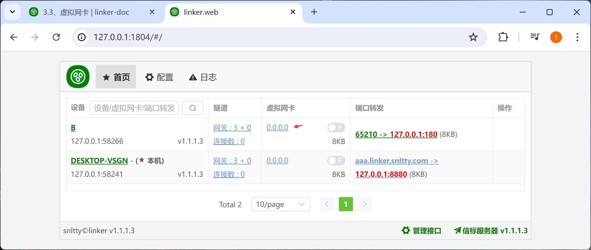
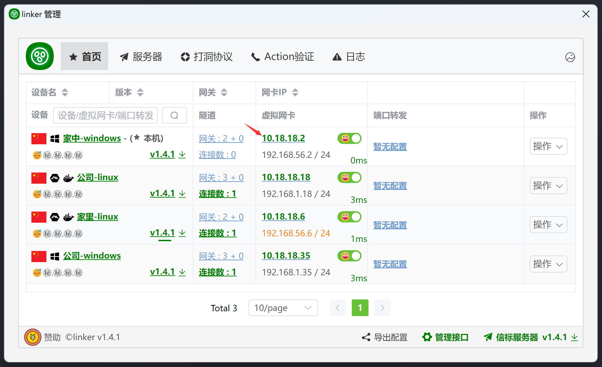
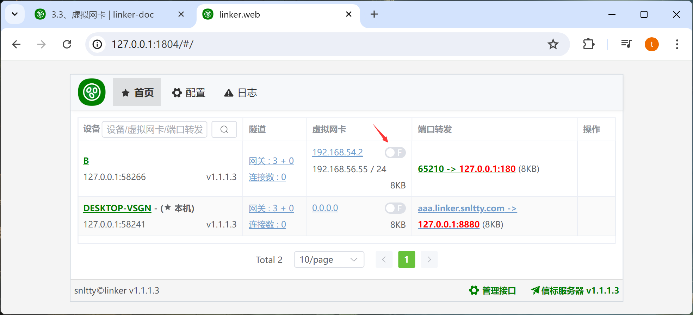

# 3.1、虚拟网卡

:::tip[说明]

1. 各个设备的`网卡IP`，不要一样，要同一网段，且不应该使用`1`、`255`
2. `局域网IP`，是选填的，可以不填，不懂是啥时，不要填、不要填、不要填
3. 虽然支持UDP广播，但是UDP广播不会去主动连接所有设备，所以，你可以先 ping 以下对方，让两端相互连接
:::

## 1、配置虚拟网卡IP

在设备，虚拟网卡一栏，点击IP配置

## 2、开启网卡

开启网卡成功后，即可通过`虚拟IP`访问目标设备(当然，前提是能够打洞成功，或者中继成功)

## 3、点对网（局域网IP）

:::tip[说明]

1. 在各端，已经自动添加NAT，只需要填写自己的局域网IP，对方即可访问你局域网内的所有设备
2. 局域网IP，是你设备所在局域网的IP，不是虚拟网卡IP、不是虚拟网卡IP、不是虚拟网卡IP

:::

## 4、网对网

:::tip[说明]

1. 如果你把linker安装在路由器上，你可以
2. 在使用**A端**使用 `iptables -t nat -A POSTROUTING -o linker -s 192.168.1.0/24 -j MASQUERADE` 添加转发规则，**192.168.1.0/24**是**B端**的局域网IP
3. 这样在**A端**的所有局域网设备，都可以访问**B端**的所有局域网设备
4. 反之B端想要访问A端，也是一样

:::

