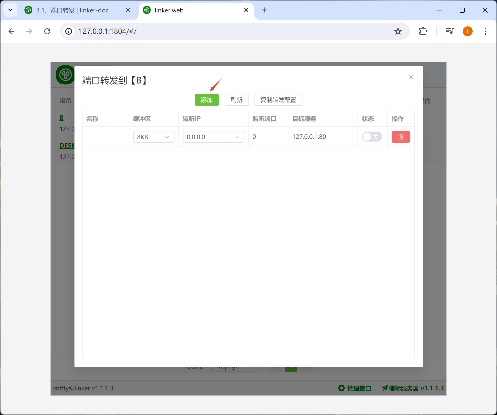
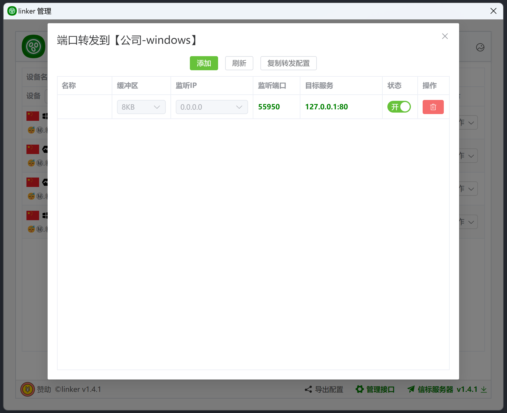
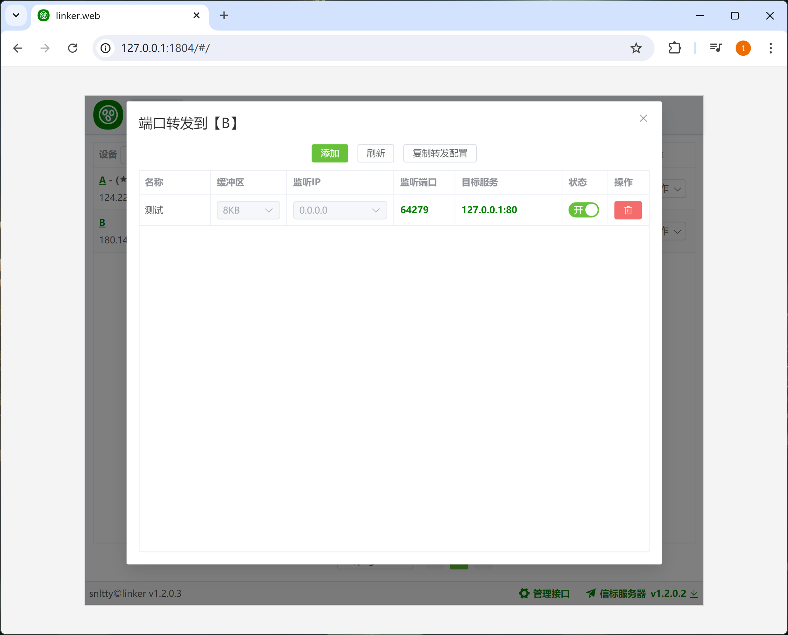

# 3.2、端口转发

:::tip[说明]

1. 相比于虚拟网卡，这种一种备选的方式，如果能使用虚拟网卡，端口转发是完全不需要的
2. 端口转发仅支持 TCP+UDP
:::

## 1、配置端口转发

:::tip[说明]
1. 当你拥有配置权限时，你可以配置任意一台设备的端口转发
2. 关闭状态时，可双击栏目修改
3. 当 **监听端口** 为 **0** 时，启动，会随机本地端口
3. **目标服务**为目标设备上的服务，可以是目标设备本机的服务，也可以是目标设备局域网内的服务

通过本机的**55950**端口，访问到了对方的**80**端口，第一次访问时，会去打洞或者中继，请耐心等待

:::
