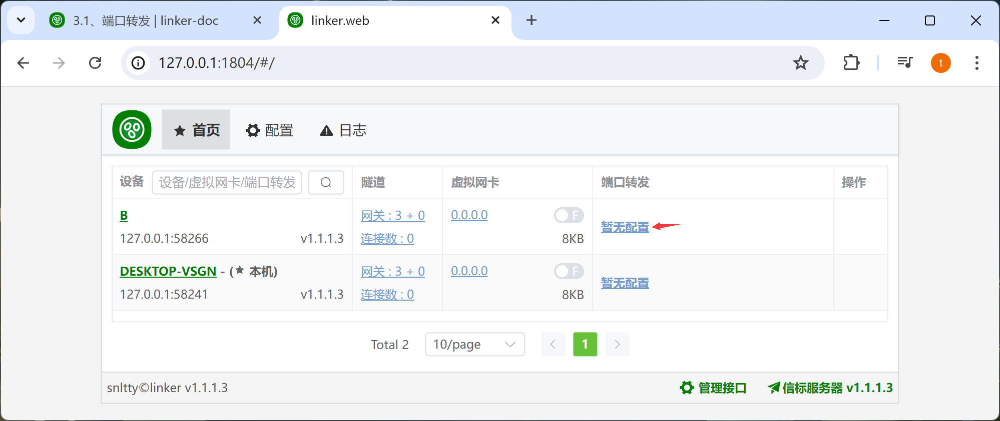

# 3.2、端口转发

:::tip[说明]

相比于虚拟网卡，这种一种备选的方式，如果能使用虚拟网卡，端口转发是完全不需要的

:::

## 1、配置端口转发

1. 在 **非本机** 设备上，端口转发一栏，管理你的端口转发，表示要使用`本机`的某个端口，去访问它的服务

:::tip[说明]
1. 关闭状态时，可双击栏目修改
2. 当 **监听端口** 为 **0** 时，启动，会随机配置端口
3. **目标服务**为目标设备上的服务
:::

## 2、可能存在的问题

:::danger[说明]
1. 开启后，如果红色，表示无法访问
:::

## 3、如果没有问题

如果都是绿色的，那么就可以通过 **127.0.0.1:65210** 访问到目标设备的**127.0.0.1:180**服务