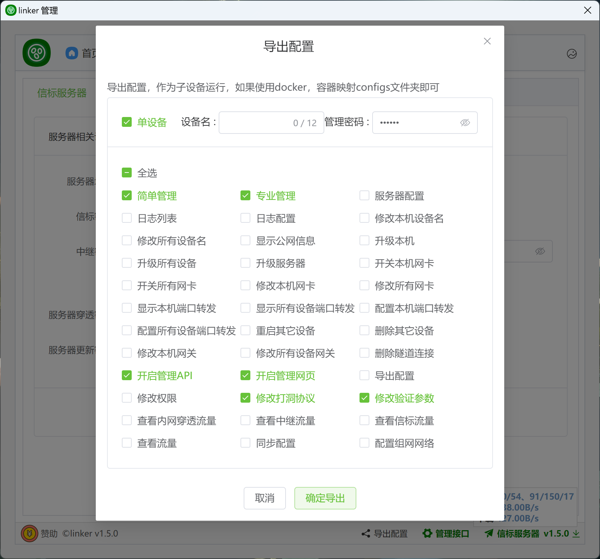

# 5、导出配置和管理权限

:::tip[说明]
1. 按 <a href="../2、首次运行/2.1、安装">首次运行，安装</a>，此设备拥有完全管理权限，可导出配置，用以作为组网子设备运行
2. 导出配置可指定设备名，以及其管理密码，建议使用与管理设备不同的管理密码，如果指定为`单设备`，则此配置仅可同时运行于一台设备，无法重复连接服务端（当相同配置的设备离线后，另外的设备可以连接）
3. 在运行中，拥有`配置权限`的设备，仍然可以实时修改其它设备的权限，但是有一个限制，仅当B是A的子集时，A可管理B的权限，表现为 `~A & B == 0` 时
4. 对于拥有`导出配置`权限的子设备，可再次导出配置，但，不超过自身权限，无法指定管理密码，必须为单设备

:::