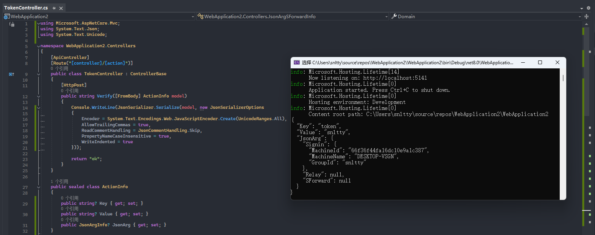

# 6、自定义验证

## 1、不修改源码的Action方式

:::tip[说明]
服务端`server.json`中的，`Relay中继`、`SForward穿透`、`SignIn信标`，都可以设置`ActionUrl`，当`ActionUrl`不为空时，这些操作都会发送HTTP POST请求到`ActionUrl`，并携带json参数，可用于自定义验证。参数暂时不支持固定设置，这需要你自己连接客户端管理接口，设置参数。

以javascript 为例，设置参数方法：
```
const ws = new WebSocket(`ws://127.0.0.1:1803`, ['接口密钥']);
ws.onopen = () => {
    const json = {Key:'token',Value:'snltty'}; //你的参数内容，json格式，任意内容，将原样post到ActionUrl
    ws.send(JSON.stringify({  
        Path:'Action/SetArgs',//设置参数的接口
        RequestId:1,  //请求id，递增即可
        Content: JSON.stringify(json) //json序列化为字符串内容
    }));
}
``` 

:::


## 2、修改源码方式

:::tip[说明]

你可以在任意对方编写这些代码，可以参考 `plugins->action`，action方式就实现了这些自定义认证

#### 2.1、连接服务器验证
```
public sealed class MySignArgs:ISignInArgs
{
    //客户端连接服务器时调用，你可以往args里添加你自定义的参数
    public async Task<string> Invoke(Dictionary<string, string> args)
    {
        args.TryAdd("myArg", "");
        //返回空字符串表示成功操作，非空将断开连接
        return string.Empty;
    }
    public async Task<string> Verify(SignInfo signInfo, SignCacheInfo cache)
    {
        //本地连接的参数
        signInfo.Args.TryGetValue("myArg", out string argNew);
        //之前连接的参数
        cache.Args.TryGetValue("myArg", out string argOld);

        //返回空字符串表示验证通过，非空将断开连接
        return string.Empty;
    }    
}
```
#### 2.2、中继验证
```
public sealed class MyRelayValidator : IRelayValidator
{
    public MyRelayValidator()
    {
    }

    // <summary>
    /// 验证
    /// </summary>
    /// <param name="fromMachine">来源客户端</param>
    /// <param name="toMachine">目标客户端，可能为null</param>
    /// <returns></returns>
    public async Task<string> Validate(SignCacheInfo fromMachine, SignCacheInfo toMachine)
    {
        //返回空字符串表示验证通过，非空将断开连接
        return string.Empty;
    }
}
```

#### 2.3、内网穿透验证
```
public sealed class MySForwardValidator : ISForwardValidator
{
    public MySForwardValidator()
    {
    }
    /// <summary>
    /// 验证
    /// </summary>
    /// <param name="signCacheInfo">来源客户端</param>
    /// <param name="sForwardAddInfo">穿透信息</param>
    /// <returns></returns>
    public async Task<string> Validate(SignCacheInfo cache, SForwardAddInfo sForwardAddInfo)
    {
        //返回空字符串表示验证通过，非空将不允许添加穿透
        return string.Empty;
    }
}
```

#### 2.4、实现一个启动器，将你的这些实现注入
```
public sealed class MyValidatorStartup : IStartup
{
    public StartupLevel Level => StartupLevel.Normal;
    public string Name => "myValdator";

    public bool Required => false;
    public string[] Dependent => new string[] {};
    public StartupLoadType LoadType => StartupLoadType.Normal;

    //客户端
    public void AddClient(ServiceCollection serviceCollection, FileConfig config, Assembly[] assemblies)
    {
        serviceCollection.AddSingleton<MySignArgs>();
        serviceCollection.AddSingleton<MyRelayValidator>();
        serviceCollection.AddSingleton<MySForwardValidator>();
    }

    //服务端
    public void AddServer(ServiceCollection serviceCollection, FileConfig config, Assembly[] assemblies)
    {
        serviceCollection.AddSingleton<MySignArgs>();
        serviceCollection.AddSingleton<MyRelayValidator>();
        serviceCollection.AddSingleton<MySForwardValidator>();
    }

    public void UseClient(ServiceProvider serviceProvider, FileConfig config, Assembly[] assemblies)
    {
    }
    public void UseServer(ServiceProvider serviceProvider, FileConfig config, Assembly[] assemblies)
    {
    }
}
```
:::
