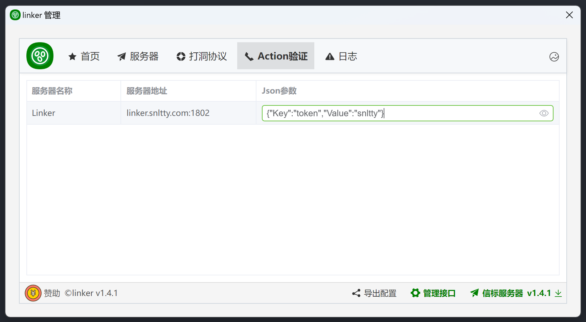

# 6、自定义验证

## 1、不修改源码的Action方式

:::tip[说明]
1. 服务端`action.json`中的，`RelayActionUrl中继`、`SForwardActionUrl穿透`、`SignInActionUrl信标`，都可以设置支持HTTP POST的URL，当不为空时，这些操作都会发送HTTP POST请求到`ActionUrl`，并携带json参数，可用于自定义验证。
2. 在`Action验证`中，设置静态参数，或者使用管理接口动态配置参数
3. 优先采用动态参数，动态参数为空则使用信标服务器配置的参数。
4. `HTTP POST`返回`ok`表示验证成功，其余均为错误信息。
 

### 1.1、静态配置


### 1.2、动态配置示例
以javascript 为例，设置参数方法：
```
const ws = new WebSocket(`ws://127.0.0.1:1803`, ['接口密钥']);
ws.onopen = () => {
    const json = {Key:'token',Value:'snltty'}; //你的参数内容，json格式，任意内容，将原样post到ActionUrl
    ws.send(JSON.stringify({  
        Path:'Action/SetArgs',//设置参数的接口
        RequestId:1,  //请求id，递增即可
        Content: JSON.stringify(json) //json序列化为字符串内容
    }));
}
``` 
### 1.3、结果示例


### 1.4、额外数据
在以上图片可以看到，结果中，除了你自定义的字段，有一个`JsonArg`字段，此字段携带者一些额外的信息，这些信息的格式为
```
public sealed class JsonArgInfo
{
    /// <summary>
    /// 登入信息，每次都会携带
    /// </summary>
    public JsonArgSignInInfo Signin { get; set; }
    /// <summary>
    /// 中继信息，非中继验证时为null
    /// </summary>
    public JsonArgRelayInfo Relay { get; set; }
    /// <summary>
    /// 穿透信息，非穿透验证时为null
    /// </summary>
    public JsonArgSForwardInfo SForward { get; set; }
}
public sealed class JsonArgSignInInfo
{
    /// <summary>
    /// 设备id
    /// </summary>
    public string MachineId { get; set; } = string.Empty;
    /// <summary>
    /// 设备名
    /// </summary>
    public string MachineName { get; set; } = string.Empty;
    /// <summary>
    /// 设备所在机器的编号
    /// </summary>
    public string MachineKey { get; set; } = string.Empty;
    /// <summary>
    /// IP地址
    /// </summary>
    public IPAddress IPAddress { get; set; } = IPAddress.Any;
    /// <summary>
    /// 分组id
    /// </summary>
    public string GroupId { get; set; } = string.Empty;
}
public sealed class JsonArgRelayInfo
{
    /// <summary>
    /// 来源设备id
    /// </summary>
    public string FromMachineId { get; set; }
    /// <summary>
    /// 来源设备名
    /// </summary>
    public string FromMachineName { get; set; }
    /// <summary>
    /// 目标设备id
    /// </summary>
    public string RemoteMachineId { get; set; }
    /// <summary>
    /// 目标设备名
    /// </summary>
    public string RemoteMachineName { get; set; }
    /// <summary>
    /// 事务id
    /// </summary>
    public string TransactionId { get; set; }
    /// <summary>
    /// 协议名
    /// </summary>
    public string TransportName { get; set; }
    /// <summary>
    /// 流水id
    /// </summary>
    public ulong FlowingId { get; set; }
}
public sealed class JsonArgSForwardInfo
{
    /// <summary>
    /// 域名
    /// </summary>
    public string Domain { get; set; }
    /// <summary>
    /// 端口
    /// </summary>
    public int RemotePort { get; set; }
}
```
:::


## 2、修改源码方式

:::tip[说明]

你可以在任意对方编写这些代码，可以参考 `plugins->action`，action插件就是使用以下方式实现。

### 2.1、连接服务器验证
```
public sealed class MySignArgs:ISignInArgs
{
    //客户端连接服务器时调用，你可以往args里添加你自定义的参数
    public async Task<string> Invoke(Dictionary<string, string> args)
    {
        args.TryAdd("myArg", "");
        //返回空字符串表示成功操作，非空将断开连接
        return string.Empty;
    }
    public async Task<string> Verify(SignInfo signInfo, SignCacheInfo cache)
    {
        //本地连接的参数
        signInfo.Args.TryGetValue("myArg", out string argNew);
        //之前连接的参数
        cache.Args.TryGetValue("myArg", out string argOld);

        //返回空字符串表示验证通过，非空将断开连接
        return string.Empty;
    }    
}
```
### 2.2、中继验证
```
public sealed class MyRelayValidator : IRelayValidator
{
    public MyRelayValidator()
    {
    }

    // <summary>
    /// 验证
    /// </summary>
    /// <param name="fromMachine">来源客户端</param>
    /// <param name="toMachine">目标客户端，可能为null</param>
    /// <returns></returns>
    public async Task<string> Validate(SignCacheInfo fromMachine, SignCacheInfo toMachine)
    {
        //返回空字符串表示验证通过，非空将断开连接
        return string.Empty;
    }
}
```

### 2.3、内网穿透验证
```
public sealed class MySForwardValidator : ISForwardValidator
{
    public MySForwardValidator()
    {
    }
    /// <summary>
    /// 验证
    /// </summary>
    /// <param name="signCacheInfo">来源客户端</param>
    /// <param name="sForwardAddInfo">穿透信息</param>
    /// <returns></returns>
    public async Task<string> Validate(SignCacheInfo cache, SForwardAddInfo sForwardAddInfo)
    {
        //返回空字符串表示验证通过，非空将不允许添加穿透
        return string.Empty;
    }
}
```

### 2.4、实现一个启动器，将你的这些实现注入
```
public sealed class MyValidatorStartup : IStartup
{
    public StartupLevel Level => StartupLevel.Normal;
    public string Name => "myValdator";

    public bool Required => false;
    public string[] Dependent => new string[] {};
    public StartupLoadType LoadType => StartupLoadType.Normal;

    //客户端
    public void AddClient(ServiceCollection serviceCollection, FileConfig config, Assembly[] assemblies)
    {
        serviceCollection.AddSingleton<MySignArgs>();
        serviceCollection.AddSingleton<MyRelayValidator>();
        serviceCollection.AddSingleton<MySForwardValidator>();
    }

    //服务端
    public void AddServer(ServiceCollection serviceCollection, FileConfig config, Assembly[] assemblies)
    {
        serviceCollection.AddSingleton<MySignArgs>();
        serviceCollection.AddSingleton<MyRelayValidator>();
        serviceCollection.AddSingleton<MySForwardValidator>();
    }

    public void UseClient(ServiceProvider serviceProvider, FileConfig config, Assembly[] assemblies)
    {
    }
    public void UseServer(ServiceProvider serviceProvider, FileConfig config, Assembly[] assemblies)
    {
    }
}
```
:::
