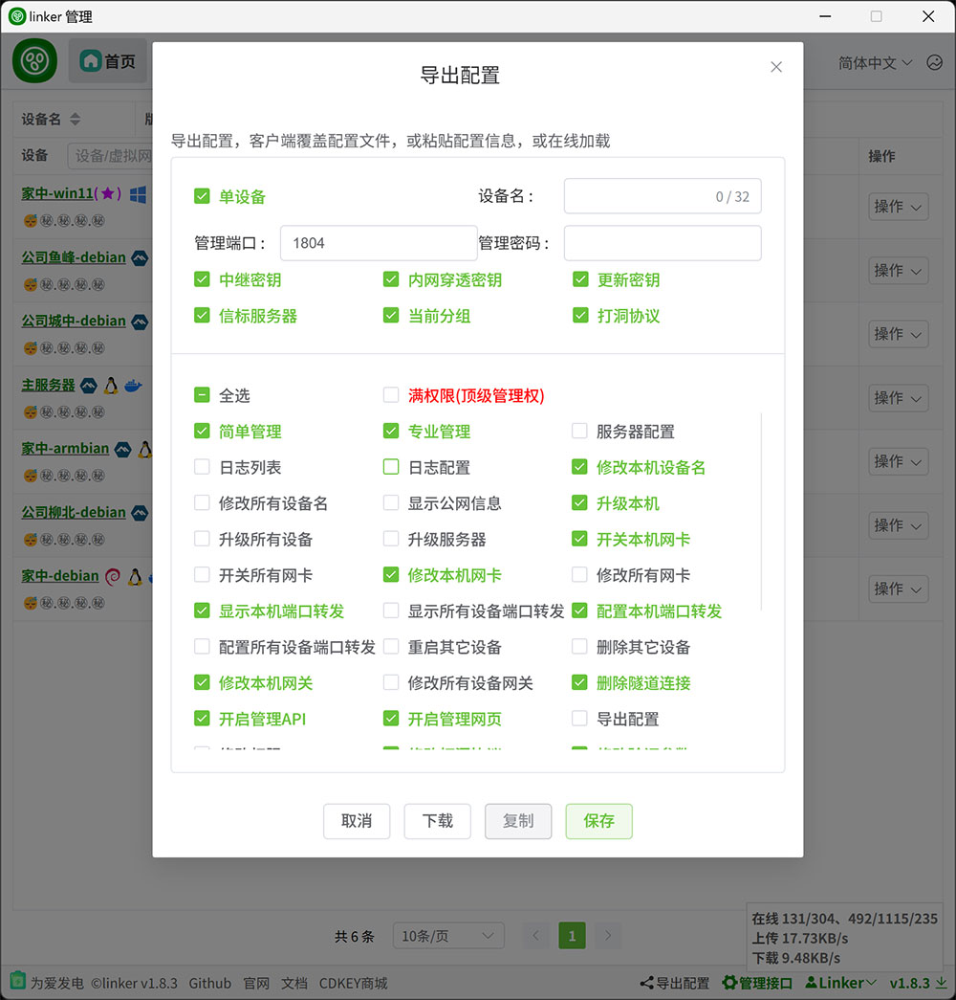

# 2.10、导出配置

:::tip[说明]
1. 首次运行手动初始化的客户端拥有完全管理权限，可导出配置，用以作为组网其它设备运行
2. 可以指定导出的设备名，管理端口，管理密码，和本客户端的其它配置信息
3. 可以指定导出的配置拥有什么权限
4. `下载`则导出压缩包，可以复制到其它电脑上直接运行
5. `复制`导出的配置复制到剪贴板，对应初始化配置时的`粘贴配置`
6. `保存`导出的配置保存到服务器，对应初始化配置时的`在线导入`

:::