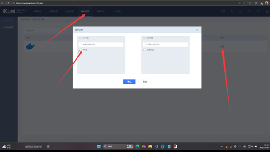
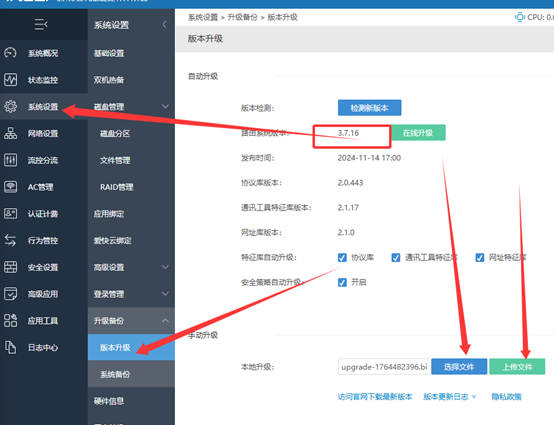
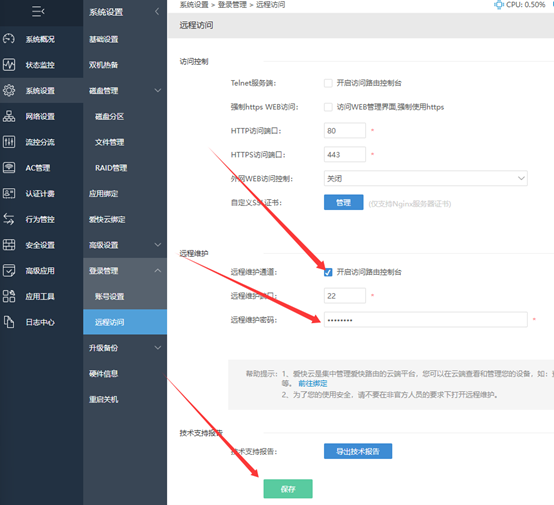
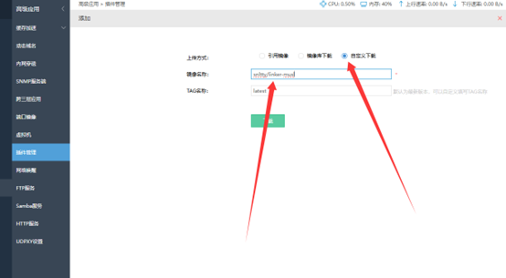
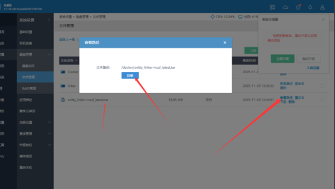
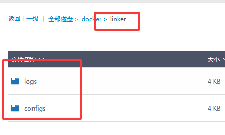

#  2.4、安装方法（ikuai）

## 一、前期准备：开启爱快路由必要功能

### 1.1 打开爱快 Docker 插件

首先进入爱快云平台获取相关支持，云平台地址：[https://yun.ikuai8.com](https://yun.ikuai8.com)

在爱快路由控制台中找到并启用 Docker 插件，操作界面参考如下：



### 1.2 开启爱快 SSH 服务（关键步骤）

SSH 服务是后续远程操作的基础，必须严格按以下流程执行，否则配置不生效：
- 所需文件<a href="/iKuai-3.7.16-base.bin" target="_blank">iKuai-3.7.16</a>，<a href="/update-20241130.bin" target="_blank">update-20241130.bin</a>

1.  将爱快路由系统升级至最新版本，升级后重启设备；

2.  将系统降级至 3.7.16 版本，降级后重启设备；

3.  安装对应更新包（安装后无重启提示，但**必须手动重启**，否则进入SSH命令端）。

操作界面参考如下：



### 1.3 配置远程访问

进入路由控制台路径：**系统设置 > 登录管理 > 远程访问**，核心配置项如下：


- 远程维护通道：开启访问路由控制台

- 远程维护端口：默认 22（SSH 连接端口）

- 远程维护密码：设置并牢记，后续 SSH 登录需使用

配置界面参考如下：



### 1.4 通过 SSH 工具远程连接路由

核心信息：

- SSH 登录用户名：sshd

- SSH 登录密码：1.3 步骤中设置的“远程维护密码”

- 连接地址：爱快路由的局域网 IP（如 192.168.121.200）


## 二、拉取 Linker 镜像（三种方法任选）

### 2.1 方法一：通过爱快控制台直接拉取

进入路由控制台路径：**高级应用 > 插件管理 > 虚拟机 > 镜像管理**，按界面提示填写镜像信息：
- 建议加速站 [轩辕镜像https://docker.xuanyuan.me/](https://docker.xuanyuan.me/)
- 镜像名称：snltty/linker-musl

- TAG 名称：latest

- 上传方式：自定义下载

操作界面参考如下：



### 2.2 方法二：通过爱快控制台引用本地镜像
1.  先下载后缀为.tar的离线镜像[Docker离线镜像下载](https://docker.mk/images.html)
2.  先将本地镜像文件（如 snltty_linker-musl_latest.tar后缀问.tar文件）上传至路由指定路径，上传路径：**系统设置 > 磁盘管理 > 文件管理 > /docker**；

3.  进入镜像管理界面，选择“引用镜像”，填写镜像路径：/docker/snltty_linker-musl_latest.tar；

操作界面参考如下：




### 2.3 方法三：通过 SSH 命令拉取

1.  通过 1.4 步骤的 SSH 连接进入路由终端；

2.  执行以下拉取命令：

```bash

docker pull snltty/linker-musl:latest
```

## 三、创建容器映射目录

需创建两个核心目录用于容器数据挂载，分别存储配置文件和日志文件，目录结构如下：



> **关键说明**：爱快控制台显示的路径并非系统真实路径，通过 SSH 查看时，真实路径为 **/etc/disk_user/[控制台磁盘名]/**，例如控制台显示“docker > linker”，对应系统真实路径为 **/etc/disk_user/docker/linker**。

## 四、创建并启动 Docker 容器

通过 SSH 连接路由终端，进入映射目录（如 /etc/disk_user/docker/linker），执行以下启动命令（网络模式为host其它网络见[2.3、安装方法（docker）](./2.2、安装方法（docker）.md)）：

```bash

docker run -it -d --name linker \
-v /etc/disk_user/docker/linker/configs:/app/configs \
-v /etc/disk_user/docker/linker/logs:/app/logs \
--device /dev/net/tun \
--restart=always \
--privileged=true \
--network host \
snltty/linker-musl
```


## 五、Linker 初始化配置

容器启动成功后，在浏览器中输入以下地址进入 Linker 初始化页面：

**http://[爱快路由IP]:1804**

例如：路由 IP 为 192.168.121.200，则访问地址为 192.168.121.200:1804，按页面指引完成初始化即可。