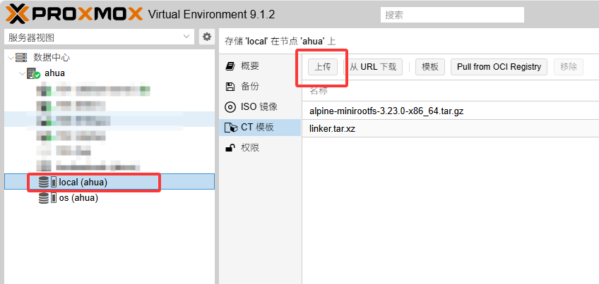
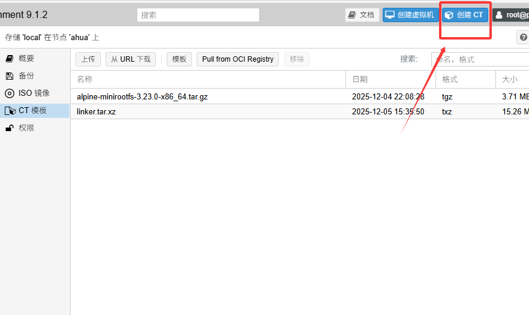
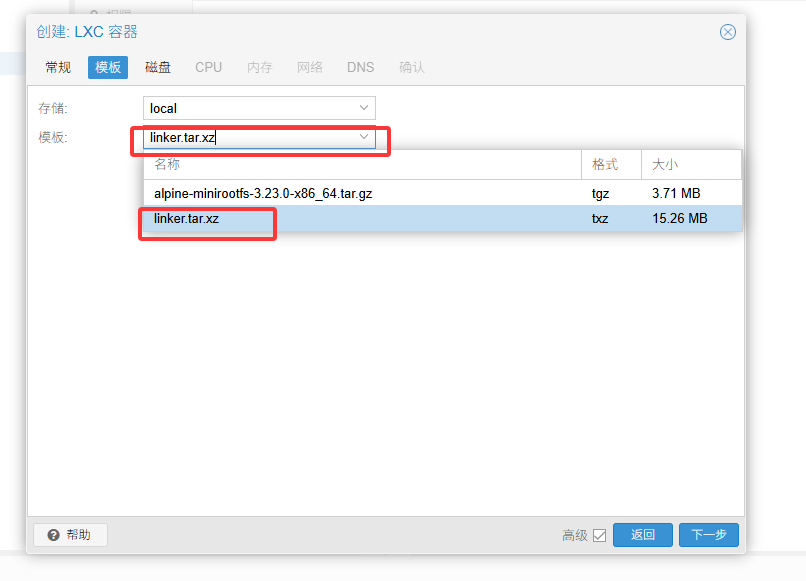
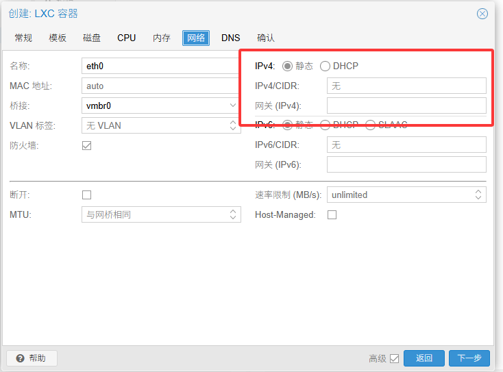
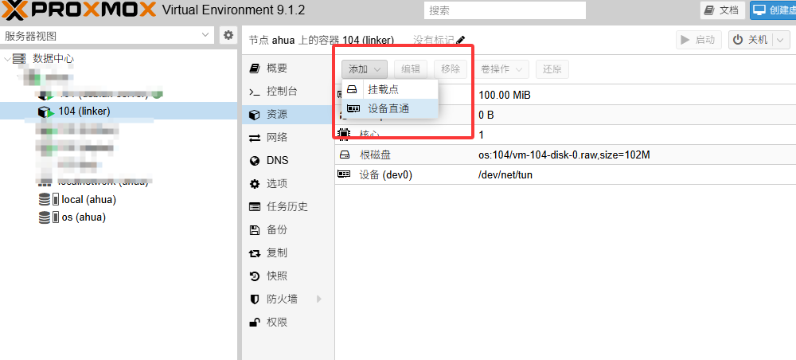
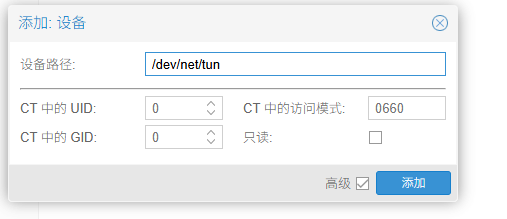
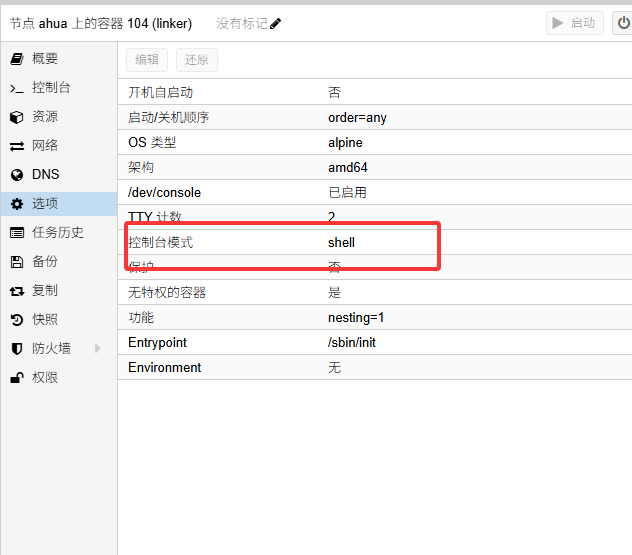
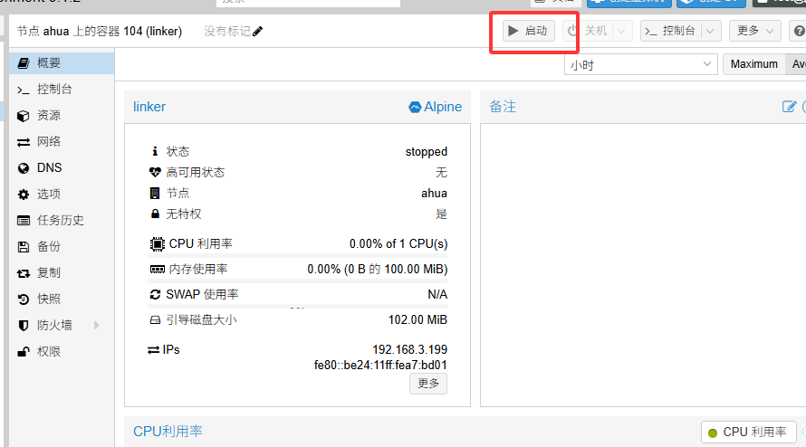

#  2.5、安装方法（pve-ct）

#### **镜像包： [linker-lxc.tar.xz](/linker-lxc.tar.xz)**

------------
> 下载镜像 - 上传镜像 - 添加CT - 挂载TUN - 启动 - IP:1804
------------

1、下载镜像包，上传到PVE镜像目录中的CT模板中

2、上传之后创建CT

3、主机名和密码 按需填写 建议用默认无特权容器

4、镜像选择刚刚上传的

5、磁盘、CPU、内存 按需填写 100MB磁盘和运存基本就够了 网络需要写路由器内外IP或者使用DHCP 不填写是没有IP的

6、创建成功后 点击资源 添加 设备直通 

7、添加 /dev/net/tun

8、控制台用默认也可以 改shell 也可以

9、完工 启动 访问您的 IP:1804 进入配置界面

> 如果想利用容器可以把控制台改成shell
容器默认没有安装其它多余软件，实在是想用可以把启动脚本换成/sbin/init1 这样启动完整容器
