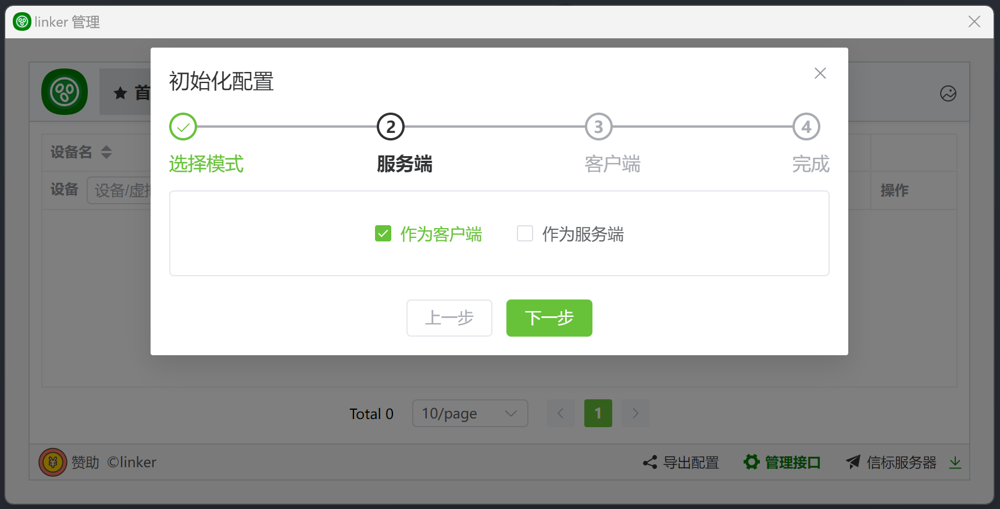
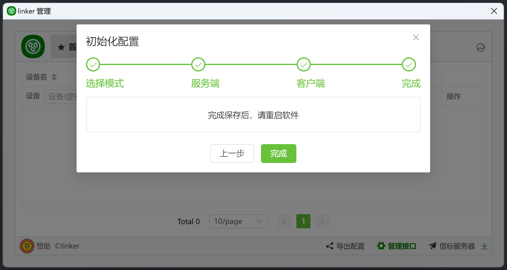

# 2.8、初始化配置3（客户端）


## 1、客户端使用web初始化

:::tip[说明]
1. 运行程序后,浏览器打开<a href="http://127.0.0.1:1804" target="_blank">http://127.0.0.1:1804</a>
2. 如果你自己部署了服务端，你可以勾选**我有服务器**，填写你部署的服务端的各种信息





对应配置文件 client.json
```
{
    "Name": "A", //客户端名
    "AccessBits": '11111111111', //按下标，1有权限，0无权限，可以看`src/linker.messenger.api/Config.cs`里的`AccessValue`枚举
    "CApi": {
        "ApiPassword": "snltty", //api密码
        "WebPort": 1804, //web端口
        "WebRoot": "./web/" //web根目录
    },
    "Servers": [
        {
            "Name": "Linker", //信标服务器名称
            "Host": "127.0.0.1:1802", //信标服务器地址
            "SecretKey": null, //信标密钥
            "UserId": "8225e9d4-0ac7-4d76-9946-c4fe04ad4696" //用户标识，多个客户端可相同
        }
    ],
    "Groups": [
        {
            "Name": "snltty", //分组名
            "Id": "snltty", //分组id
            "Password": "snltty" //分组密码
        }
    ],
    "Relay": {
        "Servers": [
            {
                "SecretKey": "snltty", //中继密钥
                "Disabled": false, //是否禁用
                "SSL": true //启用ssl
            }
        ]
    },
    "SForward": {
        "SecretKey": "snltty" //服务器穿透密钥
    },
    "Updater": {
        "SecretKey": "snltty" //更新密钥
    },
    "Action": {
        "Args": {} //自定义验证的参数
    }
}
```
:::


