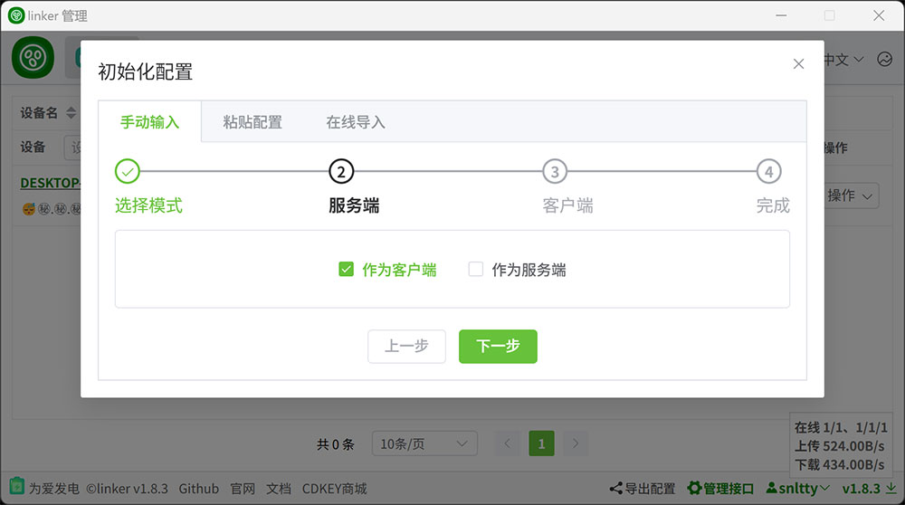
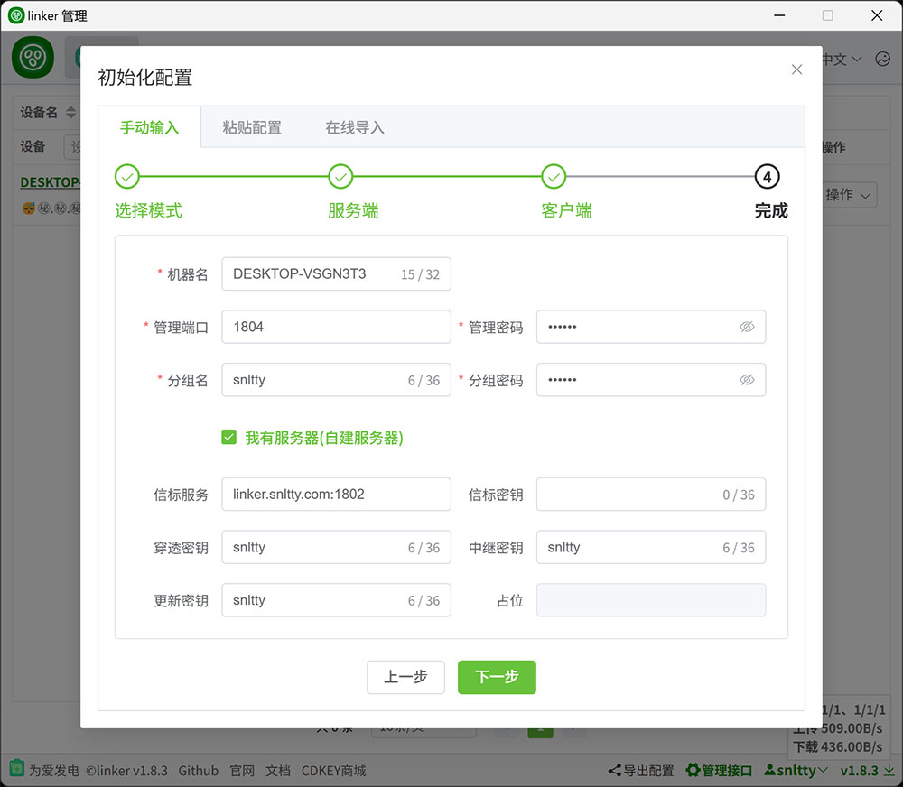
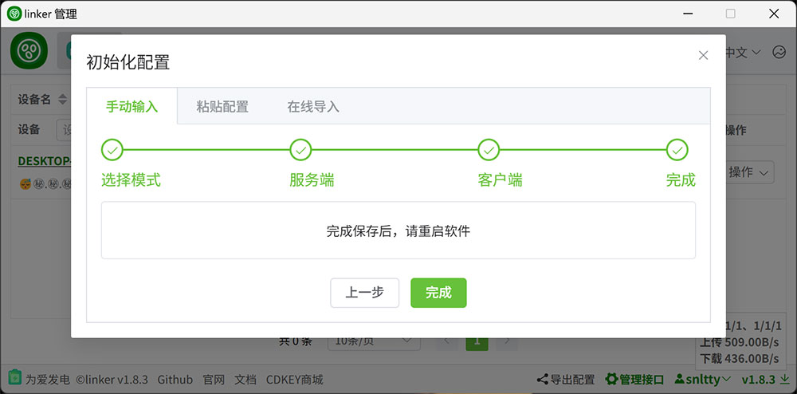

# 2.98、初始化配置（客户端）

## 1、客户端使用web初始化

:::tip[说明]
1. 运行程序后,浏览器打开<a href="http://127.0.0.1:1804" target="_blank">http://127.0.0.1:1804</a>填写信息进行初始化，此外可以使用`http://127.0.0.1:1804/health`判断客户端是否在运行
2. 只勾选客户端
3. 你可以勾选**我有服务器**，填写你部署的服务端的各种信息，默认使用公共服务器`linker.snltty.com:1802`
4. 关于`信标服务`和`信标服务1`
    1. 优先`信标服务`
    2. 当无法连接`信标服务`时，将尝试连接`信标服务1`
    3. 当已连接`信标服务1`，会定时检测`信标服务`，发现可用则切回`信标服务`
5. 当满足以下所有条件时，各个客户端之间相互可见
    1. 连接同一信标服务器
    2. 分组`id、密码`都相同

:::

