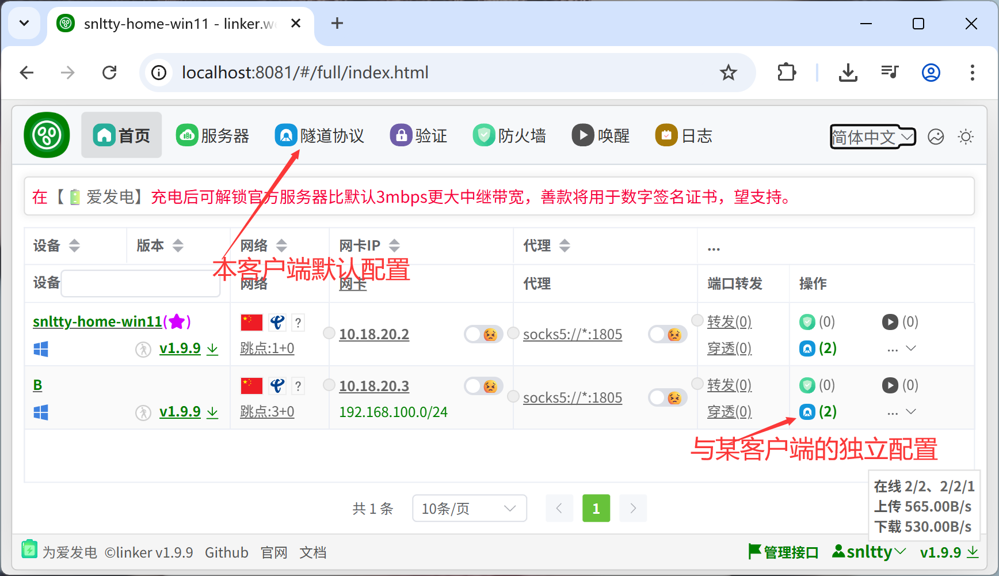
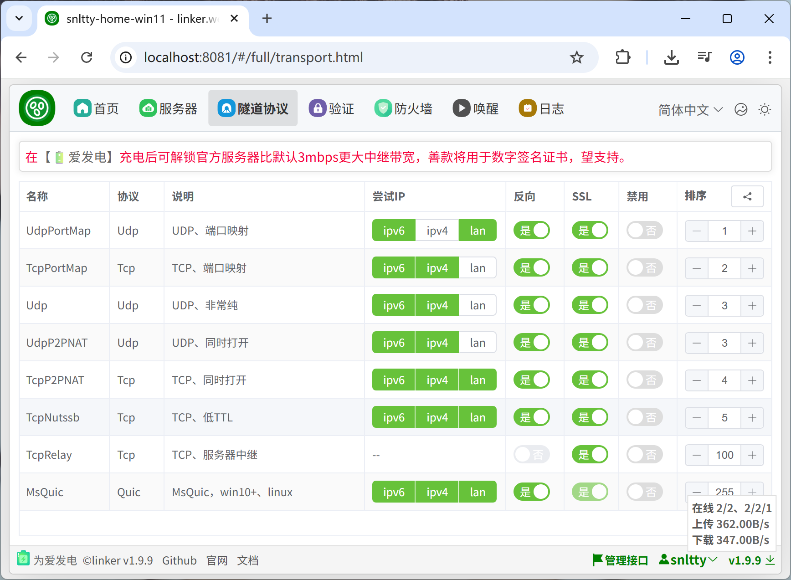

# 3.0、P2P打洞直连

## 1、打洞协议调整

:::tip[说明]
1. 从上往下按顺序尝试连接，且跳过禁用项，你可以随便调整
2. 关于尝试IP，ipv6、ipv4、lan，如果你不想让它用某一项就取消勾选，lan是局域网ip的意思
3. 关于与某客户端的独立配置，比如和某客户端只想中继，不想打洞等等，随便调整，连接时将优先使用独立配置
4. `按喜好调整好即可，往后的所有通信都是自动的，无需其它操作`

:::
