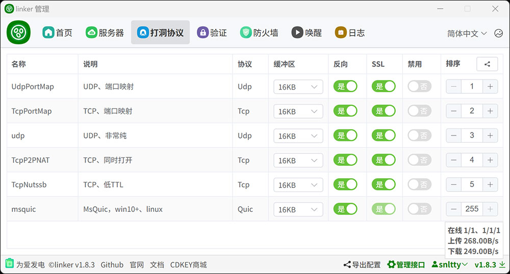

# 3.0、打洞

## 1、支持msquic

:::tip[说明]

1. 在windows，如果提示不支持msquic，可以到 <a target="_blank" href="https://github.com/microsoft/msquic/releases/latest">msquic</a> 下载合适你系统的版本，覆盖根目录下的msquic.dll，一般来说，win10或以下版本，需要openssl版本的msquic
2. 在linux ubuntu  debian，请按<a target="_blank" href="https://github.com/dotnet/runtime/tree/main/src/libraries/System.Net.Quic">官方说明</a>安装msquic
3. 在linux alpine，可以参照<a target="_blank" href="https://blog.snltty.com/2024/07/24/%e8%87%aa%e5%b7%b1%e7%bc%96%e8%af%91alpine%e4%b8%8b%e7%9a%84msquic/">编译alpine平台的msquic</a>自己编译msquic

:::

## 2、打洞协议调整

:::tip[说明]
1. 按顺序打洞，你可以调整顺序，优先使用哪些打洞协议
2. 如果你不想打洞，可以禁用所有打洞协议
3. `按喜好调整好即可，往后的所有通信都是自动的，无需其它操作`

:::