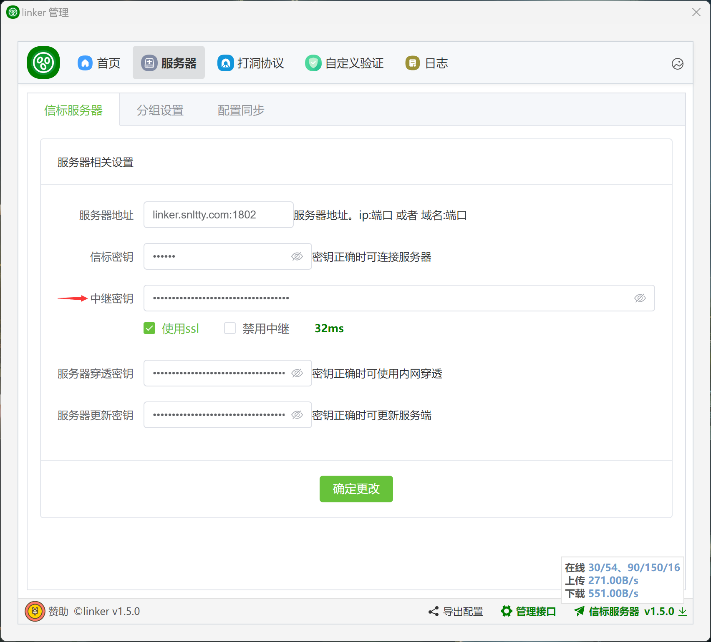

# 3.2、中继

前提是你自建信标服务器，如果使用`linker.snltty.com:1802`服务器，这不需要这些操作，此服务器提供一些公开的中继服务

## 1、主服务器中继

:::tip[说明]

在服务端 `configs/server.json` 复制中继密钥(`Relay->SecretKey`)，在客户端中填写


:::


## 2、多服务器中继节点
:::tip[说明]

1. 如果你有多个服务器，希望将这些服务器作为一个中继节点
2. 在服务端 `configs/server.json` 中(`Relay->Distributed`)下配置

```json
"Distributed": {
    //我是中继节点服务器，填写自己的信息，报告给主服务器，Id,Name,MasterHost,MasterSecretKey任一为空时不生效
    "Node": {
        //节点ID，首次运行会自动生成一个，你也可以替换成自己喜欢的
        "Id": "EEC9231A-D505-4B65-85F1-CB26181F5196",
        //本中继节点服务器名称
        "Name": "中继节点A",
        //本中继节点服务器地址 ，可以是域名，IP，域名:端口，IP:端口
        "Host": "",
        //最大连接数，0无限
        "MaxConnection": 100,
        //单连接最大带宽 Mbps，0无限
        "MaxBandwidth": 1,
        //总最大带宽 Mbps，0无限
        "MaxBandwidthTotal": 0,
        //月流量，GB，0无限
        "MaxGbTotal": 0,
        //剩余流量，字节数，0即可
        "MaxGbTotalLastBytes": 0,
        //流量统计月度，0即可
        "MaxGbTotalMonth": 0,
        //是否公开本节点，公开则主服务器上的所有客户端可用本节点，不公开则中继认证通过时可用
        "Public": false,

        //主服务器地址
        "MasterHost": "linker.snltty.com:1802",
        //主服务器的密钥，主服务里的，Master里的SecretKey
        "MasterSecretKey": ""
    },
    //我是主服务器，接收其它中继节点服务器的信息
    "Master": {
        //作为主服务器时的密钥，中继节点填写正确的密钥才能加入进来
        "SecretKey": "8B1D6F96-8E2C-4891-97D6-883B82675719"
    }
}
```
:::