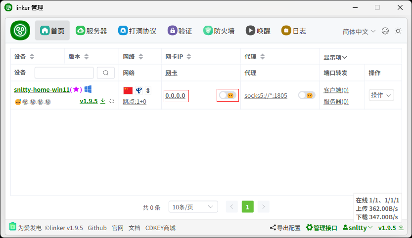
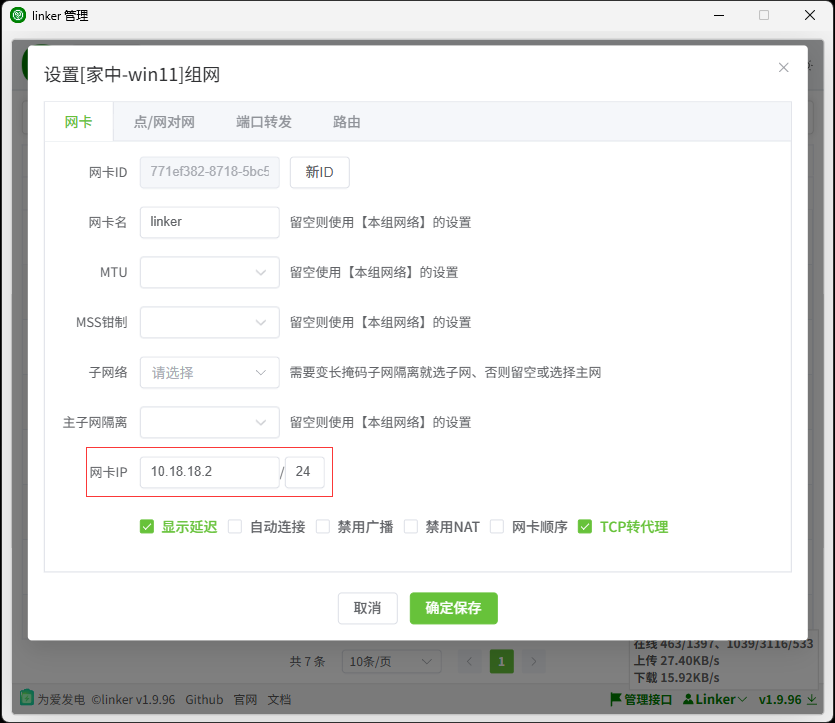

# 1、虚拟IP

:::tip[说明]

1. 各设备使用不同`网卡IP`，使用一网段，且不应使用`0`,`1`、`255`
2. 请使用 `10.0.0.0 - 10.255.255.255`、`172.16.0.0 - 172.31.255.255`、`192.168.0.0 - 192.168.255.255` 范围内的IP 
3. 支持UDP广播，但是UDP广播不主动连接所有设备，所以，你可以先 ping 一下对方
:::

## 1、配置虚拟网卡IP

:::tip[说明]

1. 在设备，虚拟网卡一栏，点击IP配置，设置喜欢的IP，然后开启网卡 
2. 开启网卡成功后，使用对方的虚拟IP即可访问目标设备，首次访问时需要打洞或者中继操作，时间可能会比较久，耐心等待

:::
