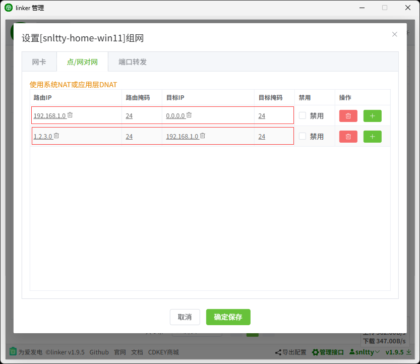

# 2、点对网

:::tip[说明]

## 1、检查和启用NAT

1. **linux：** 已经自动添加NAT转发
2. **linux软路由docker：** 在`OpenWrt、群晖`或者其它软路由系统，可能需要在宿主机允许IP转发，可以在UI设置，也可以尝试`sysctl -w net.ipv4.ip_forward=1`允许IP转发，然后`iptables -t nat -A POSTROUTING -s 10.18.18.0/24 -j MASQUERADE`添加NAT，10.18.18.0/24是你的虚拟网卡网段
3. **windows：** 优先使用系统`NetNat`，`NetNat`失败则启用`应用层代理实现NAT`，但是性能应该没有`NetNat`好
    - 在`powershell`尝试运行`New-NetNat -Name linker -InternalIPInterfaceAddressPrefix 192.168.18.0/24`命令，如果没有报错，运行`Remove-NetNat -Name linker`命令删除，你可以使用NetNat
    - 如果报错，那你需要打开`Hyper-V`功能， 在`控制面板\程序\启用或关闭 Windows 功能`中勾选，如果列表里找不到`Hyper-V`，可以使用管理员身份尝试在`powershell`执行`Enable-WindowsOptionalFeature -Online -FeatureName Microsoft-Hyper-V -All`启用，然后重启系统

## 2、配置路由

假设在`B端`配置`点/网对网`

1. `路由IP/路由掩码`：决定了`A端`哪些目标IP的数据包会被路由到虚拟网卡交由`linker`处理，并发往`B端`
2. `目标IP/目标掩码`：规定`B端`如何替换IP，默认0.0.0.0不做任何修改

举例如下图，两种配置方式

- `第一种方式、路由IP`：此时`路由IP`为真实局域网网段（注意最后一位应为0）
    - 按图中配置（只看截图中第一行就好了）：`A端`访问`192.168.1.5`会访问到`B端`局域网下`192.168.1.5`的设备
    
- `第二种方式、路由IP + 目标IP`：此时`路由IP`为虚假网段，可以是任意的，`目标IP`为真实局域网网段（注意最后一位应为0）
    - 按图中配置（只看截图中第二行就好了）：`A端`访问`1.2.3.5`，如果`目标掩码`是24则访问到`B端``192.168.1.5`，16则访问到`192.168.3.5`，8则访问到`192.2.3.5`

