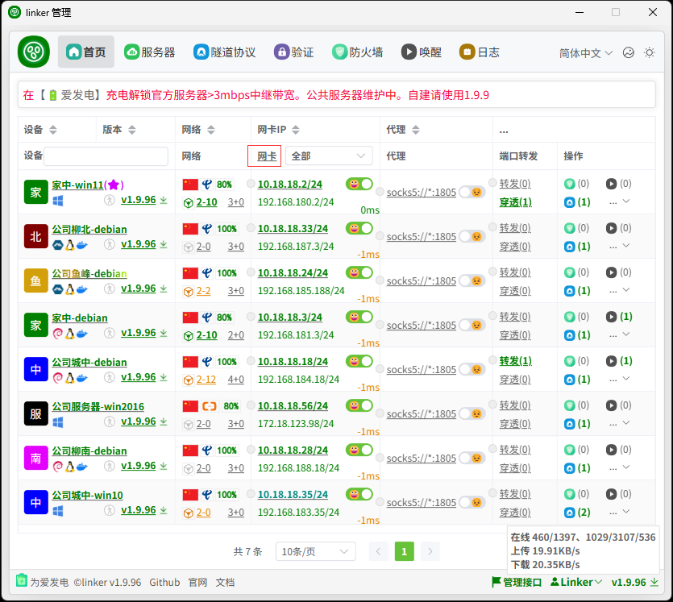
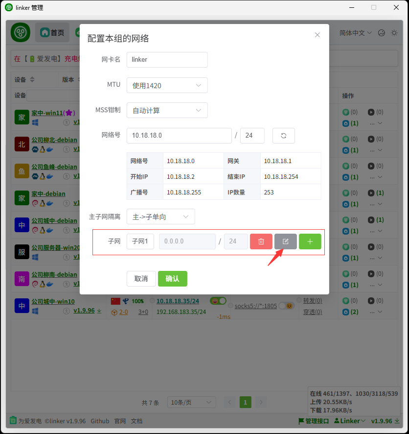
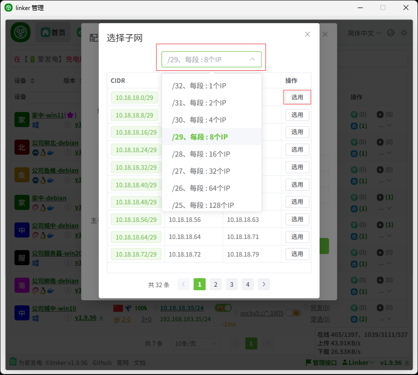
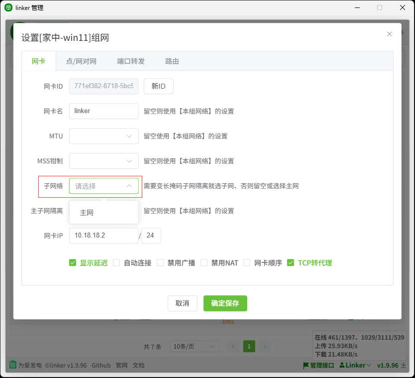
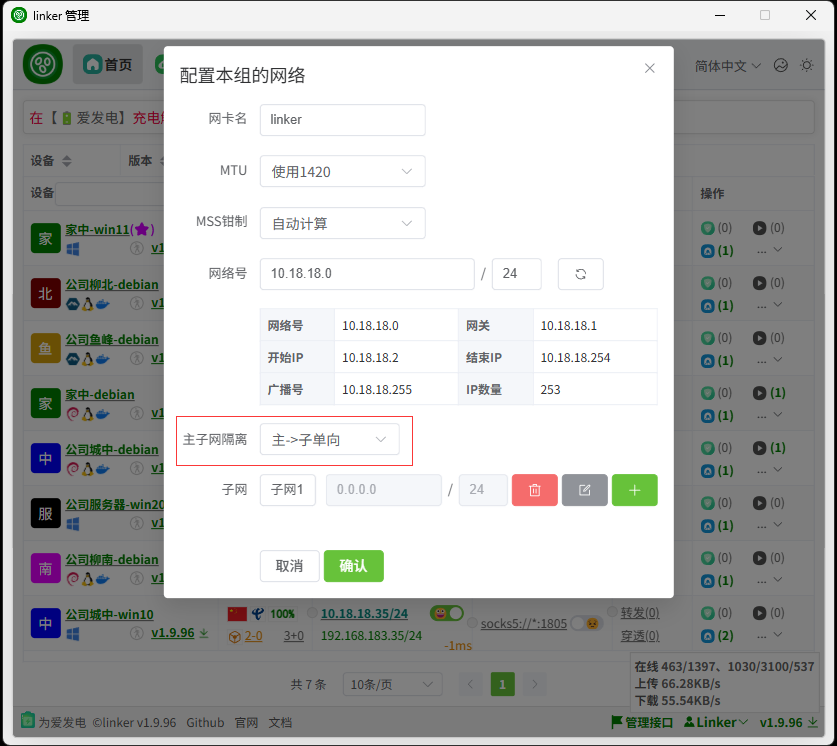

# 4、变长子网

:::tip[说明]

如果你一个分组里有很多客户端，比如A、B、C、D、E、F等等，你希望分为例如ABC、DEF等多个组，然后ABC、DEF组内可以互相通信，但ABC无法和DEF通信，那么你可以使用变长子网

:::

:::tip[配置]

配置自动获取IP

添加一些子网，然后点编辑，选择子网的网段

  

默认是/29每段8个ip，你可以选择不同的段长度，然后选择子网

然后给客户端配置时选择子网

当然，如果你配置了子网，那么还可以选择主网的设备是否可以和子网的设备进行通信(各子网之间是隔离的)

:::
