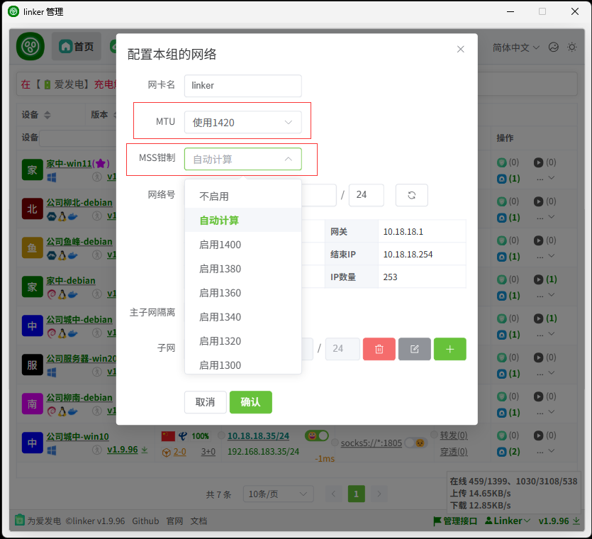

# 5、MSS钳制

:::tip[说明]

MSS Clamping

一般出现在linux，比如 A、B 两个客户端，B配置点对网，A访问B下局域网内的设备，虽然linker配置了MTU可能是1420，但有可能B那边的某个网关的MTU更小，可能是1380，那数据1420数据包就有可能被丢弃，导致无法通信

有两种办法

1. 将linker客户端的MTU调小，比如1380
2. 配置MSS Clamping，即MSS钳制，可以选择自动计算，也可以选择1380或更小的值

可以在动态获取ip配置本组网络的配置，也可以为某个客户端单独配置

:::
