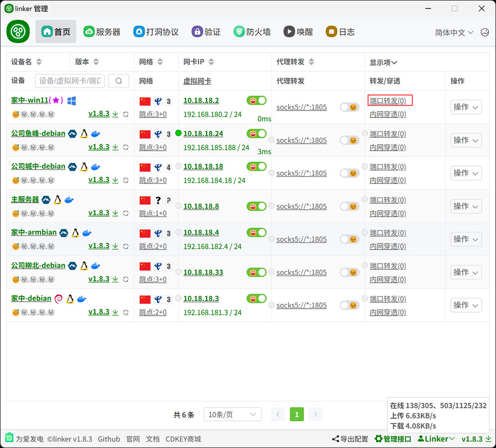
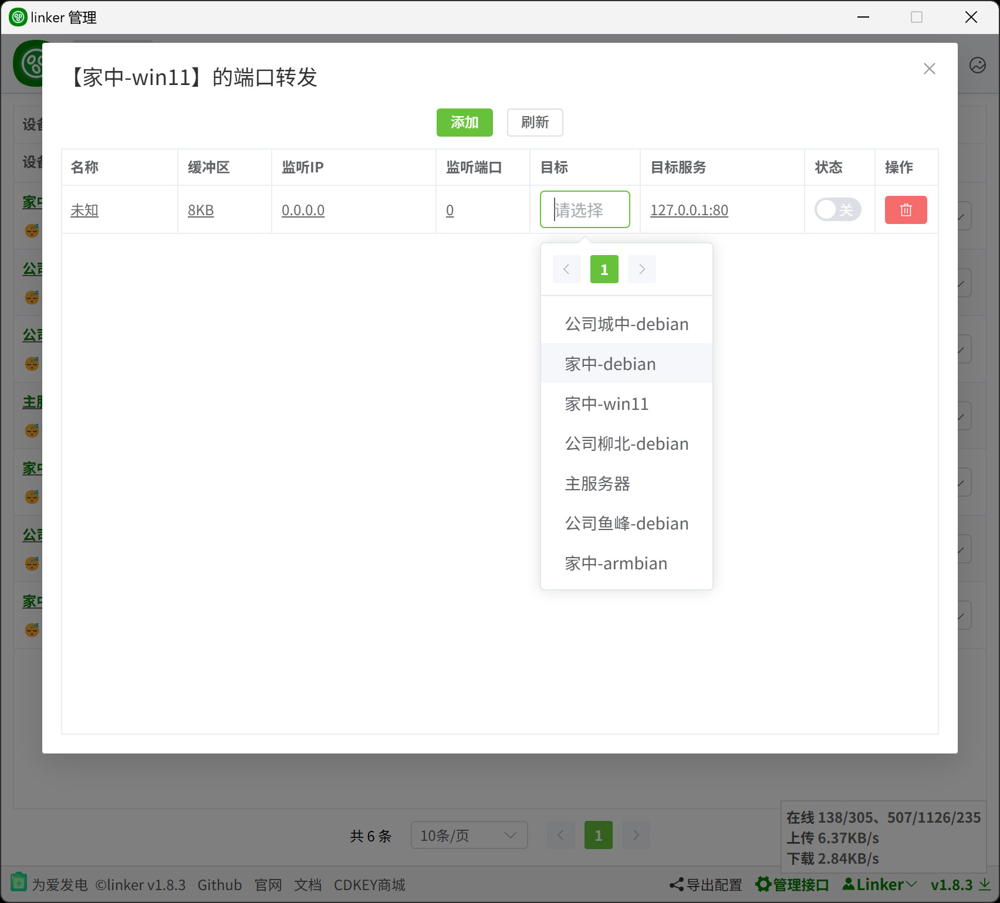
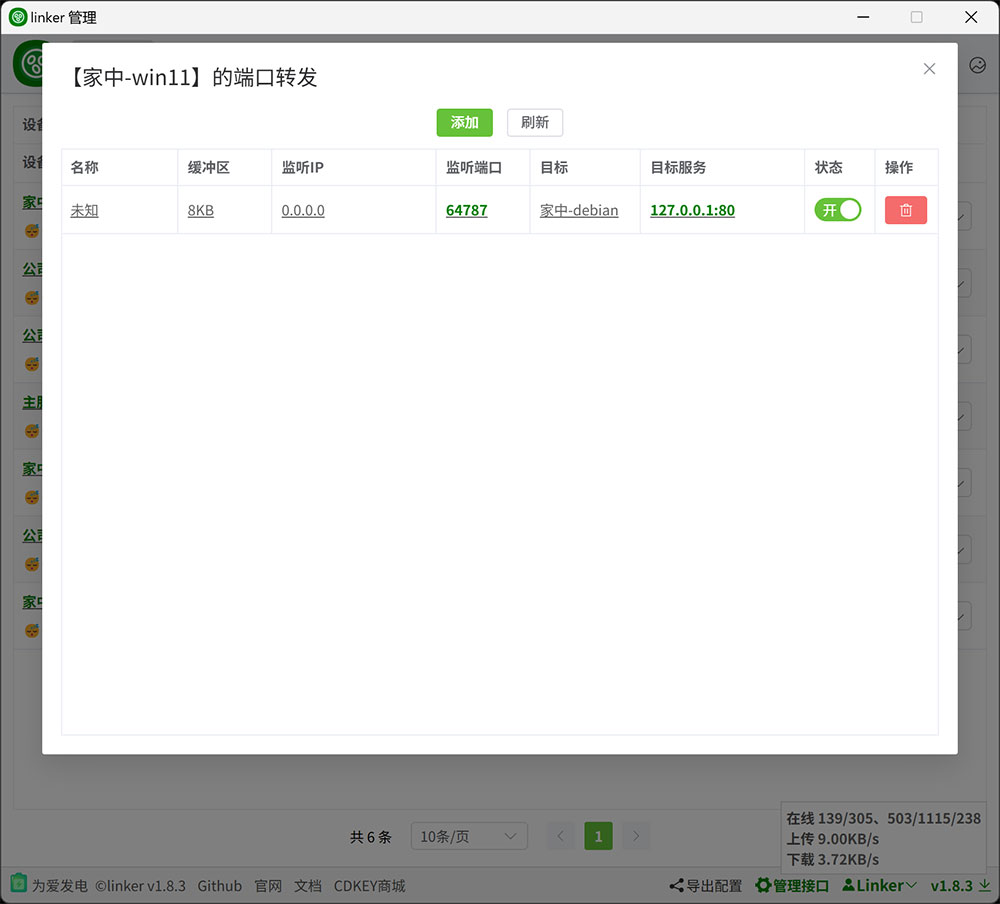

# 4.1、端口转发

:::tip[说明]

1. 相比于虚拟网卡，这种一种备选的方式，如果能使用虚拟网卡，端口转发是完全不需要的
2. 端口转发仅支持 TCP+UDP
:::

## 1、配置端口转发

:::tip[说明]
1. 当你拥有配置权限时，你可以配置任意一台设备的端口转发
2. 关闭状态时，可修改配置
3. 当 **监听端口** 为 **0** 时，启动，会随机本地端口
3. **目标服务**为目标设备上的服务，可以是目标设备本机的服务，也可以是目标设备局域网内的服务
4. 启动后，可以通过访问段的监听端口访问到目标设备的目标服务，本示例中，可以在`家中-win11`上访问`127.0.0.1:64787`最终访问到`家中-debian`的`127.0.0.1:80`

:::
