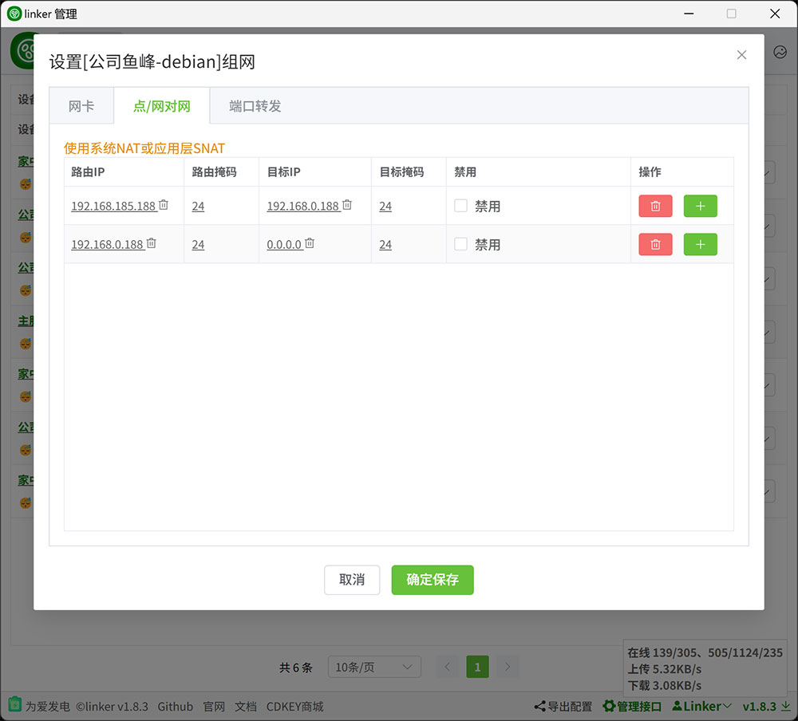
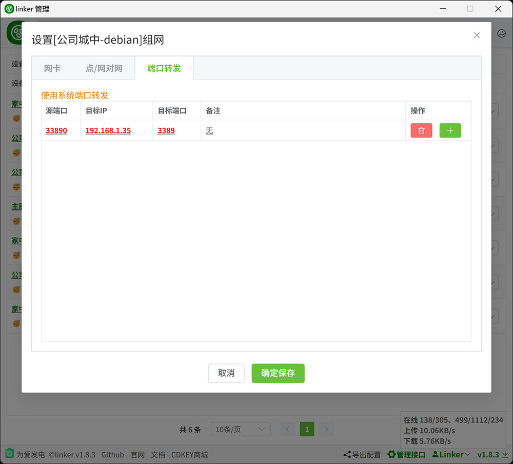

# 1.1、点对网

:::danger[重要]

你要确定你知道你在搞什么，如果只是简单的P2P通信，上面的内容已经够了，以下的东西不要看，不要看，不要看

:::

:::tip[1、情况1，你的设备支持NAT转发时]

1. linux，已经自动添加NAT转发
2. linux软路由docker,在`OpenWrt、群晖`或者其它软路由系统，可能需要在宿主机允许IP转发，可以在UI设置，也可以尝试`sysctl -w net.ipv4.ip_forward=1`允许IP转发，然后`iptables -t nat -A POSTROUTING -s 10.18.18.0/24 -j MASQUERADE`然后添加NAT，10.18.18.0/24是你的虚拟网卡网段
3. windows，优先使用系统`NetNat`，`NetNat`失败则启用`内置SNAT`，但是性能应该没有`NetNat`好
    1. 由于`内置SNAT`依赖`WinDivert驱动`，如果报错`Windows 无法验证此文件的数字签名`什么的，可以尝试以下两种解决办法
    2. 使用`管理员身份运行cmd`执行以下两条命令，然后重启系统
        ```
        BCDEDIT -SET LOADOPTIONS DISABLE_INTEGRITY_CHECKS
        BCDEDIT -SET TESTSIGNING ON
        ```
    3. 或者安装一个<a href="https://www.microsoft.com/zh-cn/download/details.aspx?id=46148" target="_blank">KB3033929补丁</a>，然后重启系统

:::danger[重点]
1. 仅配置路由ip时，可以通过192.168.0.x访问对方的192.168.0.x
2. 如果你多个客户端之间的ip存在冲突，则路由ip可以配置一个虚假网段，然后目标IP填写真实网段，连接192.168.185.x时会被替换为 192.168.0.x，实际访问到192.168.0.x


:::


:::tip[2、情况2，你的设备无法使用NAT转发时]

1. 你的设备无法使用NAT转发(一般出现在低版本windows下，win10以下)，那你只能使用端口转发功能来访问你当前设备局域网下的其它设备
2. 按如下配置。当其它设备通过`10.18.18.18:33890` 访问`公司城中-debian`时，将访问到`公司城中-debianx`局域网的`192.168.1.35:3389`


:::

