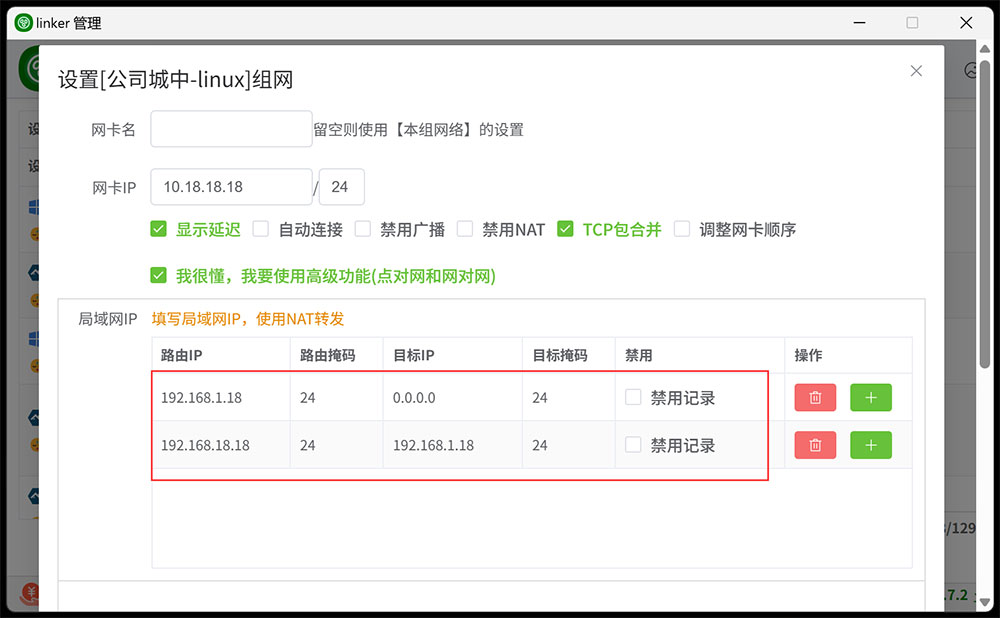
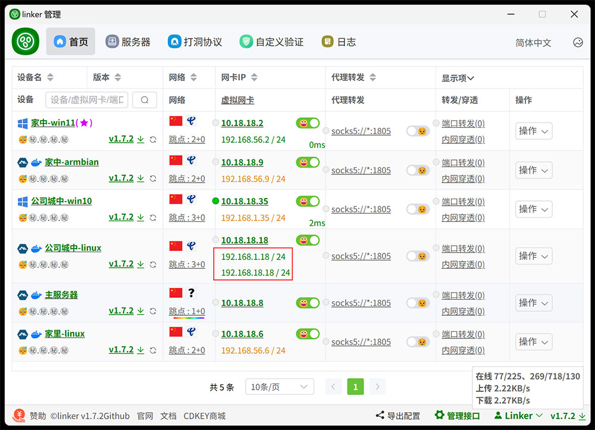
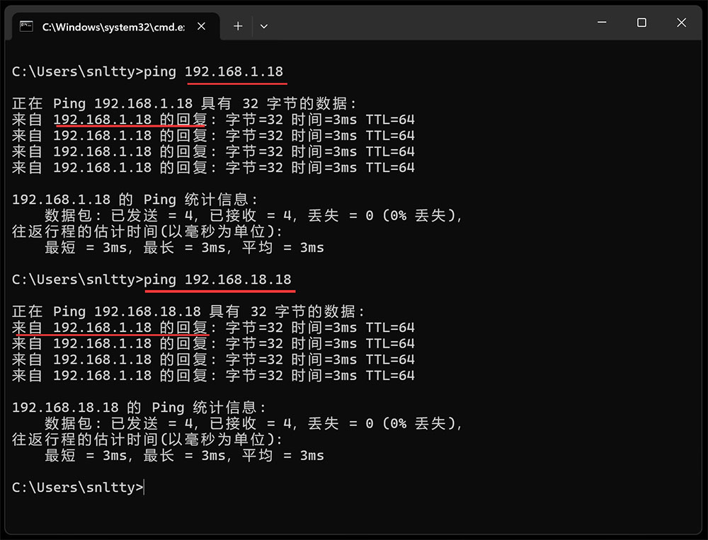
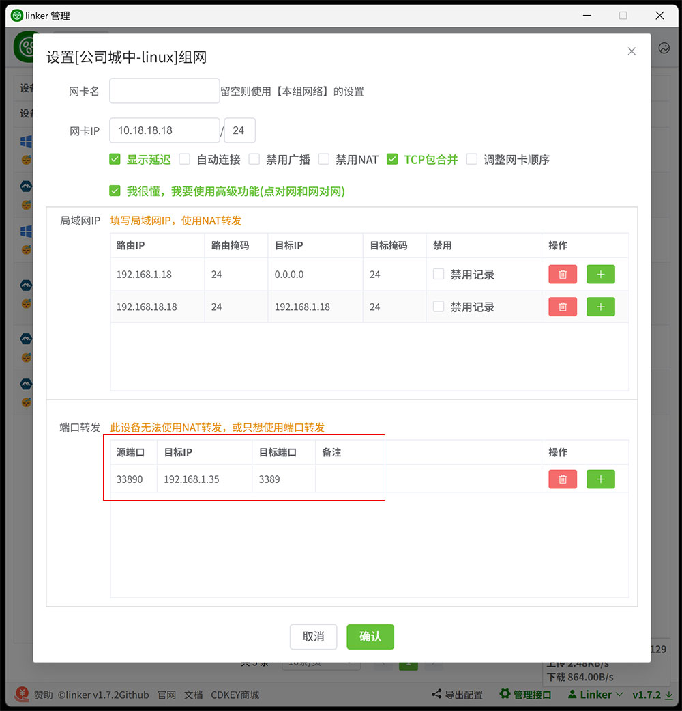

# 1.1、点对网

:::danger[重要]
1. 你要确定你知道你在搞什么，如果只是简单的P2P通信，上面的内容已经够了，以下的东西不要看，不要看，不要看
2. 确定要搞，那么请看示意图（仅示例，以下绿色内容与此图无关）


:::

:::tip[1、情况1，你的设备支持NAT转发时]

1. linux，已经自动添加NAT转发(在`OpenWrt`，需要在`防火墙 - 区域设置`中将`转发`设置为`接受`)
2. windows，优先使用系统`NetNat`，`NetNat`失败则启用`内置SNAT`，但是性能应该没有`NetNat`好
    1. 由于`内置SNAT`依赖`WinDivert驱动`，如果报错`Windows 无法验证此文件的数字签名`什么的，可以尝试以下两种解决办法
    2. 使用`管理员身份运行cmd`执行以下两条命令，然后重启系统
        ```
        BCDEDIT -SET LOADOPTIONS DISABLE_INTEGRITY_CHECKS
        BCDEDIT -SET TESTSIGNING ON
        ```
    3. 或者安装一个<a href="https://www.microsoft.com/zh-cn/download/details.aspx?id=46148" target="_blank">KB3033929补丁</a>，然后重启系统
3. macos，需要你自己在**被访问端**添加NAT转发
```
# 开启ip转发
sudo sysctl -w net.ipv4.ip_forward=1
# 配置NAT转发规则
# 在/etc/pf.conf文件中添加以下规则,10.18.18.0/24是来源网段
nat on en0 from 10.18.18.0/24 to any -> (en0)
# 加载规则
sudo pfctl -f /etc/pf.conf -e
```

:::danger[重点]
1. 如图配置第一条配置，`目标IP`填写`0.0.0.0`，则`路由IP`就是真实内网网段，其它客户端可以通过`192.168.1.0/24`网段访问到`公司城中-linux`的`192.168.1.0/24`网段
2. 如图配置第二条配置，`目标IP`填写`192.168.1.0/24`，则`路由IP`伪虚假网段，`目标IP`为真实内网网段，其它客户端可以通过一个`假的` `192.168.18.0/24`网段访问到`公司城中-linux`的`192.168.1.0/24`网段
3. 注意，两条配置不能同时使用 
4. 网段映射其实就是 按`目标IP`，`目标掩码`计算出网络号，将网络号覆盖`路由IP`得到最终的访问IP
5. 当前网段映射仅支持，IPV4`ICMP`、`TCP`、`UDP`、如需更多协议，请联系作者添加




:::


:::tip[2、情况2，你的设备无法使用NAT转发时]

1. 你的设备无法使用NAT转发(一般出现在低版本windows下，win10以下)，那你只能使用端口转发功能来访问你当前设备局域网下的其它设备
2. 按如下配置。当其它设备通过`10.18.18.18:33890` 访问`公司-linux`时，将访问到`公司-linux`局域网的`192.168.1.35:3389`
3. macos下需要你自己在**被访问端**添加端口转发
```
//编辑 pf 配置文件
sudo nano /etc/pf.conf

//添加转发规则
rdr pass on en0 inet proto tcp from any to any port 33890 -> 192.168.1.35 port 3389
rdr pass on en0 inet proto udp from any to any port 33890 -> 192.168.1.35 port 3389

//启用并重新加载 pf
sudo pfctl -f /etc/pf.conf
sudo pfctl -e
```



:::

