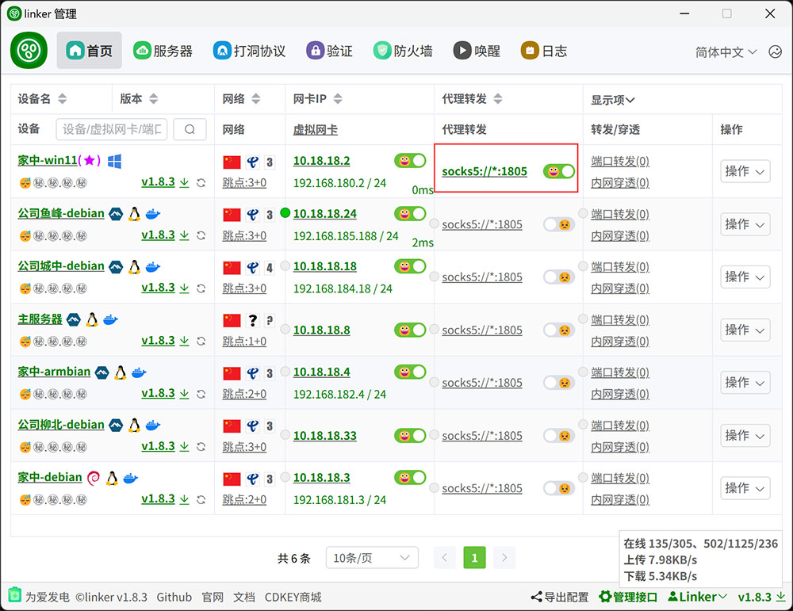
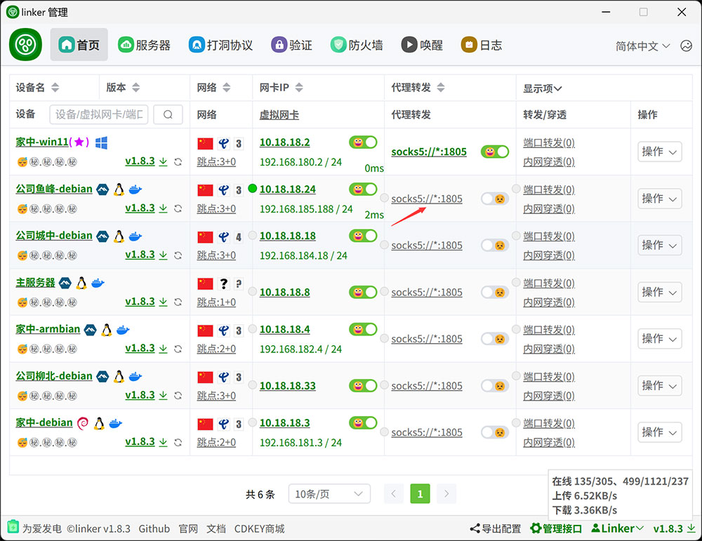
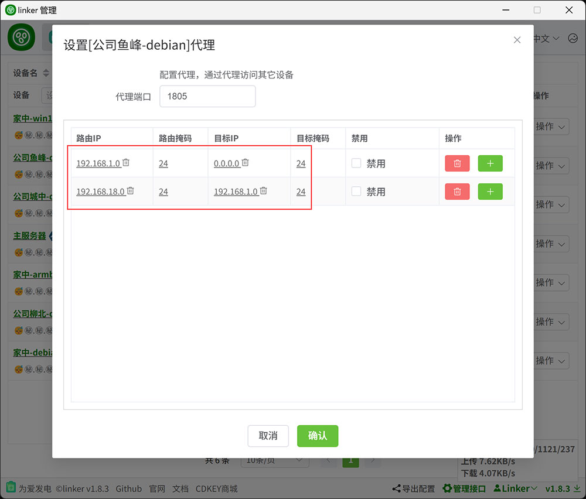
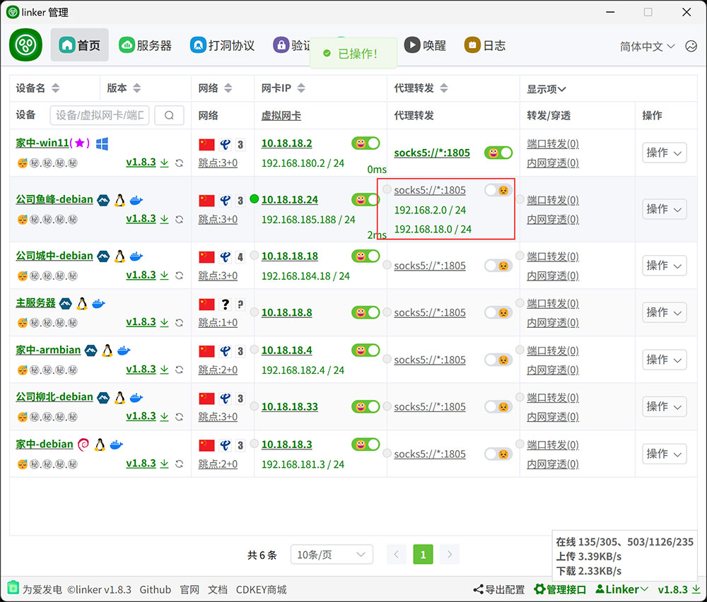

# 4.2、socks5代理

:::tip[说明]

1. 相比于端口转发，socks5代理不需要指定端口，但是需要指定IP
2. 虽然只写socks://*:1805，但同时支持socks5代理和HTTP代理两种代理协议
3. socks5代理仅支持TCP+UDP，http代理仅支持tcp

需要特别说明的是，本代理功能仅支持A通过代理访问B、C、D等其它客户端的内网服务，不是梯子

:::

## 1、配置IP

:::tip[说明]

访问端启动socks5，可理解为代理服务器，代理软件上设置代理服务器为127.0.0.1:1805

被访问端端配置IP，这是被访问的服务，配置ip目的是，当通过代理访问这些ip时，将被代理到这个客户端，而不是其它客户端

有两种办法
1. 仅配置路由ip，可以直接连接192.168.1.x
2. 如果你多个客户端之间的ip存在冲突，则路由ip可以配置一个虚假网段，然后目标IP填写真实网段，然后连接192.168.18.x，最后会被替换为 192.168.1.x，实际访问到192.168.1.x

:::
