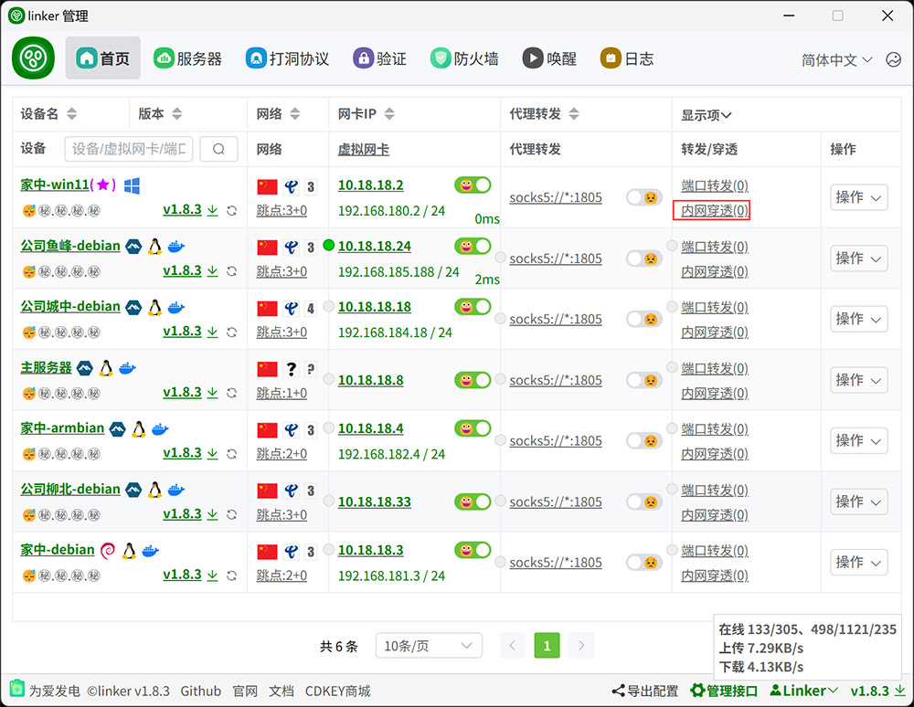
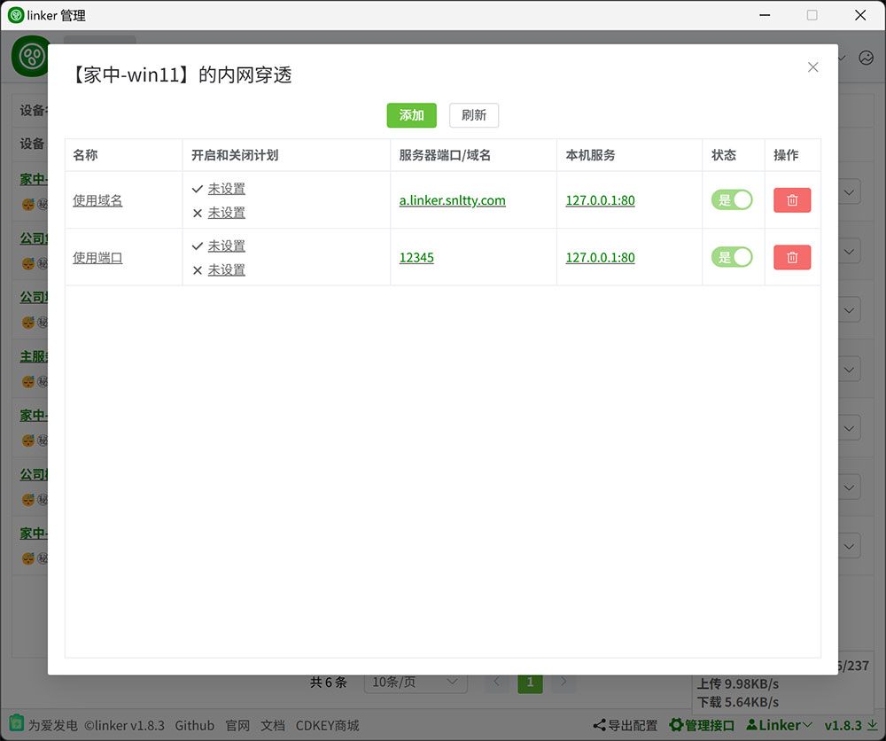

# 4.3、服务器穿透

:::tip[说明]

1. 这是一种将本地端口映射到公网的穿透方式，大概就是通过`服务器ip:端口`、`域名:端口`，访问你本机的服务
2. 这需要你自己部署服务端，`linker.snltty.com`是不支持的
3. 只在被访问端运行linker客户端，访问端不需要运行客户端
:::

## 1、配置穿透
:::tip[说明]
1. 在服务端`configs/server.json`中
2. `WebPort` 用于单一端口承载多个HTTP服务，因为HTTP Headers 中有Host字段，可以用于区分不同的HTTP服务
3. `TunnelPortRange` 用于开放一个端口范围，提供给客户端动态添加端口监听，每个端口对应不同的TCP+UDP服务

:::

## 2、配置端口转发
:::tip[说明]
1. 当你拥有管理权限时，你可以管理任意一台设备的内网穿透映射
2. 使用`WebPort`时，需要使用域名，比如我使用了`a.linker.snltty.com`，我已经将`*.linker.snltty.com`泛解析到我的服务器，那么通过`a.linker.snltty.com:8080`即可访问到我本机的`127.0.0.1:80`
3. 使用`TunnelPortRange`时，需要使用端口，比如我使用了`12345`，那么通过`服务器域名:12345`或者`服务器IP:12345`都可以访问到我本机的`127.0.0.1:80`



:::


## 2、多服务器穿透节点
:::tip[说明]

1. 如果你有多个服务器，希望将这些服务器作为一个节点
2. 在主服务器外的其它服务器部署一个服务端，然后
    - 可以打开`configs/server.json`
    - 将`SForward->ShareKey`(仅连接)或`SForward->ShareKeyManager`(能管理)复制内容主服务中节点列表处导入
    - 也可以留意程序运行时类似`build sforward share key : xxx`或`build sforward share key manager: xxx`的输出，复制内容主服务中节点列表处导入
3. 默认配置就是可用的，但是也可以对节点配置进行一些修改，在`configs/server.json->SForward` 下修改配置

```json
"SForward": {
    //分享key，自动生成，【无需修改】
    "ShareKey": "",
    "ShareKeyManager": "",
    //管理密钥，自动生成【无需修改】
    "MasterKey": "66f54039c618da829b16c1007f6e5f30",
    //自动生成，【无需修改】
    "DataMonth": 0,
    //主机，默认为空会自动获取公网IP，比较建议手动填写公网IP或域名
    "Host": "",
    //节点id，自动生成，，【无需修改】
    "NodeId": "2A277A9E-DC4D-4CF3-B029-04A02F1F032F",
    //节点名称
    "Name": "default",
    //域名，为空则使用公网ip访问
    "Domain": "",
    //web端口，为0则不启用
    "WebPort": 0,
    //隧道端口范围，为空不限制，多个逗号隔开，-表示范围，比如 80,8080,10000-60000
    "TunnelPorts": "1024-65535",
    //最大连接数，0为不限制
    "Connections": 0,
    //带宽限制，0为不限制
    "Bandwidth": 0,
    //月流量，0为不限制
    "DataEachMonth": 0,
    //剩余流量，自动生成，【无需修改】
    "DataRemain": 0,
    //跳转地址，可以填写你喜欢的地址，在节点列表中点击节点名称跳转到此地址
    "Url": "https://linker.snltty.com",
    //节点图标，可以填写你喜欢的图标，在节点列表中展示
    "Logo": "https://linker.snltty.com/img/logo.png"
}
```
:::