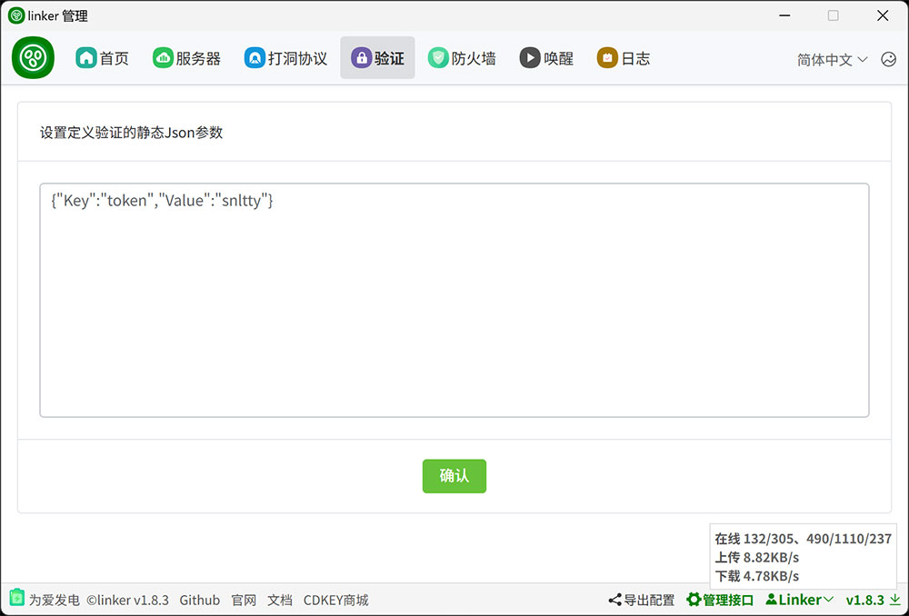
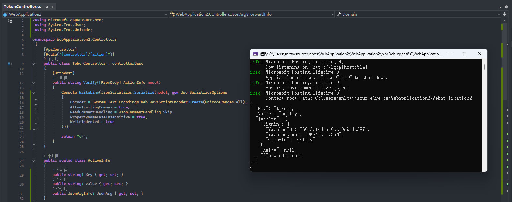

# 5、自定义验证

:::tip[说明]
1. 服务端`action.json`中的，`RelayActionUrl中继`、`SForwardActionUrl穿透`、`SignInActionUrl信标`，都可以设置支持HTTP POST的URL，当不为空时，这些操作都会发送HTTP POST请求到`ActionUrl`，并携带json参数，可用于自定义验证。
2. 在`Action验证`中，设置静态参数，或者使用管理接口动态配置参数
3. 优先采用动态参数，动态参数为空则使用页面配置的静态参数。
4. `HTTP POST`返回`ok`表示验证成功，其余均为错误信息。
 

### 1.1、静态配置


### 1.2、动态配置示例
以javascript 为例，设置参数方法：
```
const ws = new WebSocket(`ws://127.0.0.1:1804`);
ws.onopen = () => {

    //先发送一个接口密码
    ws.send(JSON.stringify({  Path:'password', RequestId:1, Content: '接口密码' }));

    const json = {Key:'token',Value:'snltty'}; //你的参数内容，json格式，任意内容，将原样post到ActionUrl
    ws.send(JSON.stringify({  
        Path:'Action/SetArgs',//设置参数的接口
        RequestId:2,  //请求id，递增即可
        Content: JSON.stringify(json) //json序列化为字符串内容
    }));
}
``` 
### 1.3、结果示例



### 1.4、额外数据
在以上图片可以看到，结果中，除了你自定义的字段，有一个`JsonArg`字段，此字段携带者一些额外的信息，这些信息的格式为
```
public sealed class JsonArgInfo
{
    /// <summary>
    /// 登入信息，每次都会携带
    /// </summary>
    public JsonArgSignInInfo Signin { get; set; }
    /// <summary>
    /// 中继信息，非中继验证时为null
    /// </summary>
    public JsonArgRelayInfo Relay { get; set; }
    /// <summary>
    /// 穿透信息，非穿透验证时为null
    /// </summary>
    public JsonArgSForwardInfo SForward { get; set; }
}
public sealed class JsonArgSignInInfo
{
    /// <summary>
    /// 设备id
    /// </summary>
    public string MachineId { get; set; } = string.Empty;
    /// <summary>
    /// 设备名
    /// </summary>
    public string MachineName { get; set; } = string.Empty;
    /// <summary>
    /// 设备所在机器的编号
    /// </summary>
    public string MachineKey { get; set; } = string.Empty;
    /// <summary>
    /// IP地址
    /// </summary>
    public IPAddress IPAddress { get; set; } = IPAddress.Any;
    /// <summary>
    /// 分组id
    /// </summary>
    public string GroupId { get; set; } = string.Empty;
    /// <summary>
    /// 是否超级管理员
    /// </summary>
    public bool Super { get; set; }
}
public sealed class JsonArgRelayInfo
{
    /// <summary>
    /// 来源设备id
    /// </summary>
    public string FromMachineId { get; set; }
    /// <summary>
    /// 来源设备名
    /// </summary>
    public string FromMachineName { get; set; }
    /// <summary>
    /// 目标设备id
    /// </summary>
    public string RemoteMachineId { get; set; }
    /// <summary>
    /// 目标设备名
    /// </summary>
    public string RemoteMachineName { get; set; }
    /// <summary>
    /// 事务id
    /// </summary>
    public string TransactionId { get; set; }
}
public sealed class JsonArgSForwardInfo
{
    /// <summary>
    /// 域名
    /// </summary>
    public string Domain { get; set; }
    /// <summary>
    /// 端口
    /// </summary>
    public int RemotePort { get; set; }
}
```
:::
