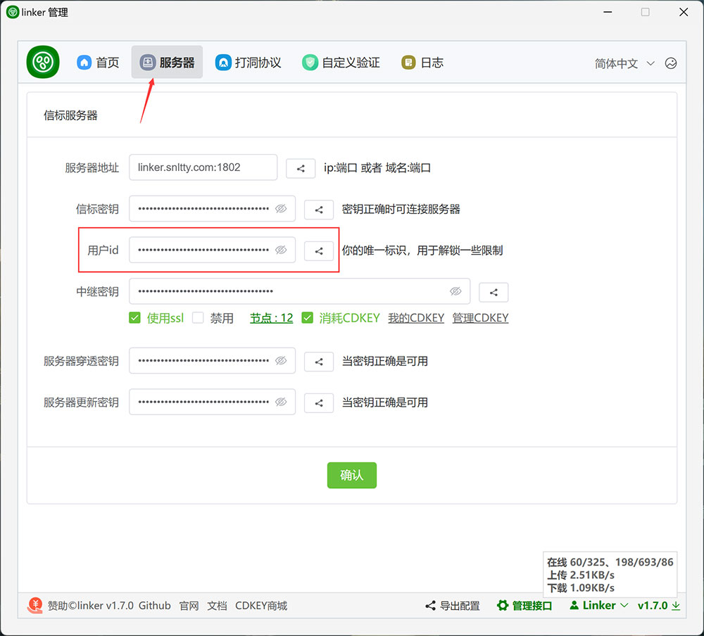
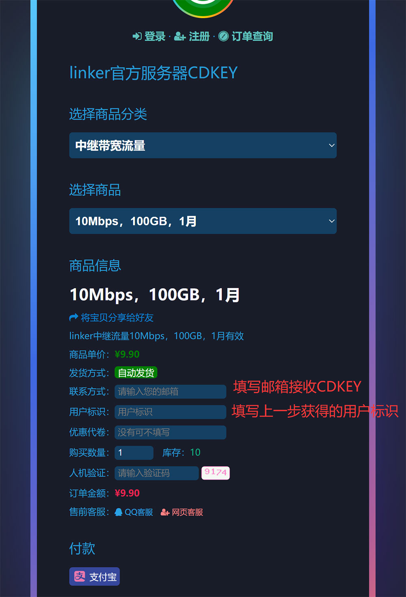

# 7、CDKEY

:::tip[说明]
使用CDKEY解锁中继带宽和流量限制，本文提到的 [CDKEY商城](https://v.netzo123.com)，购买的CDKEY只能在官方服务器使用，自建服务器无法使用

1. 获取你的唯一标识，当然这个标识可以随便修改，也可以多个客户端使用同一标识，最方便的是点击那个同步按钮，将你的唯一标识同步到本组的所有设备

2. 前往 [CDKEY商城](https://v.netzo123.com) 购买合适的CDKEY，`购买数量`为月流量叠加，带宽不变，比如购买`10Mbps，100GB，1月`，数量`2`，则获得`10Mbps，200GB，1月`

2. 前往在linker页面导入你的CDKEY，`导入成功后不用管它了，重新连接中继即可`

:::