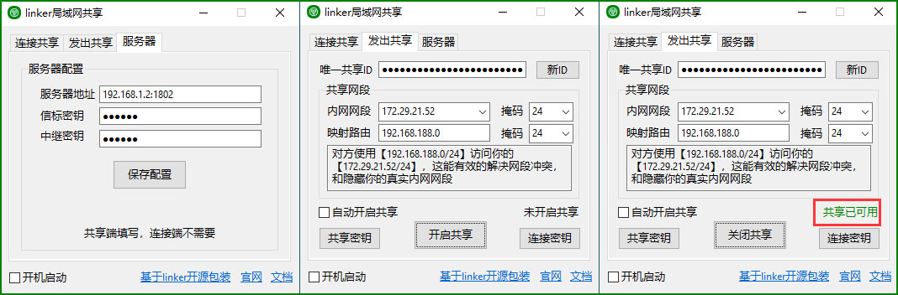
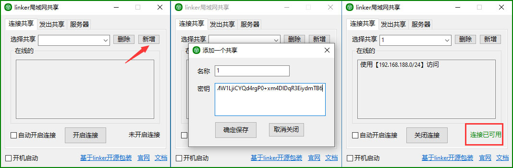
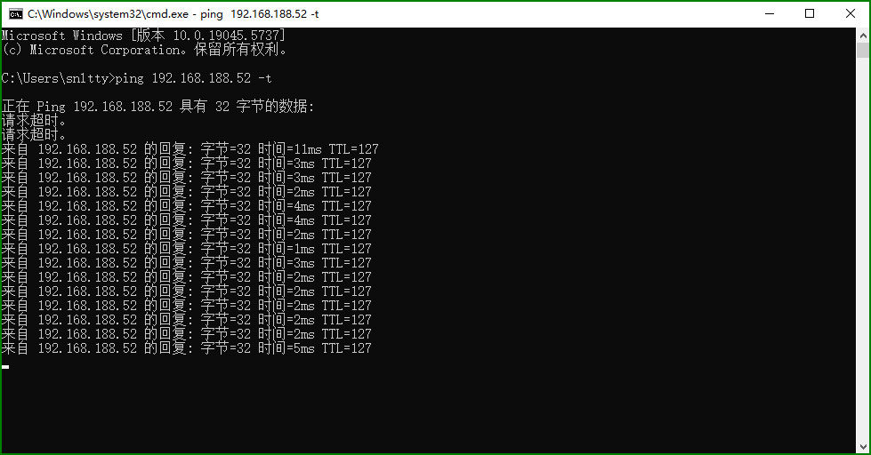

# 97、傻瓜特别版（共享局域网）

:::tip[不开源不免费，有需要请联系作者]

### 共享端

1. 填写服务器信息
2. 可以选择一下你被访问的内网网段，然后开去共享，等变成绿色可用了，连接端就可以访问了
3. 可以复制`共享密钥`去别的地方运行，比如在linux下`./linker base64`这样子
4. 可以复制`连接密钥`去给连接端使用

### 连接端

1. 添加一下从共享端得到的`连接密钥`密钥，选择密钥，然后开启连接，等变成绿色就可以使用了

:::

