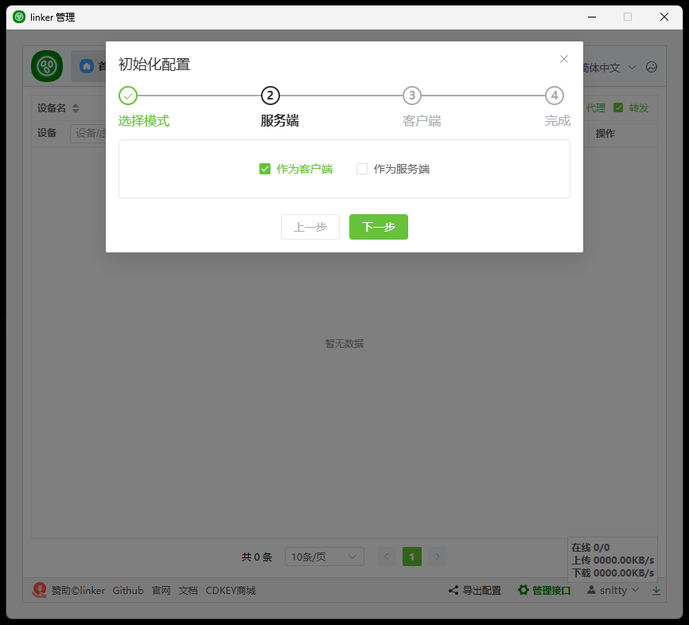
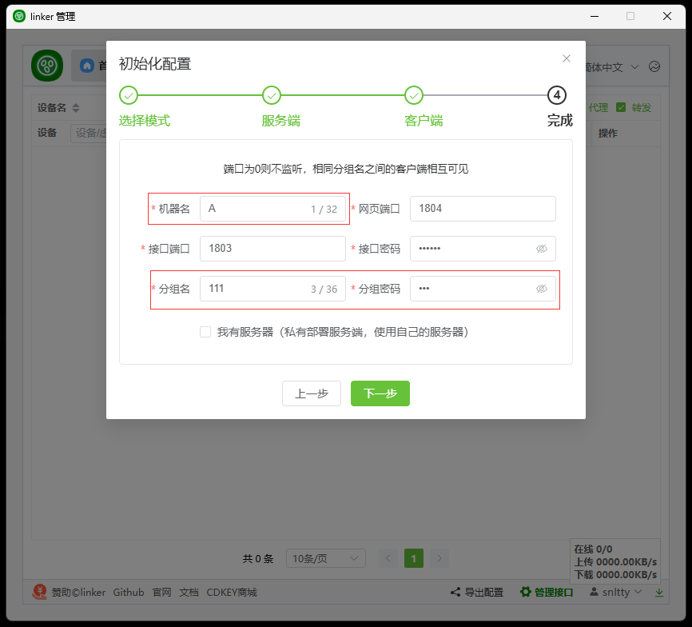
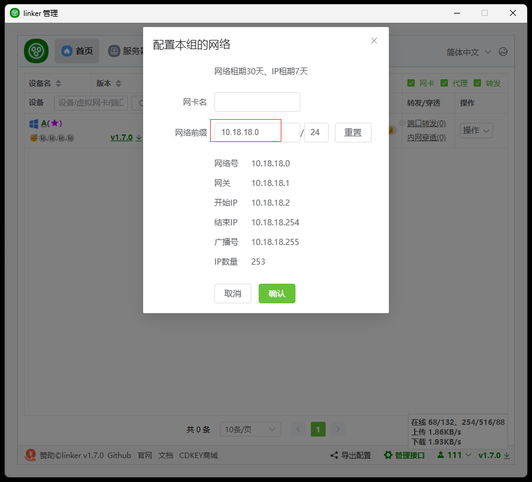
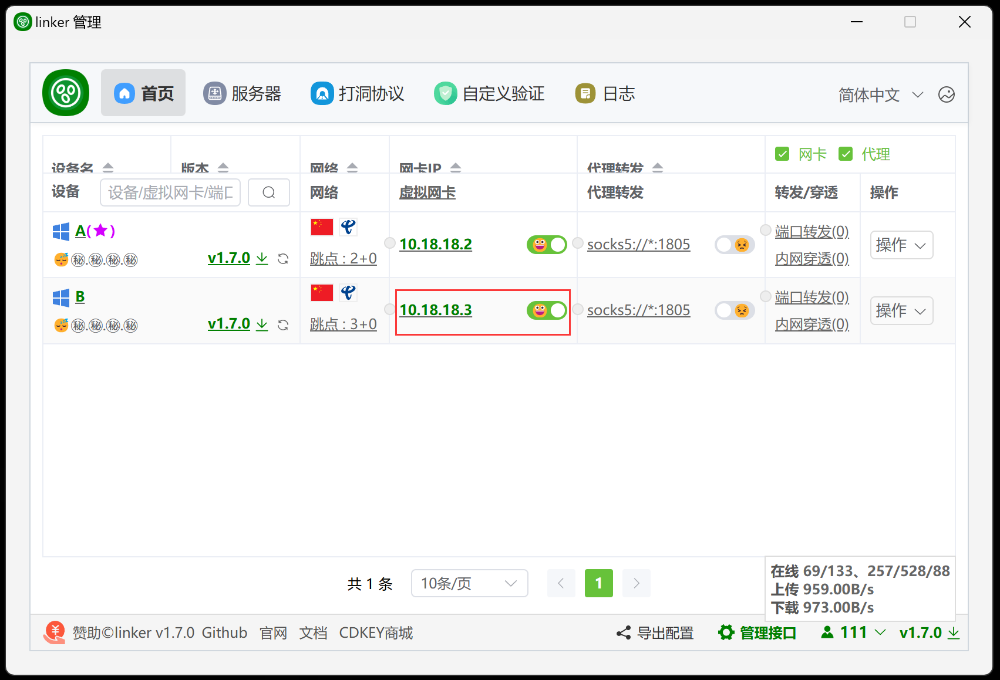

# 99.1、安装linker

:::tip[说明]
1. 去<a href="https://linker.snltty.com" target="_blank">linker官网</a> 或者 <a href="https://github.com/snltty/linker/releases" target="_blank">GitBub</a> 下载最新版本的linker，得到一个压缩包，解压到任意的你喜欢的位置

2. 运行`linker.tray.win.exe`，点击`安装服务`，安装完后自动运行，然后点击`管理(专业)`进入管理页面进行初始化配置

3. 点击`管理(专业)`进入管理页面进行初始化配置

这里我们只选客户端即可，直接使用linker官方的服务器

给本客户端起个名字，我这里就叫`A`，填一个分组编号和密码，我这里都使用`111`，别的客户端也填写相同的分组编号和密码时你们就相互可见了

然后点完成，完成后重启一次服务，也可以点卸载然后再重新安装服务

再次进入管理页面后，可以看到自己在线了

我们点击这个`虚拟网卡`给本组设置一个网络

假设我将网络设置为`10.18.18.0/24`

确定后，本机就有一个虚拟IP了，然后我们启动网卡

绿色的就是启动成功了，如果是红色的，可以把鼠标放上去看有什么错误信息

然后跟本机一样，在你朋友那里按一样的步骤也安装初始化一下，我这里在我朋友那里装了一个，叫`B`，也给它启动一下网卡，这样两边就都完成了

来尝试ping一下看通不通，通的话，接下来就安装一个游戏试试

:::
