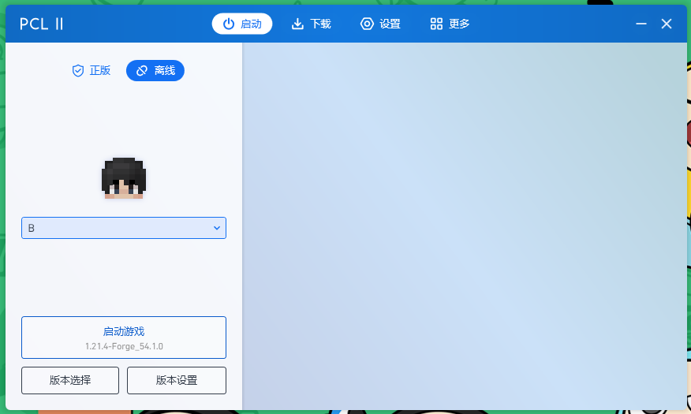
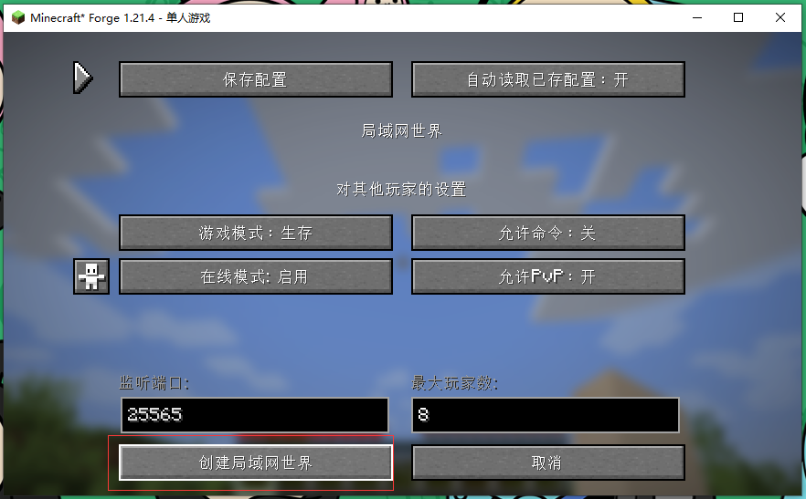
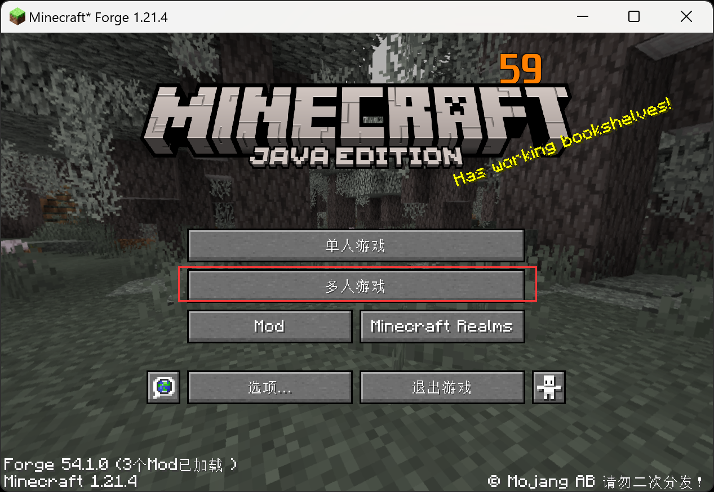
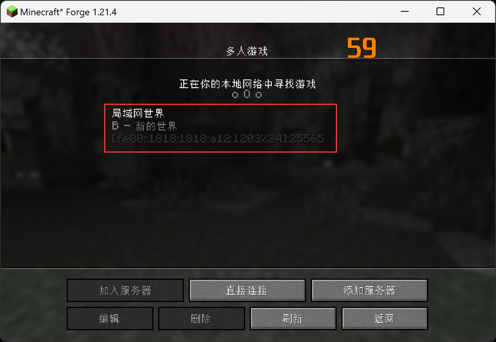

# 99.2、开始联机我的世界

:::tip[说明]
1. 根据上一步安装了linker之后，我们可以开始联机了

2. 我这里使用PCL2来安装我的世界，直接安装个最新的支持插件的版本

这个插件装不装都可以

我这里以B端启动为主机

选单人

进去后设置对局域网开放

然后在A端，多人游戏

搜索到了B端的游戏，如果搜不到，就去ping一下主机的虚拟网卡IP，看通不通，ping通后再来搜索就可以搜到了

:::
